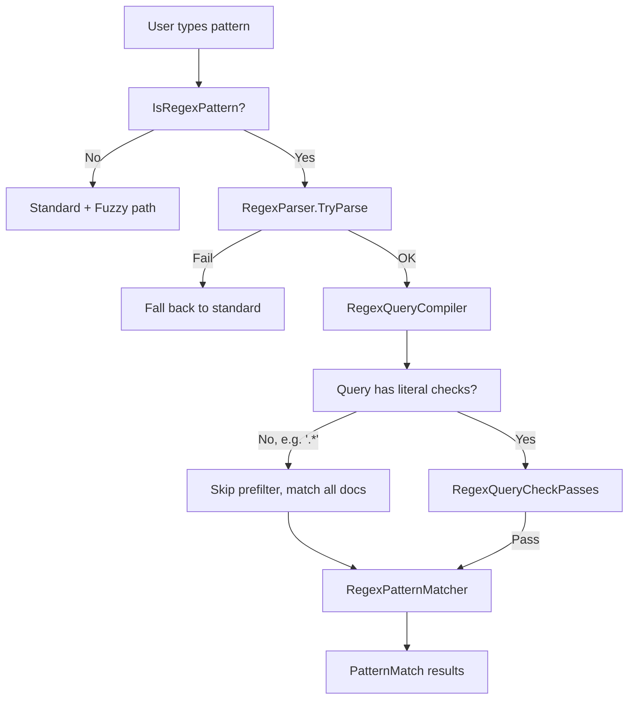

# Regex NavigateTo Search

## Overview

Users searching NavigateTo with patterns like `(Read|Write)Line` currently get no results because the pattern matcher treats regex metacharacters as literal text. This plan adds regex-aware searching by:

1. Detecting when a pattern contains regex syntax
2. Compiling the regex AST into a query tree for fast pre-filtering against the existing index
3. Running a compiled `Regex` against candidate symbol names for exact matching

## Architecture



## 1. Regex Detection and Dot Splitting

### `IsRegexPattern`

Add a static helper `IsRegexPattern(string pattern)` that returns true if the pattern contains any regex metacharacter from the set: `|`, `(`, `)`, `[`, `]`, `{`, `}`, `+`, `?`, `*`, `\`, `^`, `$`. This deliberately includes `[` and `]` -- VB users who need to search for verbatim names like `[class]` can type `class` directly. C# users with `@` prefixes are likewise handled by the existing non-word-char stripping in the pre-filter.

Note: `*` is now a regex metacharacter (no legacy glob behavior). Users who previously typed `Foo*Bar` to mean "Foo-anything-Bar" should now type `Foo.*Bar`. A naked `.` (see below) is NOT a regex trigger -- it remains a container/name separator.

### Dot Splitting: AST-based (regex-aware)

The existing [PatternMatcher.GetNameAndContainer](src/Workspaces/Core/Portable/PatternMatching/PatternMatcher.cs) splits on the last `.`:

```100:107:src/Workspaces/Core/Portable/PatternMatching/PatternMatcher.cs
    internal static (string name, string? containerOpt) GetNameAndContainer(string pattern)
    {
        var dotIndex = pattern.LastIndexOf('.');
        var containsDots = dotIndex >= 0;
        return containsDots
            ? (name: pattern[(dotIndex + 1)..], containerOpt: pattern[..dotIndex])
            : (name: pattern, containerOpt: null);
    }
```

For regex patterns, instead of a lexical scan, we use the **parsed regex AST** to determine the split point. After calling `RegexParser.TryParse`, walk the top-level `RegexSequenceNode` and look for an unquantified `RegexWildcardNode` (which represents a bare `.` in the source). This is structurally distinct from:
- `\.` -- an escape node, not a wildcard
- `.*` / `.+` / `.?` -- a wildcard wrapped in a quantifier node

If found, we pick one such bare wildcard as the container/name split point. The AST nodes to its left form the container subtree; the nodes to its right form the name subtree. If no bare wildcard exists, the whole tree is name-only.

**First vs. last split point:** Either the first or last bare wildcard could serve as the split. "Last" is consistent with existing `GetNameAndContainer` (which uses `LastIndexOf('.')`) and keeps the name portion minimal (matching `DeclaredSymbolInfo.Name`). "First" would put more structure into the name side. Whichever we choose, the code should document the decision and its rationale.

This is more robust than a lexical scan because the regex parser already handles escapes, character classes, nested groups, and all other edge cases. And since we're already parsing the regex for query compilation, the split logic is essentially free -- `RegexQueryCompiler` can compile each subtree directly without re-parsing.

Examples:

- `Foo.Bar` -- AST: `Text("Foo"), Wildcard, Text("Bar")` -- bare wildcard -> container=`Foo`, name=`Bar`
- `(Foo|Bar).Baz` -- AST: `Alternation(...), Wildcard, Text("Baz")` -- bare wildcard -> container subtree = alternation, name subtree = text
- `(Foo|Bar).(Baz|Quux)` -- AST: `Alternation(...), Wildcard, Alternation(...)` -- bare wildcard -> regex container, regex name
- `Foo.*Bar` -- AST: `Text("Foo"), ZeroOrMore(Wildcard), Text("Bar")` -- wildcard is quantified, NOT bare -> no split, name-only
- `Foo\.Bar` -- AST: `Text("Foo"), Escape('.'), Text("Bar")` -- escape node, NOT a wildcard -> no split, name-only
- `System.(IO|Net).File` -- AST: `Text("System"), Wildcard, Alternation(...), Wildcard, Text("File")` -- last bare wildcard is before "File" -> container subtree = everything left of that, name subtree = "File"

After splitting, each side is independently handled:
- If the **name** subtree contains regex structure -> use `RegexPatternMatcher` for name matching, compile subtree into `RegexQuery` for pre-filtering
- If the **container** subtree contains regex structure -> use `RegexPatternMatcher` for container matching (instead of `CreateDotSeparatedContainerMatcher`)
- If neither side has regex structure (e.g. `Foo.Bar` where both sides are plain `RegexTextNode`) -> fall back to existing standard/fuzzy path

Current flow in `SearchSingleDocumentAsync`:

```95:95:src/Features/Core/Portable/NavigateTo/AbstractNavigateToSearchService.InProcess.cs
    using var nameMatcher = PatternMatcher.CreatePatternMatcher(patternName, includeMatchedSpans: true, matchKinds);
```

When regex is detected, we take a different code path (see section 7).

## 2. RegexQuery Types

**New file:** `src/Workspaces/Core/Portable/PatternMatching/RegexQuery.cs`

A discriminated union representing a boolean query compiled from a regex AST:

```csharp
internal abstract class RegexQuery
{
    internal sealed class All(ImmutableArray<RegexQuery> children) : RegexQuery;  // AND
    internal sealed class Any(ImmutableArray<RegexQuery> children) : RegexQuery;  // OR
    internal sealed class Literal(string text) : RegexQuery;                      // "check this literal"
    internal sealed class None : RegexQuery;                                       // unsupported node
}
```

- `All` = AND: every child must pass (from concatenation / `RegexSequenceNode`)
- `Any` = OR: at least one child must pass (from alternation / `RegexAlternationNode`)
- `Literal` = a concrete literal string extracted from a `RegexTextNode`
- `None` = an opaque node (`.`, `\d`, etc.) that cannot be pre-filtered

## 3. RegexQueryCompiler

**New file:** `src/Features/Core/Portable/NavigateTo/RegexQueryCompiler.cs`

Walks the `RegexTree` AST (using `IRegexNodeVisitor`) and produces a `RegexQuery` tree:

- `RegexSequenceNode` (A then B then C) -> `All(compile(A), compile(B), compile(C))`
- `RegexAlternationNode` (A|B) -> `Any(compile(A), compile(B))`
- `RegexTextNode` ("Line") -> `Literal("Line")` (original case preserved)
- `RegexSimpleGroupingNode` ((expr)) -> recurse into `Expression`
- Quantifiers (`?`, `+`, `*`, `{n,m}`):
  - For `+` / `{1,}` -> keep the inner expression (at least one match required)
  - For `?` / `*` / `{0,}` -> `None` (zero matches is valid, can't require the literal)
- Everything else (`.`, `\d`, character classes, anchors, backreferences) -> `None`

**Key parser entry point:**

```127:132:src/Features/Core/Portable/EmbeddedLanguages/RegularExpressions/RegexParser.cs
    public static RegexTree? TryParse(VirtualCharSequence text, RegexOptions options)
    {
        if (text.IsDefault)
        {
            return null;
        }
```

The compiler calls `RegexParser.TryParse` with `RegexOptions.None`.

## 4. Query Tree Optimizer

**Same file or a static method on `RegexQuery`.**

Post-processing passes on the compiled tree:

- **Flatten**: nested `All(All(a, b), c)` -> `All(a, b, c)`, same for `Any`
- **Prune `None`**: `All(a, None, b)` -> `All(a, b)` (AND ignores unknowns); `Any(a, None)` -> `None` (OR with unknown = could match anything)
- **Factor shared children from `Or` branches**: `Any(All(Literal("read"), Literal("line")), All(Literal("write"), Literal("line")))` -> `All(Literal("line"), Any(Literal("read"), Literal("write")))` -- this ensures "line" is always checked
- **Compute `HasLiterals`**: walk the final tree; if no `Literal` node survives, the entire query is `None` and we skip pre-filtering (e.g. for `.*`)

## 5. Pre-filter Evaluation: `RegexQueryCheckPasses`

**File:** [NavigateToSearchIndex.NavigateToSearchInfo.cs](src/Workspaces/Core/Portable/FindSymbols/TopLevelSyntaxTree/NavigateToSearchIndex.NavigateToSearchInfo.cs)

New method on `NavigateToSearchInfo`:

```csharp
public bool RegexQueryCheckPasses(RegexQuery query)
```

Recursive evaluation:

- `All(children)` -> all children pass
- `Any(children)` -> any child passes
- `None` -> true (unknown = don't filter)
- `Literal(text)` -> lowercase `text`, then extract bigrams/trigrams and check them against the existing `_fuzzyBigramBitset` and `_trigramFilter`:
  - For each bigram in the lowercased literal, check the bigram bitset
  - For each trigram in the lowercased literal (if length >= 3), check the trigram bloom filter
  - Both must pass (AND)

The pre-filter operates on lowercased data (matching how the index is built), so it is inherently case-insensitive. Since the actual regex match is also case-insensitive (for finding), this is a perfect fit -- the pre-filter and the matcher agree on casing semantics.

This reuses the **existing** index data structures -- no new index fields are needed for the core implementation. The bigram bitset (`_fuzzyBigramBitset`, 184 bytes) and trigram Bloom filter (`_trigramFilter`) already store exactly the right data.

## 6. RegexPatternMatcher

**New file:** `src/Workspaces/Core/Portable/PatternMatching/RegexPatternMatcher.cs`

A `PatternMatcher` subclass that runs a compiled `System.Text.RegularExpressions.Regex` against candidate symbol names:

```csharp
internal sealed class RegexPatternMatcher : PatternMatcher
{
    private readonly Regex _caseInsensitiveRegex;
    private readonly Regex _caseSensitiveRegex;

    public override bool AddMatches(string candidate, ref TemporaryArray<PatternMatch> matches)
    {
        if (!_caseInsensitiveRegex.Match(candidate).Success)
            return false;

        var caseSensitiveMatch = _caseSensitiveRegex.Match(candidate);
        var isCaseSensitive = caseSensitiveMatch.Success;

        var bestMatch = isCaseSensitive ? caseSensitiveMatch : _caseInsensitiveRegex.Match(candidate);
        var kind = bestMatch.Value == candidate
            ? PatternMatchKind.Exact
            : PatternMatchKind.NonLowercaseSubstring;

        matches.Add(new PatternMatch(kind, isCaseSensitive, matchedSpans: ...));
        return true;
    }
}
```

Regex matching **finds** results case-insensitively (`RegexOptions.IgnoreCase | RegexOptions.Compiled`), so `(Read|Write)Line` matches both `ReadLine` and `readline`. Results are then **categorized**: a second case-sensitive regex determines `isCaseSensitive`, which the UI uses for ranking (case-sensitive matches sort higher). This is consistent with how the existing `SimplePatternMatcher` reports `IsCaseSensitive` on `PatternMatch`.

## 7. Integration

**File:** [AbstractNavigateToSearchService.InProcess.cs](src/Features/Core/Portable/NavigateTo/AbstractNavigateToSearchService.InProcess.cs) (and sibling files: `NormalSearch.cs`, `CachedDocumentSearch.cs`, `GeneratedDocumentSearch.cs` -- all call `GetNameAndContainer` and `SearchSingleDocumentAsync`).

The flow changes at two levels:

**Level 1: Splitting.** All callers currently use `PatternMatcher.GetNameAndContainer(searchPattern)`. Replace with the new regex-aware splitting (section 1). This produces `(namePart, containerPart)` where each side may or may not be regex.

**Level 2: Search path.** In `SearchSingleDocumentAsync` and `ProcessIndex`, branch based on whether the name and/or container are regex:

```csharp
var isNameRegex = IsRegexPattern(namePart);
var isContainerRegex = containerPart != null && IsRegexPattern(containerPart);

// Name matcher
if (isNameRegex)
{
    var regexQuery = RegexQueryCompiler.Compile(namePart);
    if (regexQuery.HasLiterals && !filterIndex.RegexQueryCheckPasses(regexQuery))
        return;
    nameMatcher = new RegexPatternMatcher(namePart, includeMatchedSpans: true);
}
else
{
    var matchKinds = filterIndex.CouldContainNavigateToMatch(namePart, containerPart);
    if (matchKinds == PatternMatcherKind.None) return;
    nameMatcher = PatternMatcher.CreatePatternMatcher(namePart, includeMatchedSpans: true, matchKinds);
}

// Container matcher
if (isContainerRegex)
    containerMatcher = new RegexPatternMatcher(containerPart, includeMatchedSpans: true);
else
    containerMatcher = PatternMatcher.CreateDotSeparatedContainerMatcher(containerPart, includeMatchedSpans: true);
```

The `RegexPatternMatcher` is reusable for both name and container matching -- it just runs a regex against a candidate string. For container matching, the candidate is `declaredSymbolInfo.FullyQualifiedContainerName`.

Add `Regex = 4` to `PatternMatcherKind` (value `4`) so the enum becomes `None = 0, Standard = 1, Fuzzy = 2, Regex = 4`. This keeps the flags orthogonal.

## 8. Branch 2: Sparse N-grams (separate branch off branch 1)

This work lives in a **second branch** created off the main regex search branch. It has no effect on the higher-level regex search tests (which continue to pass/fail identically), but adds its own low-level tests validating the n-gram computation and filtering improvements.

**Background:** GitHub's Blackbird search system uses "sparse n-grams" -- variable-length n-grams selected via a monotonic-stack algorithm over bigram hashes (see [danlark1/sparse_ngrams](https://github.com/danlark1/sparse_ngrams)). Instead of fixed-width trigrams, the algorithm emits O(n) n-grams of varying length (typically 3-8 characters) that are more selective than trigrams while using similar space.

**How it works in NavigateTo:**

- **Indexing:** In `AddNameData` / `AddTrigramData`, also compute sparse n-grams using the bigram-hash monotonic-stack algorithm. Store them in the existing `_trigramFilter` Bloom filter (the filter already accepts variable-length strings; no structural change needed).
- **Query-time:** When evaluating `RegexQuery.Literal(...)`, extract the same sparse n-grams from the literal. Since these are longer than trigrams, they are more selective -- a 6-character sparse gram is far less likely to appear by coincidence across unrelated symbols.
- **Cost:** Slightly more entries in the Bloom filter (O(n) per symbol name, same asymptotic as trigrams). No new data structures. The monotonic-stack algorithm is O(n) per string.

**Branch 2 commits:**

- **Commit A:** Sparse n-gram computation algorithm + unit tests (`SparseNgramTests.cs`) -- positive: correct grams produced for known inputs; negative: edge cases (empty string, single char, all-same chars)
- **Commit B:** Hook into `AddTrigramData` and `RegexQueryCheckPasses` + benchmarks comparing false positive rates with and without sparse n-grams

## 9. Tests (written first)

Implementation follows a **test-first** approach: write the tests that describe the desired behavior before building the production code. This makes it easy to verify correctness incrementally and catch regressions.

Every component is testable as a **standalone unit** without touching the NavigateTo pipeline. Each piece has clean, well-defined inputs and outputs:

- `IsRegexPattern(string)` -> `bool`
- `RegexQueryCompiler.Compile(string)` -> `RegexQuery` tree (pure data)
- `NavigateToSearchInfo.RegexQueryCheckPasses(RegexQuery)` -> `bool` (against a `NavigateToSearchInfo` built from a list of symbol names -- same pattern used by existing `NavigateToSearchIndexTests`)
- `RegexPatternMatcher.AddMatches(string)` -> `PatternMatch` results

This means we can have extensive unit test coverage validating all regex parsing, query compilation, optimization, pre-filter evaluation, and matching **before** wiring anything into the NavigateTo search pipeline. The integration commit (commit 5) only connects already-proven building blocks.

All tests go in **new test classes**, as siblings to the existing [NavigateToSearchIndexTests.cs](src/Workspaces/CoreTest/FindSymbols/NavigateToSearchIndexTests.cs). Every test class should have extensive **positive AND negative** test cases.

- **`RegexDetectionTests.cs`**
  - Positive (is regex): `(Read|Write)`, `[abc]`, `Foo.*Bar`, `x+`, `a\d`, `^Start`, `End$`, `a{2,3}`
  - Negative (not regex): `abc`, `FooBar`, `x.y`, `Foo.Bar.Baz`, `get word`
  - Dot splitting positive: `Foo.Bar` -> container/name, `(Foo|Bar).Baz` -> regex container + plain name, `(Foo|Bar).(Baz|Quux)` -> regex container + regex name, `System.(IO|Net).File` -> split on last bare wildcard
  - Dot splitting negative (no split): `Foo.*Bar`, `Foo\.Bar`, `Foo.+Bar`, `(Read|Write)Line` (no dot at all)

- **`RegexQueryCompilerTests.cs`**
  - Positive: `(Read|Write)Line` -> `All(Any(Literal("Read"), Literal("Write")), Literal("Line"))`; `Foo+` -> `Literal("Foo")`; `Read(Line)?` -> `Literal("Read")` (optional stripped)
  - Negative: `.*` -> `None` (no literals); `\d+` -> `None`; `.` -> `None`
  - Optimizer: `All(All(a,b),c)` flattens; `Any(a, None)` -> `None`; shared child factoring from `Or` branches
  - `HasLiterals`: true for `(Read|Write)Line`, false for `.*`

- **`RegexPreFilterTests.cs`**
  - Positive (filter passes): document with `ReadLine` + `WriteLine`, query `(Read|Write)Line` -> passes (bigrams/trigrams present)
  - Negative (filter rejects): document with `FooBar` + `BazQuux`, query `(Read|Write)Line` -> rejected (no matching bigrams/trigrams)
  - Edge: `.*` query (no literals) -> always passes; single-char literal -> bigram check only; long literal -> both bigram + trigram
  - **False-positive baseline tests** (relevant to sparse n-grams later): document with symbols `Reading` and `Outline` -- query `Literal("ReadLine")` -- bigrams "re","ea","ad","dl","li","in","ne" may individually appear across the two symbols even though neither contains "ReadLine". Document these as known pre-filter false positives. These tests establish baseline behavior that branch 2's sparse n-grams may improve.

- **`RegexPatternMatcherTests.cs`**
  - Positive (matches): `(Read|Write)Line` matches `ReadLine`, `WriteLine`, `readline` (case-insensitive); `Foo.*Bar` matches `FooXyzBar`, `FooBar`; `Read(Line)?` matches `Read`, `ReadLine`
  - Negative (no match): `(Read|Write)Line` does NOT match `WriteBuffer`, `ReadLin`, `xReadLine` (substring but regex not anchored... actually it would match as substring -- need to clarify anchoring); `Foo.*Bar` does NOT match `FooBaz`
  - Case sensitivity: `(Read|Write)Line` matching `ReadLine` -> `isCaseSensitive: true`; matching `readline` -> `isCaseSensitive: false`
  - Match kind: full match -> `Exact`; partial match -> `NonLowercaseSubstring`
  - Error handling: invalid regex pattern -> graceful failure (falls back to standard path)

## 10. Benchmarks

**File:** New `NavigateToRegexPreFilterBenchmarks.cs` as a sibling to the existing [NavigateToPreFilterBenchmarks.cs](src/Tools/IdeCoreBenchmarks/NavigateToPreFilterBenchmarks.cs) and [NavigateToFuzzyPreFilterBenchmarks.cs](src/Tools/IdeCoreBenchmarks/NavigateToFuzzyPreFilterBenchmarks.cs).

- **Query compilation cost**: time to parse a regex and compile the query tree
- **Pre-filter evaluation**: `RegexQueryCheckPasses` against realistic and stress indices, comparing hit vs. miss rates
- **Full regex match**: `RegexPatternMatcher.AddMatches` across a realistic symbol list

---

## Commit Plan

Each commit is self-contained and reviewable independently. Tests come first in the order, and each subsequent commit makes more tests pass.

### Commit 1: `RegexQuery` types and `RegexQueryCompiler` + tests

- `RegexQuery.cs` -- the discriminated union (`All`, `Any`, `Literal`, `None`)
- `RegexQueryCompiler.cs` -- walks the regex AST, produces a `RegexQuery` tree
- Query tree optimizer (flatten, prune `None`, factor shared children)
- `HasLiterals` computation
- `RegexQueryCompilerTests.cs` -- tests for compilation, optimization, and `HasLiterals`

*Reviewer sees: pure data types + a pure function from regex AST to query tree. No integration, no side effects. Easy to evaluate the AST walking logic in isolation.*

### Commit 2: Regex detection + AST-based dot splitting + tests

- `IsRegexPattern` helper (static, pure function)
- AST-based `SplitOnContainerDot` -- parses with `RegexParser.TryParse`, walks top-level sequence for last unquantified `RegexWildcardNode`, returns container/name subtrees (or the original regex tree if no split)
- `RegexDetectionTests.cs` -- exhaustive `IsRegexPattern` true/false cases + dot-splitting tests covering all the examples from section 1

*Reviewer sees: `IsRegexPattern` is trivial. The dot-splitting delegates to the already-reviewed regex parser and inspects the AST structurally -- no ad-hoc lexical scanning. Well-tested.*

### Commit 3: `RegexQueryCheckPasses` pre-filter + tests + benchmarks

- `RegexQueryCheckPasses` on `NavigateToSearchInfo` -- evaluates the query tree against existing bigram/trigram index data
- `RegexPreFilterTests.cs` -- builds `NavigateToSearchInfo` from known symbols, asserts filter pass/reject for various regex queries
- `NavigateToRegexPreFilterBenchmarks.cs` -- benchmarks for pre-filter evaluation

*Reviewer sees: the pre-filter logic and proof that it correctly accepts/rejects documents. No changes to the search pipeline yet.*

### Commit 4: `RegexPatternMatcher` + tests

- `RegexPatternMatcher.cs` -- case-insensitive find, case-sensitive categorization, `PatternMatchKind.Exact` vs `NonLowercaseSubstring`
- `RegexPatternMatcherTests.cs` -- matching behavior, case sensitivity reporting, edge cases

*Reviewer sees: the matcher in isolation. Can evaluate regex compilation, match quality, and `IsCaseSensitive` logic without pipeline concerns.*

### Commit 5: Integration into NavigateTo search pipeline

- Add `Regex = 4` to `PatternMatcherKind`
- Replace `PatternMatcher.GetNameAndContainer` calls with regex-aware splitting in `NormalSearch.cs`, `CachedDocumentSearch.cs`, `GeneratedDocumentSearch.cs`
- Branch on `IsRegexPattern` in `SearchSingleDocumentAsync` / `ProcessIndex` for both name and container matching
- Wire `RegexQueryCompiler` + `RegexQueryCheckPasses` + `RegexPatternMatcher` into the document search loop
- Container regex: when the container side has regex metacharacters, use `RegexPatternMatcher` instead of `CreateDotSeparatedContainerMatcher`

*Reviewer sees: just the wiring -- all building blocks already reviewed in prior commits. Easy to verify the control flow is correct.*

### Branch 2 (new branch off branch 1): Sparse n-gram indexing

**Commit A:** Sparse n-gram algorithm + `SparseNgramTests.cs`
- Monotonic-stack algorithm for computing variable-length n-grams
- Positive tests: correct grams for known inputs
- Negative tests: edge cases (empty, single char, all-same)

**Commit B:** Hook into indexing + pre-filter + benchmarks
- Integrate into `AddTrigramData` and `RegexQueryCheckPasses`
- Benchmarks comparing false positive rates with and without sparse n-grams
- The false-positive baseline tests from branch 1 may now show improved filtering

*Higher-level regex search tests from branch 1 continue to pass identically -- this is purely an indexing/filtering optimization.*
