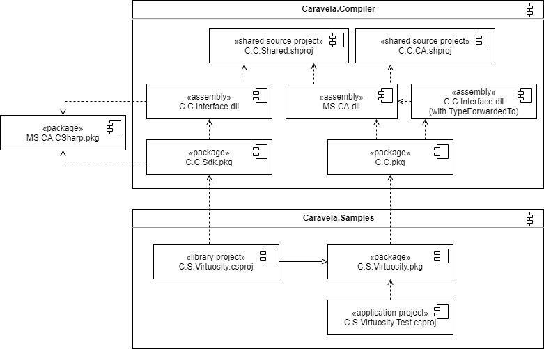

# Componens

The diagram above shows relationships between the components of the Metalama compiler, along with a sample transformer project and an application using it. Most of this information are implementation details and are not necessary to understand to author source transformers or to use them.

### Metalama.Compiler

#### Metalama.Compiler.Interface.dll

The Metalama.Compiler.Interface.dll assembly contains the 4 types described in [the API](API.md), referencing the official stable version of Microsoft.CodeAnalysis.CSharp.

Because there is a cyclic dependency between Metalama.Compiler.Interface and the Metalama.Compiler version of Microsoft.CodeAnalysis.dll, the relevant code is actually in the shared source project Metalama.Compiler.Shared, which is included into the Metalama.Compiler.Sdk version of Metalama.Compiler.Interface.dll and the Metalama.Compiler version of Microsoft.CodeAnalysis.dll (more on the distinction between Sdk and the base package below). To make assembly identity work, Metalama.Compiler also contains a version of Metalama.Compiler.Interface.dll which uses `[TypeForwardedTo]` to Microsoft.CodeAnalysis.dll.

#### Microsoft.CodeAnalysis.dll

Microsoft.CodeAnalysis.dll contains many of the modifications of Roslyn code needed for Metalama (others are in Microsoft.CodeAnalysis.CSharp.dll).

These modifications come in three forms:

1. As mentioned above, the Metalama.Compiler API, code for which comes from the shared source project Metalama.Compiler.Shared.
2. Direct modifications of existing code in Microsoft.CodeAnalysis.dll.
3. Code from the shared source project Metalama.Compiler.CodeAnalysis, which contains new types introduced for Metalama.Compiler. This isn't strictly speaking necessary, but exists for better separation of Metalama.Compiler code from Roslyn code.

#### Metalama.Compiler.Sdk.pkg

Metalama.Compiler.Sdk is the NuGet package used as a reference by transformer projects (in practice, that is just Metalama proper). It contains reference assembly Metalama.Compiler.Interface.dll, along with MSBuild targets necessary for producing transformer packages. That includes editing the nuspec file of the transformer project so that the produced package depends on Metalama.Compiler instead of Metalama.Compiler.Sdk.

#### Metalama.Compiler.pkg

Metalama.Compiler is a NuGet package used as a dependency of transformer packages. It includes the Metalama.Compiler fork of the C# compiler along with MSBuild files that make sure this is the compiler used at build time.

It is effectively a renamed Microsoft.Net.Compilers.Toolset.

