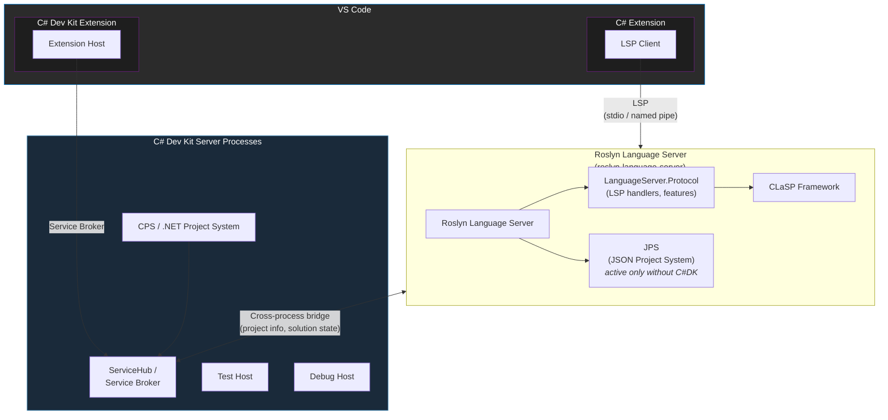
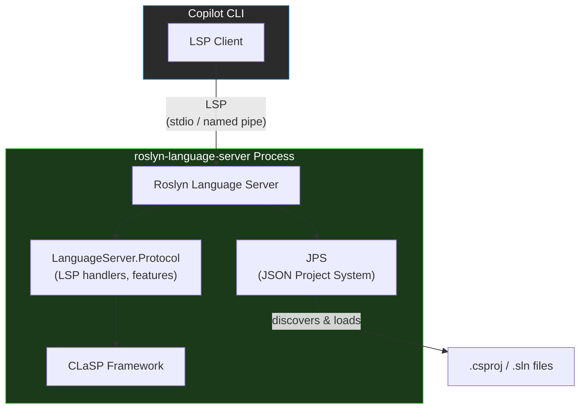

# Glossary: C# Language Server Ecosystem

A reference for common terms, acronyms, and components in the C# language server ecosystem.

---

## Protocol & Standards

| Term | Definition |
|------|------------|
| **LSP** (Language Server Protocol) | The JSON-RPC based protocol specification that defines communication between an editor (client) and a language server. Defines the types, methods, and lifecycle for features like completion, diagnostics, go-to-definition, etc. Spec: https://microsoft.github.io/language-server-protocol/ |
| **JSON-RPC** | The remote procedure call protocol used as the transport layer for LSP. Messages are encoded as JSON and sent over stdio, named pipes, or other transports. |
| **Custom LSP Messages** | LSP allows servers and clients to define custom request and notification methods beyond the standard specification. Roslyn uses custom messages (prefixed with `roslyn/`) for features not covered by the standard protocol, such as code action resolve, project diagnostics, and source generator support. |
| **VS LSP Extensions** | Visual Studio extends LSP with additional protocol methods and types (prefixed with `vs/` or `_vs_`) to support richer IDE features that the standard LSP spec does not cover, such as document highlighting, project context, icon mappings, and rich diagnostics. These extensions are available when the Roslyn language server runs inside Visual Studio and can be negotiated via capabilities. |

## Language Servers

| Term | Definition |
|------|------------|
| **Roslyn Language Server (RLS)** | The standalone Roslyn-powered language server executable (`roslyn-language-server`). Built from `src/LanguageServer/Microsoft.CodeAnalysis.LanguageServer/`. Provides C# (and VB) language features over LSP. Used both by the C# extension and as a standalone tool. Also referred to as "Roslyn LS." |
| **OmniSharp (O#)** | The legacy open-source C# language server that predated the Roslyn Language Server. Can be run as a standalone server process (not limited to VS Code) and supports both the standard LSP protocol and its own custom OmniSharp protocol. Previously powered the C# VS Code extension. Repo: [OmniSharp/omnisharp-roslyn](https://github.com/OmniSharp/omnisharp-roslyn). |

## Roslyn LSP Architecture

| Term | Definition |
|------|------------|
| **Microsoft.CodeAnalysis.LanguageServer** | The project hosting the standalone language server executable (`roslyn-language-server`). References LanguageServer.Protocol and packages it into a runnable .NET tool that communicates over stdio or named pipes. Used by the C# VS Code extension (which launches it as a child process) and available as a CLI tool via `dotnet tool install`.  Includes JPS (but can be deactivated). Located in `src/LanguageServer/Microsoft.CodeAnalysis.LanguageServer/`. |
| **Microsoft.CodeAnalysis.LanguageServer.Protocol** | The shared LSP implementation library used by all Roslyn LSP scenarios. Contains LSP request handlers, protocol type definitions, workspace integration, and feature wiring. This project is consumed by both the standalone language server executable and the Visual Studio in-process LSP server, providing a single implementation of Roslyn's language features over LSP. Located in `src/LanguageServer/Protocol/`. |
| **CLaSP** (Common Language Server Protocol Framework) | A framework built by Roslyn for creating LSP server implementations. Provides base classes (`AbstractLanguageServer`, `IRequestHandler`, `IRequestContextFactory`, etc.) and request queue management. Located in `src/LanguageServer/Microsoft.CommonLanguageServerProtocol.Framework/`. |
| **Roslyn LSP Protocol Types** | The C# type definitions for LSP protocol messages, shared with Razor and XAML. Located in `src/LanguageServer/Protocol/Protocol/`. |

## Project Systems

| Term | Definition |
|------|------------|
| **CPS** (Common Project System) / **.NET Project System** | The project system used by C# Dev Kit and Visual Studio. Provides full MSBuild-based project evaluation and design-time builds.  Shipped and hosted by the C# Dev Kit extension in VSCode.  Communicates cross process with RLS in the C# extension |
| **JPS** (Jason Project System) | A lightweight project system used by Roslyn Language Server when not connected to C# Dev Kit (aka C# extension only, or CLI scenarios). Provides project discovery and loading. |

## VSCode Extensions

| Term | Definition |
|------|------------|
| **C# Extension (standalone)** | The [C# for Visual Studio Code](https://marketplace.visualstudio.com/items?itemName=ms-dotnettools.csharp) extension running without C# Dev Kit. Uses the Roslyn Language Server (RLS) for language features and the Jason Project System (JPS) for project loading. |
| **C# Dev Kit (C#DK)** | The [C# Dev Kit](https://marketplace.visualstudio.com/items?itemName=ms-dotnettools.csdevkit) VS Code extension. Hosts independent processes that add solution management, test explorer, and richer project system support on top of the C# extension. |
| **C# + C# Dev Kit** | The combination of the C# extension and C# Dev Kit extension installed together in VS Code. In this scenario, the Roslyn Language Server is connected to C# Dev Kit's ServiceHub server via a cross process bridge.  JPS is deactivated, and CPS provides project information to the Roslyn Language Server via this bridge. |

## Architecture Diagram

> **C# Extension standalone** (without C# Dev Kit): Only the right side is active — the C# extension launches RLS, which uses JPS for project loading. The C# Dev Kit extension and its ServiceHub processes are not present.
>
> **C# + C# Dev Kit**: Both extensions are active. C# Dev Kit launches ServiceHub processes hosting CPS and other services. RLS connects to ServiceHub via a cross-process bridge, JPS is deactivated, and CPS provides project information to RLS.

## Standalone Tool Architecture

> **Standalone usage**: The `roslyn-language-server` can be installed as a .NET tool (`dotnet tool install --global roslyn-language-server`). It runs as a single process, uses JPS for project discovery, and communicates over stdio or named pipes.

