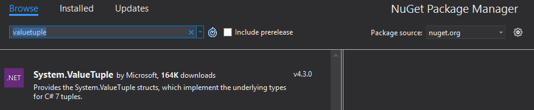

Quickstart guide for deconstructions (C# 7.0)
----------------------------------------------
1. Install dev15 preview 4
2. Start a C# project
3. Add a reference to the `System.ValueTuple` package from NuGet (pre-release)

4. Use deconstructions:
    ```C#
public class C
{
        public static void Main()
        {
                
              int code;
              string message;

              var pair = (42, "hello");
              (code, message) = pair; // deconstruct a tuple into existing variables
              Console.Write(message); // hello

              (code, message) = new Deconstructable(); // deconstruct any object with a proper Deconstruct method into existing variables
              Console.Write(message); // world
              
              (int code2, int message2) = pair; // deconstruct into new variables
              var (code3, message3) = new Deconstructable(); // deconstruct into new 'var' variables
        }
}

public class Deconstructable
{
        public void Deconstruct(out int x, out int y)
        {
                x = 43;
                y = "world";
        }
}
    ```

Design
------
This design doc will cover two kinds of deconstruction: deconstruction into existing variables (*deconstruction-assignment*) and deconstruction into new variables (*deconstruction-declaration*).

Here is an example of deconstruction-assignment:
```C#
class C
{
    static void Main()
    {
        long x;
        string y;

        (x, y) = new C();
        System.Console.WriteLine(x + "" "" + y);
    }

    public void Deconstruct(out int a, out string b)
    {
        a = 1;
        b = ""hello"";
    }
}
```

###Deconstruction-assignment (deconstruction into existing variables):

This doesn't introduce any changes to the language grammar. We have an *assignment-expression* (also simply called *assignment* in the C# grammar) where the *unary-expression* (the left-hand-side) is a *tuple-expression*.
In short, what this does in the general case is find a `Deconstruct` method on the expression on the right-hand-side of the assignment, invoke it with the appropriate number of `out var` parameters, converts those output values (if needed) and assign them to the variables on the left-hand-side. And in the special case where the expression on the right-hand-side is a tuple (tuple expression or tuple type), then the elements of the tuple can be assigned to the variables on the left-hand-side without needing to call `Deconstruct`.

If the left-hand-side is nested the process will be repeated. For instance, in `(x, (y, z)) = deconstructable;`, `deconstructable` will be deconstructed into two parts and its second part will be further deconstructed. 

In the case where the expression on the right is a tuple expression, it is first given a type. So in `long x; string y; (x, y) = (1, null);` the literals on the right-hand-side are typed as `long` and `string` before the deconstruction even starts, which means that no conversions will be needed during the deconstruction steps.

We noted already that tuples (which are syntactic sugar for the `System.ValueTuple` underlying type) don't need to invoke `Deconstruct`.
The .Net framework also includes a set of `System.Tuple` types. Those are not recognized as C# tuples, and so will rely on the *Deconstruct* pattern. Those `Deconstruct` methods will be provided as extension methods for `System.Tuple` for up to 3 nestings deep (that is 21 elements).

A *deconstruction-assignment* returns a tuple value which is shaped and typed like the left-hand-side and holds the (converted) parts resulting from deconstruction.

#### Evaluation order

The evaluation order can be summarized as: (1) all the side-effects on the left-hand-side, (2) all the `Deconstruct` invocations (if not tuple), (3) conversions (if needed), and (4) assignments.

In the general case, the lowering for deconstruction-assignment would translate: `(expressionX, expressionY, expressionZ) = expressionRight` into:

```
// do LHS side-effects
tempX = &evaluate expressionX
tempY = &evaluate expressionY
tempZ = &evaluate expressionZ

// do Deconstruct
evaluate right and evaluate Deconstruct in three parts (tempA, tempB and tempC)

// do conversions
tempConvA = convert tempA
tempConvB = convert tempB
tempConvC = convert tempC

// do assignments
tempX = tempConvA
tempY = tempConvB
tempZ = tempConvC
```

The evaluation order for nesting `(x, (y, z))` is:
```
// do LHS side-effects
tempX = &evaluate expressionX
tempY = &evaluate expressionY
tempZ = &evaluate expressionZ

// do Deconstruct
evaluate right and evaluate Deconstruct into two parts (tempA and tempNested)
evaluate Deconstruct on tempNested intwo two parts (tempB and tempC)

// do conversions
tempConvA = convert tempA
tempConvB = convert tempB
tempConvC = convert tempC

// do assignments
tempX = tempConvA
tempY = tempConvB
tempZ = tempConvC
```

The evaluation order for the simplest cases (locals, fields, array indexers, or anything returning ref) without needing conversion:
```
evaluate side-effect on the left-hand-side variables
evaluate Deconstruct passing the references directly in
```

#### Resolution of the Deconstruct method

The resolution is equivalent to typing `rhs.Deconstruct(out var x1, out var x2, ...);` with the appropriate number of parameters to deconstruct into.
It is based on normal overload resolution.
This implies that `rhs` cannot be dynamic and that none of the parameters of the `Deconstruct` method can be type arguments. A `Deconstruct<T>(out T x1, out T x2)` method will not be found.
Also, the `Deconstruct` method must be an instance method or an extension (but not a static method).


###Deconstruction-declaration (deconstruction into new variables):

*Deconstruction-declarations* can be thought of as two steps: (1) declaring new locals, and (2) applying a *deconstruction-assignment* into those locals.
The syntax for deconstruction is more involved and multiple forms are allowed. The simplest case is `(int x, string y)`. Variants include nested declarations like `(int x, (string y, long z))` (which declares 3 locals) and implicitly typed declarations like `(var x, var y)`. The latter can also be written using the shorthand `var (x, y)`.
`var` is the only case where such shorthand is allowed (you `int (x, y)` is not legal).

As in the case of *deconstruction-declarations*, tuple expressions on the right-hand-side have their type inferred from the left-hand-side. With *deconstruction-declaration*, this is also the case, except that any type is `var` in the left-hand-side, then the natural type of the element in the right-hand-side is used.
For example, in `(string x, byte y, var z) = (null, 1, 2);`, `null` has type `string`, the literal `1` has type `byte` (inferred from `y`) and the literal `2` has type `int` (its natural type).

###Grammar changes

```ANTLR
deconstruction_declaration_statement // new
    : modifiers variable_component_assignment ';'
    ;
    
variable_component_assignment // new
    : variable_component = expression
    ;
    
variable_component // new
    : type variable_designation
    | '(' variable_component (',' variable_component)+ ')'
    | '*' // wildcard (future)
    ;

variable_designation // new
    : identifier
    | '(' variable_designation (',' variable_designation)+ ')'
    | '*' // wildcard (future)
    ;

foreach_component_statement // new
    : 'foreach' '(' variable_component 'in' expression ')' embedded_statement
    ;

for_statement
    : 'for' '(' for_initializer? ';' for_condition? ';' for_iterator? ')' embedded_statement
    ;

for_initializer
    : local_variable_declaration
    | variable_component_assignment // new
    | statement_expression_list
    ;
```

The *deconstruction-assignment* doesn't introduce any new syntax. It is represented with an *assignment* into a tuple expression.


**References**

[C# Design Notes for Apr 12-22, 2016](https://github.com/dotnet/roslyn/issues/11031)

The [What's new in C# 7.0](https://blogs.msdn.microsoft.com/dotnet/2016/08/24/whats-new-in-csharp-7-0) post has a section on deconstructions.

