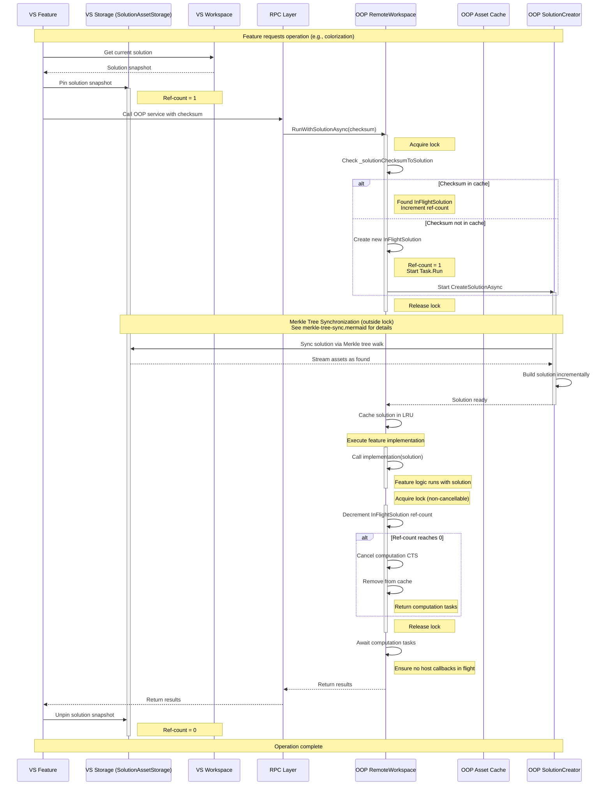
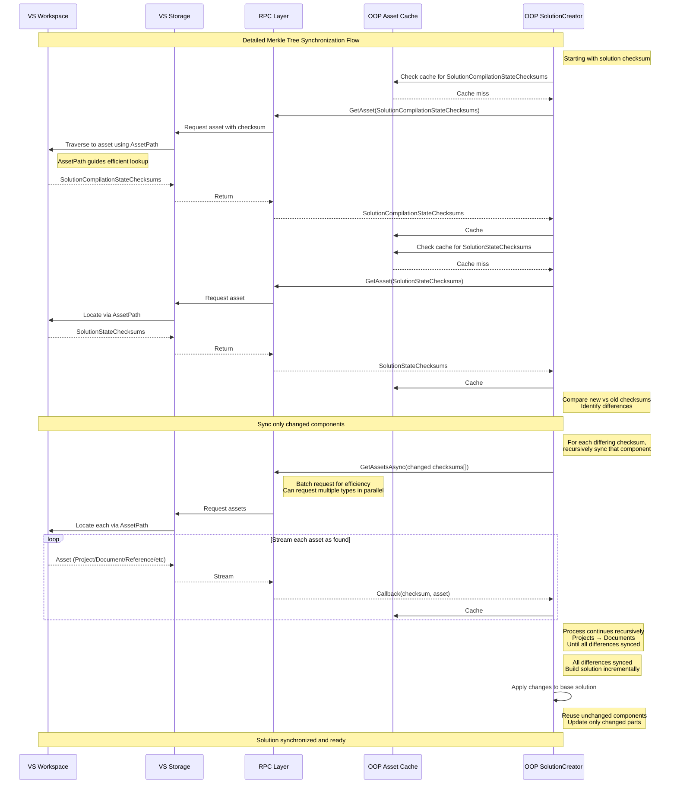

# Solution Synchronization between Visual Studio and Out-Of-Process (OOP) Server

## Overview

When Roslyn runs in-process inside Visual Studio, many expensive operations are offloaded to an external server process
known as OOP (Out-Of-Process). This architecture provides isolation and prevents blocking the VS UI thread. However, it
creates a fundamental challenge: ensuring that the solution snapshot used on the OOP side matches the one on the VS
side. All computation performed in OOP must align with what VS observes, and all results must reference valid locations
in valid files as far as VS is concerned.

The solution to this problem is a checksum-based Merkle tree synchronization system. This document describes how VS and
OOP coordinate to maintain consistent solution snapshots efficiently.

Note: This document does not cover the RPC system itself (currently JSON-RPC). Instead, it focuses on the
synchronization mechanism that ensures data consistency across the process boundary.

### Binary Serialization within JSON-RPC

While the RPC layer uses JSON-RPC, the implementation employs efficient binary serialization mechanisms where needed.
This is critical when synchronizing large amounts of data or binary data, avoiding the substantial cost of converting
binary information into stringified JSON form and back.

The system uses [Nerdbank.Streams](https://github.com/dotnet/Nerdbank.Streams/blob/main/README.md) to provide this
capability within the JSON-RPC framework. Internally, Roslyn uses its `ObjectReader`/`ObjectWriter` abstraction, which
implements a simple binary format protocol over a binary stream. This approach allows explicit control over
serialization while keeping messages simple and efficient. Future considerations include alternatives like MessagePack,
though the current approach has proven sufficient for the straightforward message structures required by the system.

## The Checksum-Based Merkle Tree

The core concept driving this system is the [Merkle tree](https://en.wikipedia.org/wiki/Merkle_tree): a tree of
checksums, where each node's checksum is derived from its children, all the way from leaves to root. This is the same
technique Git uses for repository synchronization, allowing efficient synchronization of large trees by transferring
only changed subtrees. Roslyn uses a typed version of this concept where practically all calls from VS to OOP send a
simple 128-bit checksum representing the root of the typed Merkle tree.

### Checksum Design

The checksum type is defined in [`Checksum.cs`](https://github.com/dotnet/roslyn/blob/bee340d2d6efa1d874c8a7b2ac9a8f9d3bd35c8a/src/Workspaces/Core/Portable/Workspace/Solution/Checksum.cs#L22).
We use xxHash128, which was selected for several important properties:

- 128-bit struct with no heap allocations
- High computation performance
- Negligible collision probability for practical workloads (see [xxHash collision
  analysis](https://github.com/Cyan4973/xxHash/wiki/Collision-ratio-comparison))
- Non-cryptographic hash suitable for non-security-critical checksumming (avoiding the performance cost of cryptographic
  hashes like SHA256)

### Typed Merkle Tree Structure

The actual checksum Merkle tree representing everything is called `SolutionCompilationStateChecksums`. It is a checksum
tree because it has child fields that are themselves checksums:

```csharp
public Checksum Checksum { get; }
public Checksum SolutionState { get; }
public Checksum SourceGeneratorExecutionVersionMap { get; }
```

We consider this a typed checksum tree because we clearly distinguish the individual fields and what they represent. The
structure looks like:

```
SolutionCompilationStateChecksums (root)
├── SolutionStateChecksums (uncomputed source data)
│   ├── ProjectStateChecksums[]
│   │   ├── DocumentStateChecksums[]
│   │   ├── Compilation options
│   │   ├── Parse options
│   │   └── References
│   └── Solution properties
└── SourceGeneratorExecutionVersionMap (computed compilation data)
```

The split between `SolutionCompilationStateChecksums` and `SolutionStateChecksums` is important. The latter represents
pure uncomputed data: the snapshot of files, references, and options making up the solution. The former contains data
representing compilation information computed from the latter, such as generated source generator files controlled by
their particular source generation execution version map.

### Efficient Differential Sync

When checksums differ between VS and OOP, we retrieve the corresponding checksum objects and examine which child
checksums differ. This allows the OOP side to efficiently traverse the tree, descending only into branches where
checksums differ.

For example, if the `SolutionState` checksums differ between VS/OOP, we retrieve the corresponding
`SolutionStateChecksums` and identify which child checksums differ. This process continues recursively until reaching
the actual data requiring synchronization.

The code for this tree traversal is in [`RemoteWorkspace.SolutionCreator.cs`](https://github.com/dotnet/roslyn/blob/bee340d2d6efa1d874c8a7b2ac9a8f9d3bd35c8a/src/Workspaces/Remote/ServiceHub/Host/RemoteWorkspace.SolutionCreator.cs#L35), 
specifically the `Task<Solution> SolutionCreator.CreateSolutionAsync(Checksum newSolutionChecksum, CancellationToken cancellationToken)`
method. The algorithm is as follows:

1. **Request the checksum trees**: Retrieve both `SolutionCompilationStateChecksums` and `SolutionStateChecksums` for
   the new solution from the `AssetProvider`
2. **Get the old checksums**: Retrieve the checksum trees for the base solution currently on OOP via
   `GetStateChecksumsAsync`
3. **Compare at each level**: Traverse the tree, comparing checksums at each level
4. **Sync only differences**: When checksums differ, request the corresponding data from VS

For example, when comparing solution attributes:
```csharp
if (oldSolutionChecksums.Attributes != newSolutionChecksums.Attributes)
{
    var newSolutionInfo = await _assetProvider.GetAssetAsync<SolutionInfo.SolutionAttributes>(
        AssetPathKind.SolutionAttributes, newSolutionChecksums.Attributes, cancellationToken);
    // Verify critical invariants haven't changed
    Contract.ThrowIfFalse(solution.Id == newSolutionInfo.Id && solution.FilePath == newSolutionInfo.FilePath);
}
```

The same pattern applies to all solution components:
- Projects: `UpdateProjectsAsync` handles adding, removing, and updating projects
- Documents: `UpdateDocumentsAsync` handles document changes within projects
- References: Analyzer, metadata, and project references are synced when their collection checksums differ
- Options: Compilation and parse options are synced when changed

The key property is that matching checksums indicate identical subtrees, enabling efficient tree pruning during
synchronization.

The first call to OOP is typically the most expensive, as OOP has no cached state and VS sends a checksum representing
the entire tree. Subsequent calls represent trees where most structure remains unchanged, allowing the Merkle tree
traversal to efficiently skip unchanged portions and synchronize only modified elements.

### Incremental Checksum Computation

Checksum tree construction on the VS side is equally efficient as synchronization. The implementation leverages the
internal Green nodes for the solution snapshot, specifically `ProjectState` and `DocumentState`. These green nodes are
reused across edits when possible and cache their computed checksums.

When constructing a new solution snapshot tree, the system queries each `ProjectState` for its checksum. For reused
`ProjectState` instances, the cached checksum is retrieved at zero cost. For modified projects, checksum recomputation
occurs, but this recomputation reuses all checksums from unchanged documents. This cascading reuse through the tree
hierarchy makes incremental updates efficient.

The caching mechanism is implemented in `ChecksumCache` using a `ConditionalWeakTable` to associate checksums with
objects:

```csharp
public static Checksum GetOrCreate<TValue, TArg>(TValue value, Func<TValue, TArg, Checksum> checksumCreator, TArg arg)
    where TValue : class
{
    if (s_objectToChecksumCollectionCache.TryGetValue(value, out var checksumCollection))
        return checksumCollection.Value;
    
    return s_objectToChecksumCollectionCache.GetValue(value, _ => new StrongBox<TResult>(checksumCreator(value, arg))).Value;
}
```

For objects like references, compilation options, and parse options, checksums are computed once and cached. As long as
the object remains reachable, subsequent checksum requests have zero cost. This is particularly important for
references, which are frequently shared across multiple projects.

## Lifecycle Management and Pinning

To ensure correctness, both VS and OOP must carefully manage solution snapshot lifetimes. If OOP is processing a request
for a particular solution checksum, that solution snapshot must remain available on the VS side for the duration of the
operation.

### VS-Side Pinning

When VS initiates a call to OOP, it pins the solution snapshot on the VS side associated with the checksum for that
call. This ensures that if the OOP side requires data about that snapshot, it remains available on the VS side for
querying.

The pinning mechanism is implemented in [`SolutionAssetStorage.cs`](https://github.com/dotnet/roslyn/blob/bee340d2d6efa1d874c8a7b2ac9a8f9d3bd35c8a/src/Workspaces/Remote/Core/SolutionAssetStorage.cs#L17)
and [`SolutionAssetStorage.Scope.cs`](https://github.com/dotnet/roslyn/blob/bee340d2d6efa1d874c8a7b2ac9a8f9d3bd35c8a/src/Workspaces/Remote/Core/SolutionAssetStorage.Scope.cs#L16).
The key type is `SolutionAssetStorage.Scope`, which implements reference-counted pinning. The storage maintains:

```csharp
/// Mapping from operation checksum to the scope for the syncing operation that we've created for it.
/// Ref-counted so that if we have many concurrent calls going out from the host to the OOP side that we share
/// the same storage here so that all OOP calls can safely call back into us and get the assets they need, even
/// if individual calls get canceled.
private readonly Dictionary<Checksum, Scope> _checksumToScope = [];
```

Reference counting allows multiple concurrent requests for the same snapshot (but different operations) to share a
single pinned snapshot on the VS side. The reference counting is safe through consistent use of using/try-finally
patterns throughout the codebase, preventing reference count leaks.

### OOP-Side Pinning and Caching

On the OOP side, in-flight solutions for active requests are similarly pinned via reference counting. Requests for the
same solution share the same pinned in-flight solution, incrementing its reference count. Only when the reference count
reaches zero does the OOP solution become eligible for release.

The key type is `InFlightSolution` defined in `RemoteWorkspace.InFlightSolution.cs`. This type represents not just a
solution and ref-count, but a ref-count, checksum, and the *computation* to produce a solution (a `Task<Solution>`).
This distinction is critical: representing the computation rather than a completed solution enables instant creation and
atomic insertion into a concurrent data structure. Multiple threads requesting the same checksum can immediately
discover and share the in-flight computation.

The `RemoteWorkspace` maintains:

```csharp
/// Mapping from solution-checksum to the solution computed for it. This is used so that we can hold a solution
/// around as long as the checksum for it is being used in service of some feature operation (e.g.
/// classification). As long as we're holding onto it, concurrent feature requests for the same solution
/// checksum can share the computation of that particular solution and avoid duplicated concurrent work.
private readonly Dictionary<Checksum, InFlightSolution> _solutionChecksumToSolution = [];
```

#### InFlightSolution Lifecycle

An `InFlightSolution` represents the in-flight computation of a solution for a specific checksum:

1. **Creation**: A new instance initializes with `InFlightCount = 1` and immediately schedules background computation via `Task.Run`.
2. **Concurrent requests**: Additional requests for the same checksum locate the existing instance, increment its
   ref-count, and await the shared computation task.
3. **Primary branch elevation**: When required, the solution can be promoted to become the workspace's
   `CurrentSolution`, creating a second task that performs this elevation. Subsequent requests prefer the primary branch
   solution to maximize service and cache sharing.
4. **Completion**: When the final request completes and the ref-count reaches zero, the instance cancels its work,
   removes itself from the cache, and returns its computation tasks. The caller must await these tasks (which complete
   quickly due to cancellation) before returning to the host. This prevents race conditions where the host unpins the
   solution while OOP is still executing and potentially invoking host callbacks.

#### Disconnected vs Primary Branch Solutions

An `InFlightSolution` can compute two solution types:

- **Disconnected solution**: A fork of `RemoteWorkspace.CurrentSolution` or a fresh solution instance if required.
  Always computed.
- **Primary branch solution**: Optionally elevates the disconnected solution to become the workspace's
  `CurrentSolution`. Created only on explicit request.

The distinction is significant because promoting a solution to the workspace's current solution requires updating
workspace services and caches. Maintaining solutions as disconnected when possible avoids this overhead for the majority
of operations.

### Additional OOP-Side Caching

Beyond in-flight solutions, OOP employs two additional caching strategies:

1. **Current solution strong reference**: Maintains a strong reference to `RemoteWorkspace.CurrentSolution`, as it
   exhibits high reuse probability across many operations.
2. **LRU cache of last 4 solutions**: Retains the 4 most recent solution snapshots. This accommodates scenarios where VS
   has non-concurrent background operations utilizing the same snapshot. The threshold of 4 was determined through
   telemetry analysis showing infrequent usage beyond this bound.

The caching logic is in [`RemoteWorkspace_SolutionCaching.cs`](https://github.com/dotnet/roslyn/blob/bee340d2d6efa1d874c8a7b2ac9a8f9d3bd35c8a/src/Workspaces/Remote/ServiceHub/Host/RemoteWorkspace_SolutionCaching.cs#L13).

### Base Solution Selection

When computing a new solution, OOP uses `RemoteWorkspace.CurrentSolution` as the base if the `SolutionId` and `FilePath`
match. This optimization is effective since most OOP calls target snapshots with minimal delta from the latest VS state,
resulting in minimal synchronization overhead. When `SolutionId` or `FilePath` differ, OOP constructs a fresh solution
instance.

An important optimization ([PR #81323](https://github.com/dotnet/roslyn/pull/81323)) addresses cold start scenarios.
Previously, concurrent calls with slightly divergent checksums would all synchronize from an empty solution, causing
redundant work. The optimization enables OOP to leverage any cached solution with matching `SolutionId` and `FilePath`,
substantially improving cold start performance.

### The RunWithSolutionAsync Workflow

The primary entry point for OOP operations is `RemoteWorkspace.RunWithSolutionAsync`. This method orchestrates the
complete lifecycle of solution snapshot operations. The workflow consists of three phases:

1. **Acquire solution and increment ref-count**: Under workspace lock, the method either locates an existing
   `InFlightSolution` for the checksum and increments its ref-count, or creates a new instance with initial ref-count of
   1. The method then obtains the preferred solution task (primary branch if available, otherwise disconnected).
2. **Process the solution**: Outside the lock, the method awaits the solution task and caches the result in the LRU
   cache. It then invokes the caller's implementation function with the solution.
3. **Decrement ref-count and cleanup**: In a finally block with non-cancellable locking semantics, the method decrements
   the ref-count. Upon reaching zero, the `InFlightSolution` cancels its work, removes itself from the cache, and
   returns its computation tasks for the caller to await. This ensures OOP does not invoke host callbacks after the host
   has unpinned the solution.

Key architectural properties:
- Lock acquisition is limited to cache operations, excluding solution computation
- Multiple concurrent callers share the same solution task for a given checksum
- Cleanup is non-cancellable to guarantee cache consistency

## Serialization

When the Merkle tree walk determines that data needs to be transferred from VS to OOP, the actual serialization is
handled by code in the `Workspaces/Core/Portable/Serialization` directory. The core service is `ISerializerService`,
implemented by [`SerializerService.cs`](https://github.com/dotnet/roslyn/blob/bee340d2d6efa1d874c8a7b2ac9a8f9d3bd35c8a/src/Workspaces/Core/Portable/Serialization/SerializerService.cs#L24).

### Asset Request Flow

When OOP requires an asset, it invokes `AssetProvider.GetAssetAsync<T>(AssetPath assetPath, Checksum checksum,
CancellationToken cancellationToken)`. This method first queries the local `SolutionAssetCache`, and on cache miss,
requests the data from VS through `IAssetSource.GetAssetsAsync`. The retrieved asset is then cached for subsequent
access.

The `AssetPath` parameter is critical for efficient asset location. It provides VS with precise navigation information,
enabling direct access to assets using the solution's existing acceleration structures without tree traversal or
maintaining reverse checksum-to-asset mappings. For example:

- `AssetPathKind.DocumentText` with `ProjectId` and `DocumentId`: VS utilizes the solution's existing ID-to-instance
  mappings to navigate directly from `DocumentId` to the in-memory `Document` instance
- `AssetPathKind.ProjectCompilationOptions` with `ProjectId`: VS accesses that specific project's options directly
- `AssetPathKind.SolutionAttributes`: VS examines only the solution level

Without `AssetPath`, VS would require either costly reverse mapping maintenance for every checksum or full tree
traversal to locate requested assets.

### Serialization of Different Types

The `SerializerService` handles serialization of all solution components using the `Serialize` and `Deserialize`
methods. It distinguishes types via `WellKnownSynchronizationKind`:

```csharp
public void Serialize(object value, ObjectWriter writer, CancellationToken cancellationToken)
{
    var kind = value.GetWellKnownSynchronizationKind();
    switch (kind)
    {
        case WellKnownSynchronizationKind.SolutionAttributes:
            ((SolutionInfo.SolutionAttributes)value).WriteTo(writer);
            return;
        case WellKnownSynchronizationKind.CompilationOptions:
            SerializeCompilationOptions((CompilationOptions)value, writer, cancellationToken);
            return;
        // ... other cases
    }
}
```

### SerializableSourceText: The Key Optimization

Source text (document contents) receives specialized treatment through the `SerializableSourceText` type. This type can
represent text in two modes:

1. **Direct serialization**: For text that must be in memory, the characters are serialized to the `ObjectWriter`
2. **Memory-mapped storage**: For large files that are closed (not open in the editor), the system uses a
   `TemporaryStorageTextHandle` referencing a memory-mapped file

The `SerializableSourceText` selects the appropriate representation:

```csharp
public void Serialize(ObjectWriter writer, CancellationToken cancellationToken)
{
    if (_storageHandle is not null)
    {
        // Memory-mapped case: transmit handle information only
        writer.WriteInt32((int)SerializationKinds.MemoryMapFile);
        _storageHandle.Identifier.WriteTo(writer);
        writer.WriteInt32((int)_storageHandle.ChecksumAlgorithm);
        writer.WriteEncoding(_storageHandle.Encoding);
        writer.WriteByteArray(_storageHandle.ContentHash);
    }
    else
    {
        // In-memory case: serialize text content
        writer.WriteInt32((int)SerializationKinds.Bits);
        writer.WriteInt32((int)_text.ChecksumAlgorithm);
        writer.WriteEncoding(_text.Encoding);
        writer.WriteByteArray(_text.GetContentHash());
        _text.WriteTo(writer, cancellationToken);
    }
}
```

On deserialization:
- For memory-mapped files: OOP receives a `TemporaryStorageTextHandle` enabling direct page mapping into its address space
- For in-memory text: OOP reconstructs the `SourceText` from serialized characters

The `SerializableSourceText` maintains a weak reference to any computed text, enabling multiple requests for the same
text to share the same `SourceText` instance while it remains reachable.

## Optimization Strategies

### Project Cone Synchronization

Most operations don't need the full solution synced. Operations like colorization only need a specific document's
semantics within its project, while operations like Find All References need the full solution to search across all
referencing projects. 

We call this "project cone sync": syncing only Project X and all projects it transitively depends on. This is often much
less data and represents the common case. Nearly all automatic OOP operations only need project cone sync.

The implementation is elegant. On the VS side, the caller passes either a `Solution` or `Project` instance as the first
argument to the OOP call. Passing `Project` signals a cone operation:

```csharp
// Call the project overload. We don't need the full solution synchronized over to the OOP
// in order to get accurate navbar contents for this document.
var result = await client.TryInvokeAsync<IRemoteNavigationBarItemService, ...>(
    document.Project,  // Project instance signals cone sync
    (service, checksum, cancellationToken) => service.GetItemsAsync(checksum, documentId, ...),
    cancellationToken);
```

On the OOP side, `SolutionStateChecksums.ProjectConeId` indicates cone sync. Importantly, cone sync never drops projects
locally. If a project existed before but isn't in the new cone, OOP keeps it. This is desirable since it will likely be
useful in future calls without needing to resync.

### Bulk Synchronization Strategy

For efficiency, the system supports bulk operations via `AssetProvider.SynchronizeSolutionAssetsAsync` during cold
start. This:

1. Gets the top-level compilation and solution state checksums
2. Makes parallel requests for all solution-level data (attributes, analyzer references, options)
3. Gets all `ProjectStateChecksums` for every project
4. Calls `SynchronizeProjectAssetsAsync` to sync all projects in parallel

#### Batching to Reduce RPC Overhead

A critical optimization addresses the overhead of N separate RPC calls to retrieve N objects. Each individual call
incurs JSON-RPC overhead, resulting in excessive protocol chatter. Instead, OOP utilizes `AssetProvider.GetAssetsAsync`
to request multiple checksums in a single RPC call. Assets are then streamed back as they are located on the VS side.

OOP provides a callback receiving each checksum-asset pair as it arrives, enabling immediate processing without blocking
on complete call completion. This streaming approach combines the efficiency of a single RPC invocation with the
responsiveness of incremental processing.

#### Parallel Synchronization

The system synchronizes different asset types concurrently. For example, OOP may simultaneously synchronize required
documents while also synchronizing required analyzer references. Since all components are free-threaded, this enables
efficient multi-core data transfer across the process boundary.

#### Batching Strategy

The implementation employs strategic use of narrowing hints. When synchronizing 4 or fewer projects, each is
synchronized individually with its `ProjectId` to assist VS in search narrowing. For more than 4 projects, bulk
synchronization proceeds without project-specific hints, as round-trip overhead would exceed the benefit of search
narrowing.

### Memory Mapping for Closed Files

Another clever optimization is that when syncing, we don't try to actually serialize all the bits that are in VS memory
over to OOP. For large pieces of data (specifically source files and binaries like references) that are not open in the
VS editor, we try as much as possible to memory map that file data on the VS side and then just pass information about
the memory-mapped regions over to OOP.

The protocol is simple: VS sends the file path, offset, and length of the memory-mapped region. OOP can then map these
pages directly into its process space and reference that data cheaply. This has a substantial improvement on
performance, allowing syncing of a large solution to take just a few seconds instead of minutes.

The implementation for this is in the `TemporaryStorage` directory.

### Out-of-Band Edit Optimization

Another clever optimization addresses the common editing case. As mentioned before, the normal use case is that things
are synced between VS and OOP. Then an edit happens, and calls will be made from VS to OOP to process the new solution
snapshot with the new document in it (like colorization, getting error information, etc.).

Based on the above explanation, what would have previously happened is that OOP would get the new Merkle tree, see that
the document was different, and ask to sync that data over. Because that is an open file, we are dependent on getting
the information from a VS `ITextSnapshot` and cannot use the memory mapping trick mentioned for closed files. As files
can be quite large, this could end up sending multiple megabytes of data over for each keystroke (since features like
colorization often wake up before the next user edit even comes in).

To make this more efficient, we have an out-of-band way of priming OOP for this. The implementation is in
[`SolutionChecksumUpdater.cs`](https://github.com/dotnet/roslyn/blob/bee340d2d6efa1d874c8a7b2ac9a8f9d3bd35c8a/src/EditorFeatures/Core/Remote/SolutionChecksumUpdater.cs#L139),
specifically the `SynchronizePrimaryWorkspaceAsync` method. When an edit happens on the VS
side, we send off information about that edit as quickly as we hear about the document edit event. We send the checksum
of the document before the edit and the text change info.

Then, on the OOP side, we look up in the local asset cache for the `SourceText` matching the "before checksum". We
should practically always find this since we've pinned the latest `RemoteWorkspace` solution snapshot. We then apply
that text change directly to that source text and place it back in the remote asset cache with its new checksum.

That way, when the next Merkle sync happens and we see the document is different, when we try to get the data for it
with its "after" checksum, we will just see that it is there magically in the remote asset cache, avoiding any sort of
syncing of the full contents. As a bonus, because the OOP side now has a `SourceText` that sees itself as a text change
from a prior `SourceText`, incremental parsing works properly on OOP.

Telemetry shows this optimization has approximately a 99.99% cache hit rate.

### SolutionAssetCache on OOP

The `SolutionAssetCache` (defined in [`SolutionAssetCache.cs`](https://github.com/dotnet/roslyn/blob/bee340d2d6efa1d874c8a7b2ac9a8f9d3bd35c8a/src/Workspaces/Remote/ServiceHub/Host/SolutionAssetCache.cs#L18))
is a weak cache of checksums to individual objects like
`SourceText`, `Document`, or `Project`. This is distinct from the pinned solutions (which pin the roots of trees).
Whenever we read from this cache, we update a timestamp on the object.

A background thread wakes up twice per minute and purges items from the cache that haven't been accessed in the last
minute. This cache is essential for the out-of-band edit optimization and also reduces redundant deserialization of
assets that are used across multiple operations.

## Source Generator Special Case

Source generators present a unique challenge and require a special synchronization flow. We must execute source
generators in OOP because we need to be a .NET Core executable (Visual Studio is .NET Framework). Being in .NET Core
means we can do things like reload generators, something .NET Framework doesn't support.

### The Reverse Flow

This means that VS actually asks OOP "for this solution snapshot, what are all the contents of the generated documents?"
The flow works as follows:

1. VS makes a call to OOP with a solution checksum, asking for generated document information
2. OOP syncs over the non-generated-document state from VS using the standard Merkle tree walk
3. OOP runs generators (or reuses cached generator documents based on policies)
4. OOP returns the generated `DocumentId` values along with their text checksums
5. VS compares the returned checksums to what it has locally
6. If checksums differ, VS calls back to OOP to get the actual text
7. VS's local snapshot now matches what OOP has

This reverse flow has an important optimization. Generators often produce the same text across runs, so the checksum
will match what VS already has. In this case, no text transfer is needed, saving significant bandwidth.

This is why `SolutionCompilationStateChecksums` points at `SolutionStateChecksums` rather than containing it directly.
The former contains computed compilation data (like generated files), while the latter contains pure uncomputed source
data (files, references, options). They sync somewhat independently: in the process of syncing compilation state, we may
decide to sync regular state, but they remain conceptually separate.

## Failure Modes and Resilience

### OOP Crash

If the OOP process crashes mid-operation, all pending and future calls to that particular subsystem instantly fail and
return empty results. The user is given an informational message that they should restart Visual Studio.

The pinning mechanisms on both sides are safe because everything uses proper using/try-finally patterns to ensure
reference counts don't leak even in exceptional circumstances.

### Out-of-Band Cache Miss

If the out-of-band edit message arrives but we don't find the old checksum in cache (perhaps due to timing issues or
cache eviction), we simply fall back to syncing the full document contents. There is no correctness issue, just a
performance impact. As mentioned above, telemetry shows this happens in only about 0.01% of cases.

### Network/IPC Issues

Network or IPC hiccups can't really happen in the traditional sense because this is all local. Our OOP server is just
another process that VS talks to on the same machine. If the IPC mechanism has issues, we have greater problems similar
to a function call in-process just not working for some reason beyond our control.

## Invariant Validation and Debugging

We have aggressive invariant validation throughout the synchronization system. The invariant calculations build up
information about the full trees and identify what is different when something unexpected occurs. This validation has
essentially stamped out all bugs in this area. We haven't had a synchronization correctness issue in years thanks to
these checks.

For performance issues, we investigate with PerfView performance traces when a scenario seems slow. We also have
extensive telemetry tracking:

- Cache hit rates for the out-of-band edit optimization
- LRU cache effectiveness for solution reuse
- Sync duration by tree depth
- Frequency of different sync patterns

### Threading Model

The threading model follows standard Roslyn threading rules. Both VS and OOP sides are free-threaded. There are no
special threading considerations specific to the synchronization system.

## Common Scenarios

### First Call (Cold Start)

The first call to OOP after VS starts (or after OOP restarts) is the most expensive:

1. VS makes an RPC call with a `SolutionCompilationStateChecksums` root checksum
2. OOP has an empty or unrelated solution cached
3. Full Merkle tree walk occurs, syncing all differing data
4. Memory mapping is used where possible (closed files, binary references)
5. Full serialization is used for open files
6. Duration: Typically a few seconds for a large solution (thanks to memory mapping)
7. Subsequent calls are dramatically faster

With the optimization from PR #81323, even if multiple concurrent calls go out with slightly different checksums during
cold start, they will try to piggyback off of each other rather than all syncing from an empty solution.

### Typical Edit Cycle

This is the most common scenario and is highly optimized:

1. User types in document D in project P
2. `SolutionChecksumUpdater` immediately sends `(old_checksum_D, TextChange)` to OOP
3. OOP finds old `SourceText` in `SolutionAssetCache`, applies change, caches with new checksum
4. Background feature (e.g., colorization) wakes up shortly after
5. Feature makes RPC call with new solution checksum
6. OOP walks Merkle tree, sees document D changed
7. OOP requests D's text with new checksum and finds it already in cache
8. Feature completes without large data transfer
9. Process repeats efficiently for next edit

### Concurrent Operations on Same Snapshot

When multiple features trigger on the same VS solution snapshot:

1. Each makes an RPC call with the same root checksum
2. VS maintains a single pinned snapshot via `SolutionAssetStorage.Scope` with ref-count = N
3. OOP maintains a single `InFlightSolution` with ref-count = N
4. All features share the same OOP `Solution` instance
5. As operations complete, ref-counts decrement
6. When ref-count reaches zero, snapshots become eligible for GC/eviction

### Cross-Project Operation (Find All References)

For operations that need to examine the full solution:

1. Feature explicitly requests full solution sync by passing a `Solution` instance to the RPC call
2. OOP syncs the entire solution Merkle tree
3. Operation searches across all projects that might reference the target symbol
4. Returns results with positions that are valid in VS's snapshot

### Project-Cone Operation (Colorization)

For operations that only need one project and its dependencies:

1. Feature requests operation by passing a `Project` instance (not `Solution`) to the RPC call
2. RPC mechanism generates a project cone checksum instead of full solution checksum
3. OOP only syncs project P and its transitive dependencies (one subtree of Merkle tree)
4. Much smaller data transfer compared to full solution
5. Result positions only reference documents in the cone (correct by construction)

## Key Implementation Files

Understanding the synchronization system requires familiarity with several key files:

- `Checksum.cs`: The 128-bit xxHash128 struct used throughout
- `StateChecksums.cs`: Typed Merkle tree node definitions (`SolutionCompilationStateChecksums`, `SolutionStateChecksums`, `ProjectStateChecksums`, etc.)
- `RemoteWorkspace.SolutionCreator.cs`: Tree walking sync logic, specifically `CreateSolutionAsync`
- `RemoteWorkspace.InFlightSolution.cs`: Async solution computation with ref-counting
- `RemoteWorkspace_SolutionCaching.cs`: Current solution strong reference and LRU-4 solution cache
- `SolutionAssetCache.cs`: Weak checksum to object cache with timestamp-based eviction
- `SolutionAssetStorage.cs` and `SolutionAssetStorage.Scope.cs`: VS-side pinning mechanism
- `AssetProvider.cs`: OOP-side asset retrieval interface
- `SolutionChecksumUpdater.cs`: Out-of-band edit notification system
- `TemporaryStorage/`: Memory mapping infrastructure for closed files

## Flow Diagrams:

RPC call flow:



Merkle synchronization:


