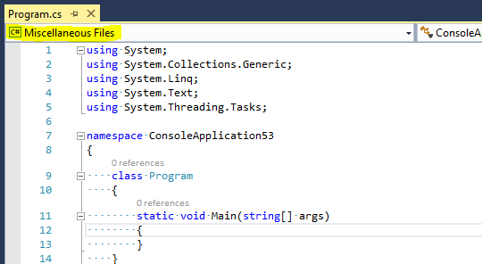
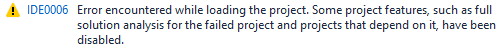
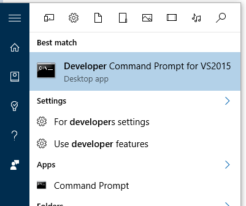

When you open a C# or VB.NET project in Visual Studio, Visual Studio needs to interpret your project file to understand
the compiler settings and references you have. In most cases, this is easy, but if you've manually customized your
project files, or are consuming additional SDKs or NuGet packages, things can sometimes go wrong. This will help you
debug the cause of what went wrong.

## How do I tell if this guide is for me?

There are a few ways to tell:

1. A Microsoft engineer asked you to follow these steps.

2. In any version of Visual Studio, look to see if the first project drop down above a text file says "Miscellaneous Files" instead of
   the name of the project you expected to see:

    

3. If you're using Visual Studio 2015 Update 2 or later, look for warning IDE0006 in the error list:
    

## How do I get log files to diagnose what is happening in Visual Studio 2019?

1. Install the [Project System Tools Extension from the Visual Studio Marketplace](https://marketplace.visualstudio.com/items?itemName=VisualStudioProductTeam.ProjectSystemTools)
2. Restart Visual Studio as a part of installing the extension.
3. Close Visual Studio again, find your solution file on disk, and delete the .vs hidden folder that is alongside your solution. You'll have to show hidden files if you don't see it.
4. Open Visual Studio. Don't open your Solution yet.
5. Go View > Other Windows > Build Logging.
6. In the Build Logging window, click the start button.
7. Open your solution, and open the file you're having troubles with. You should see various entries appearing in the Build Logging window.
8. Take a screenshot of Visual Studio after you've opened the file you're having troubles with. Save this screenshot and attach it to your feedback item.
9. Click the stop button in the Build Logging window.
10. Select all the logs by clicking on one and then pressing Ctrl+A to Select All.
11. Right click, choose Save Logs. Save them, and attach them to your feedback item.
12. Go under the Tools menu, and choose Log Roslyn Workspace Structure. This will prompt to save an XML file, and the process may take some time. Attach this item to your feedback item. If the file is large, you may wish to zip it into a .zip file if the extension didn't make a .zip file for you.

## How do I get log files to diagnose what is happening in Visual Studio 2015?

1. Close Visual Studio.
2. Find your solution file on disk, and delete the .vs hidden folder that is alongside your solution.
3. Run a "developer command prompt". The easiest way to find it is just to search in the start menu:

    

4. Type `set TRACEDESIGNTIME=true` in this prompt.
5. Type `devenv` to run Visual Studio again from this prompt.
6. Open your solution.

Now, open your `%TEMP%` directory, which should be at a path like `C:\Users\<username>\AppData\Local\Temp`. In this
you'll see a bunch of files that end in `.designtime.log`.

- If you are running Visual Studio 2015 Update 2 or later, the files start with the name of a project in your solution,
  then an underscore, and then the name of the underlying build target being invoked by Visual Studio. Look for the
  files named `YourProject_Compile_#####.designtime.log`, where ##### is just a random identifier generated to keep the
  log files unique. Look for log files with "Compile" in the name.

- If you're running Visual Studio 2015 Update 1 or sooner, it's a bit trickier. The files are just named with random
  GUIDs, but still end in .designtime.log. If you open a log file, you'll see first a section showing variables, and
  then a line like this:

  `Project "c:\Projects\ConsoleApplication53\ConsoleApplication53\ConsoleApplication53.csproj" (Compile target(s)):`

  This shows the full name of the project, along with the target (Compile) being ran. Once again, look for the "Compile"
  target. There are files with other targets being invoked, you'll want to ignore those. You might want to consider
  using Visual Studio's "find in files" feature to find the right file.

Once you've found the right log file for your project, scroll to the very end and verify there was an error. You should
see something like this:

    Build FAILED.

    c:\ConsoleApplication53\ConsoleApplication53\ConsoleApplication53.csproj(17,5): error : An error occured!
        0 Warning(s)
        1 Error(s)

Notably, you should see `Build FAILED` and then one or more errors. This is summary of the errors in the log, so if you
do see an error, you should now search this log file for that error and find out where it is. Hopefully, the error will
give some sort of a hint; it's looking for some file or SDK that's not installed, or some permissions were denied, etc.
In that case, you can follow up with the owner of that to figure out what went wrong.

If it seems to be a problem with Visual Studio itself, you might want to file a bug on
[the Roslyn GitHub project](https://github.com/dotnet/roslyn) have a Visual Studio engineer take a look. Make sure you
provide the full log and if possible your project file, since we may need both to diagnose the problem.
