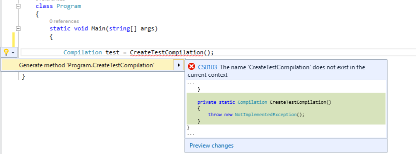

## Prerequisites
* [Visual Studio 2015](https://www.visualstudio.com/downloads)
* [.NET Compiler Platform SDK](https://aka.ms/roslynsdktemplates)
* [Getting Started C# Syntax Analysis](https://github.com/dotnet/roslyn/blob/main/docs/wiki/Getting-Started-C%23-Syntax-Analysis.md)
* [Getting Started C# Semantic Analysis](https://github.com/dotnet/roslyn/blob/main/docs/wiki/Getting-Started-C%23-Semantic-Analysis.md)

## Introduction
This walkthrough builds on concepts and techniques explored in the **Getting Started: Syntax Analysis** and **Getting Started: Semantic Analysis** walkthroughs. If you haven't already, it's strongly advised that you complete those walkthroughs before beginning this one.

In this walkthrough, you'll explore techniques for creating and transforming syntax trees. In combination with the techniques you learned in previous Getting Started walkthroughs, you will create your first command-line refactoring!

## Immutability and the .NET Compiler Platform
A fundamental tenet of the .NET Compiler Platform is immutability. Because immutable data structures cannot be changed after they are created, they can be safely shared and analyzed by multiple consumers simultaneously without the dangers of one tool affecting another in unpredictable ways. No locks or other concurrency measures needed. This applies to syntax trees, compilations, symbols, semantic models, and every other data structure you'll encounter. Instead of modification, new objects are created based on specified differences to the old ones.  You'll apply this concept to syntax trees to create tree transformations!

## Creating and "Modifying" Trees
### Creating Nodes with Factory Methods
To create **SyntaxNodes** you must use the **SyntaxFactory** class factory methods. For each kind of node, token, or trivia there is a factory method which can be used to create an instance of that type. By composing nodes hierarchically in a bottom-up fashion you can create syntax trees. 

#### Example - Creating a SyntaxNode using Factory Methods
This example uses the **SyntaxFactory** class methods to construct a **NameSyntax** representing the **System.Collections.Generic** namespace.

**NameSyntax** is the base class for four types of names that appear in C#: 

* **IdentifierNameSyntax** which represents simple single identifier names like **System** and **Microsoft**
* **GenericNameSyntax** which represents a generic type or method name such as **List<int>**
* **QualifiedNameSyntax** which represents a qualified name of the form ```<left-name>.<right-identifier-or-generic-name>``` such as **System.IO**
* **AliasQualifiedNameSyntax** which represents a name using an assembly extern alias such a **LibraryV2::Foo**
By composing these names together you can create any name which can appear in the C# language. 

1) Create a new C# **Stand-Alone Code Analysis Tool** project.
  * In Visual Studio, choose **File -> New -> Project...** to display the New Project dialog.
  * Under **Visual C# -> Extensibility**, choose **Stand-Alone Code Analysis Tool**.
  * Name your project "**ConstructionCS**" and click OK. 

2) Add the following using directive to the top of the file to import the factory methods of the **SyntaxFactory** class so that we can use them later without qualifying them:
```C#
using static Microsoft.CodeAnalysis.CSharp.SyntaxFactory;
```

3) Move your cursor to the line containing the **closing brace** of your **Main** method and set a breakpoint there.
  * In Visual Studio, choose **Debug -> Toggle Breakpoint**.

4) Run the program.
  * In Visual Studio, choose **Debug -> Start Debugging**.

5) First create a simple **IdentifierNameSyntax** representing the name of the **System** namespace and assign it to a variable. As you build up a **QualifiedNameSyntax** from this node you will reuse this variable so declare this variable to be of type **NameSyntax** to allow it to store both types of **SyntaxNode** - **DO NOT** use type inference:
```C#
            NameSyntax name = IdentifierName("System");
```

6) Set this statement as the next statement to be executed and execute it.
  * Right-click this line and choose **Set Next Statement**.
  * In Visual Studio, choose **Debug -> Step Over**, to execute this statement and initialize the new variable.
  * You will need to repeat this process for each of the following steps as we introduce new variables and inspect them with the debugger.

7) Open the **Immediate Window**.
  * In Visual Studio, choose **Debug -> Windows -> Immediate**.

8) Using the Immediate Window, type the expression **name.ToString()** and press Enter to evaluate it. You should see the string "**System**" as the result. 

9) Next, construct a **QualifiedNameSyntax** using this **name** node as the **left** of the name and a new **IdentifierNameSyntax** for the **Collections** namespace as the **right** side of the **QualifiedNameSyntax**:
```C#
            name = QualifiedName(name, IdentifierName("Collections"));
```

10) Execute this statement to set the **name** variable to the new **QualifiedNameSyntax** node.

11) Using the Immediate Window, evaluate the expression **name.ToString()**. It should evaluate to "**System.Collections**".

12) Continue this pattern by building another **QualifiedNameSyntax** node for the **Generic** namespace:
```C#
            name = QualifiedName(name, IdentifierName("Generic"));
```

13) Execute this statement and again use the Immediate Window to observe that **name.ToString()** now evaluates to the fully qualified name "**System.Collections.Generic**". 

### Modifying Nodes with With* and ReplaceNode Methods
Because the syntax trees are immutable, the **Syntax API** provides no direct mechanism for modifying an existing syntax tree after construction. However, the **Syntax API** does provide methods for producing new trees based on specified changes to existing ones. Each concrete class that derives from **SyntaxNode** defines **With*** methods which you can use to specify changes to its child properties. Additionally, the **ReplaceNode** extension method can be used to replace a descendent node in a subtree. Without this method updating a node would also require manually updating its parent to point to the newly created child and repeating this process up the entire tree - a process known as _re-spining_ the tree. 

#### Example - Transformations using the With* and ReplaceNode methods.
This example uses the **WithName** method to replace the name in a **UsingDirectiveSyntax** node with the one constructed above.

1) Continuing from the previous example above, add this code to parse a sample code file:
```C#
            SyntaxTree tree = CSharpSyntaxTree.ParseText(
@"using System;
using System.Collections;
using System.Linq;
using System.Text;
 
namespace HelloWorld
{
    class Program
    {
        static void Main(string[] args)
        {
            Console.WriteLine(""Hello, World!"");
        }
    }
}");
 
            var root = (CompilationUnitSyntax)tree.GetRoot();
```

  * Note that the file uses the **System.Collections** namespace and not the **System.Collections.Generic** namespace. 

2) Execute these statements.

3) Create a new **UsingDirectiveSyntax** node using the **UsingDirectiveSyntax.WithName** method to update the "**System.Collections**" name with the name we created above:
```C#
            var oldUsing = root.Usings[1];
            var newUsing = oldUsing.WithName(name);
```

4) Using the Immediate Window, evaluate the expression **root.ToString()** and observe that the original tree has not been changed to contain this new updated node.

5) Add the following line using the **ReplaceNode** extension method to create a new tree, replacing the existing import with the updated **newUsing** node, and store the new tree in the existing **root** variable:
```C#
            root = root.ReplaceNode(oldUsing, newUsing);
```

6) Execute this statement.

7) Using the Immediate Window evaluate the expression **root.ToString()** this time observing that the tree now correctly imports the **System.Collections.Generic** namespace.

8) Stop the program.
  * In Visual Studio, choose **Debug -> Stop debugging**.

9) Your **Program.cs** file should now look like this:
```C#
using System;
using System.Collections.Generic;
using System.Linq;
using System.Text;
using System.Threading.Tasks;
using Microsoft.CodeAnalysis;
using Microsoft.CodeAnalysis.CSharp;
using Microsoft.CodeAnalysis.CSharp.Syntax;
using static Microsoft.CodeAnalysis.CSharp.SyntaxFactory;
 
namespace ConstructionCS
{
    class Program
    {
        static void Main(string[] args)
        {
            NameSyntax name = IdentifierName("System");
            name = QualifiedName(name, IdentifierName("Collections"));
            name = QualifiedName(name, IdentifierName("Generic"));
 
            SyntaxTree tree = CSharpSyntaxTree.ParseText(
@"using System;
using System.Collections;
using System.Linq;
using System.Text;
 
namespace HelloWorld
{
    class Program
    {
        static void Main(string[] args)
        {
            Console.WriteLine(""Hello, World!"");
        }
    }
}");
 
            var root = (CompilationUnitSyntax)tree.GetRoot();
 
            var oldUsing = root.Usings[1];
            var newUsing = oldUsing.WithName(name);
 
            root = root.ReplaceNode(oldUsing, newUsing);
        }
    }
}
```

### Transforming Trees using SyntaxRewriters
The **With*** and **ReplaceNode** methods provide convenient means to transform individual branches of a syntax tree. However, often it may be necessary to perform multiple transformations on a syntax tree in concert. The **SyntaxRewriter** class is a subclass of **SyntaxVisitor** which can be used to apply a transformation to a specific type of **SyntaxNode**. It is also possible to apply a set of transformations to multiple types of **SyntaxNode** wherever they appear in a syntax tree. The following example demonstrates this in a naive implementation of a command-line refactoring which removes explicit types in local variable declarations anywhere where type inference could be used. This example makes use of techniques discussed in this walkthrough as well as the **Getting Started: Syntactic Analysis** and **Getting Started: Semantic Analysis** walkthroughs. 

#### Example - Creating a SyntaxRewriter to transform syntax trees.
1) Create a new C# **Stand-Alone Code Analysis Tool** project.
  * In Visual Studio, choose **File -> New -> Project...** to display the New Project dialog.
  * Under **Visual C# -> Extensibility**, choose **Stand-Alone Code Analysis Tool**.
  * Name your project "**TransformationCS**" and click OK. 

2) Insert the following **using** directive at the top of your **Program.cs** file:
```C#
using System.IO;
using Microsoft.CodeAnalysis;
using Microsoft.CodeAnalysis.CSharp; 
```

3) Add a new class file to the project.
  * In Visual Studio, choose **Project -> Add Class...** 
  * In the "Add New Item" dialog type **TypeInferenceRewriter.cs** as the filename.

4) Add the following using directives.
```C#
using Microsoft.CodeAnalysis;
using Microsoft.CodeAnalysis.CSharp;
using Microsoft.CodeAnalysis.CSharp.Syntax;
using static Microsoft.CodeAnalysis.CSharp.SyntaxFactory;
```

5) Make the **TypeInferenceRewriter** class extend the **CSharpSyntaxRewriter** class:
```C#
    public class TypeInferenceRewriter : CSharpSyntaxRewriter
    {
```

6) Add the following code to declare a private read-only field to hold a **SemanticModel** and initialize it from the constructor. You will need this field later on to determine where type inference can be used:
```C#
        private readonly SemanticModel SemanticModel;
 
        public TypeInferenceRewriter(SemanticModel semanticModel)
        {
            this.SemanticModel = semanticModel;
        }
```

7) Override the **VisitLocalDeclarationStatement** method:
```C#
        public override SyntaxNode VisitLocalDeclarationStatement(
                                       LocalDeclarationStatementSyntax node)
        {

        }
```

  * Note that the **VisitLocalDeclarationStatement** method returns a **SyntaxNode**, not **LocalDeclarationStatementSyntax**. In this example you'll return another **LocalDeclarationStatementSyntax** node based on the existing one. In other scenarios one kind of node may be replaced by another kind of node entirely - or even removed.

8) For the purpose of this example you'll only handle local variable declarations, though type inference may be used in **foreach** loops, **for** loops, LINQ expressions, and lambda expressions. Furthermore this rewriter will only transform declarations of the simplest form:
```C#
Type variable = expression;
```

The following forms of variable declarations in C# are either incompatible with type inference or left as an exercise to the reader.

```C#
// Multiple variables in a single declaration.
Type variable1 = expression1, 
     variable2 = expression2; 
// No initializer.
Type variable; 
```

9) Add the following code to the body of the **VisitLocalDeclarationStatement** method to skip rewriting these forms of declarations:
```C#
            if (node.Declaration.Variables.Count > 1) 
            {
                return node;
            }
            if (node.Declaration.Variables[0].Initializer == null)
            {
                return node;
            }
```

  * Note that returning the **node** parameter unmodified results in no rewriting taking place for that node. 

10) Add these statements to extract the type name specified in the declaration and bind it using the **SemanticModel** field to obtain a type symbol.
```C#
            VariableDeclaratorSyntax declarator = node.Declaration.Variables.First();
            TypeSyntax variableTypeName = node.Declaration.Type;
            
            ITypeSymbol variableType = 
                           (ITypeSymbol)SemanticModel.GetSymbolInfo(variableTypeName)
                                                     .Symbol;
```

11) Now, add this statement to bind the initializer expression: 
```C#
            TypeInfo initializerInfo = 
                         SemanticModel.GetTypeInfo(declarator
                                                   .Initializer
                                                   .Value);
```

12) Finally, add the following **if** statement to replace the existing type name with the **var** keyword if the type of the initializer expression matches the type specified:
```C#
            if (variableType == initializerInfo.Type)
            {
                TypeSyntax varTypeName = 
                               IdentifierName("var")
                                     .WithLeadingTrivia(
                                          variableTypeName.GetLeadingTrivia())
                                     .WithTrailingTrivia(
                                          variableTypeName.GetTrailingTrivia());
 
                return node.ReplaceNode(variableTypeName, varTypeName);
            }
            else
            {
                return node;
            }
```

  * Note that this conditional is required because if the types don't match the declaration may be casting the initializer expression to a base class or interface. Removing the explicit type in these cases would change the semantics of a program.
  * Note also that **var** is specified as an identifier rather than a keyword because **var** is a contextual keyword.
  * Note that the leading and trailing trivia (whitespace) is transferred from the old type name to the **var** keyword to maintain vertical whitespace and indentation.
  * Note also that it's simpler to use **ReplaceNode** rather than **With*** to transform the **LocalDeclarationStatementSyntax** because the type name is actually the grandchild of the declaration statement. 

13) Your **TypeInferenceRewriter.cs** file should now look like this:
```C#
using System;
using System.Collections.Generic;
using System.Linq;
using System.Text;
using System.Threading.Tasks;
using Microsoft.CodeAnalysis;
using Microsoft.CodeAnalysis.CSharp; 
using Microsoft.CodeAnalysis.CSharp.Syntax;
using static Microsoft.CodeAnalysis.CSharp.SyntaxFactory;
 
namespace TransformationCS
{
    public class TypeInferenceRewriter : CSharpSyntaxRewriter
    {
        private readonly SemanticModel SemanticModel;
 
        public TypeInferenceRewriter(SemanticModel semanticModel)
        {
            this.SemanticModel = semanticModel;
        }
 
        public override SyntaxNode VisitLocalDeclarationStatement(
                                       LocalDeclarationStatementSyntax node)
        {
            if (node.Declaration.Variables.Count > 1) 
            {
                return node;
            }
            if (node.Declaration.Variables[0].Initializer == null)
            {
                return node;
            }
 
            VariableDeclaratorSyntax declarator = node.Declaration.Variables.First();
            TypeSyntax variableTypeName = node.Declaration.Type;
            
            ITypeSymbol variableType = 
                           (ITypeSymbol)SemanticModel.GetSymbolInfo(variableTypeName)
                                                    .Symbol;
            
            TypeInfo initializerInfo = 
                         SemanticModel.GetTypeInfo(declarator
                                                   .Initializer
                                                   .Value);
            
            if (variableType == initializerInfo.Type)
            {
                TypeSyntax varTypeName = 
                               IdentifierName("var")
                                     .WithLeadingTrivia(
                                          variableTypeName.GetLeadingTrivia())
                                     .WithTrailingTrivia(
                                          variableTypeName.GetTrailingTrivia());
 
                return node.ReplaceNode(variableTypeName, varTypeName);
            }
            else
            {
                return node;
            }
        }
    }
}
```

14) Return to your **Program.cs** file.

15) To test your **TypeInferenceRewriter** you'll need to create a test **Compilation** to obtain the **SemanticModels** required for the type inference analysis. You'll do this step last. In the meantime declare a placeholder variable representing your test Compilation:
```C#
            Compilation test = CreateTestCompilation();
```

16) After pausing a moment you should see an error squiggle appear reporting that no **CreateTestCompilation** method exists. Press **Ctrl+Period** to open the light-bulb and then press Enter to invoke the **Generate Method Stub** command. This will generate a method stub for the **CreateTestCompilation** method in **Program**. You'll come back to fill this in later:


17) Next, write the following code to iterate over each **SyntaxTree** in the test **Compilation.** For each one initialize a new **TypeInferenceRewriter** with the **SemanticModel** for that tree:
```C#
            foreach (SyntaxTree sourceTree in test.SyntaxTrees)
            {
                SemanticModel model = test.GetSemanticModel(sourceTree);
 
                TypeInferenceRewriter rewriter = new TypeInferenceRewriter(model);
            }
```

18) Lastly, inside the **foreach** statement you just created, add the following code to perform the transformation on each source tree and conditionally write out the new transformed tree if any edits were made. Remember, your rewriter should only modify a tree if it encountered one or more local variable declarations that could be simplified using type inference:
```C#
                SyntaxNode newSource = rewriter.Visit(sourceTree.GetRoot());

                if (newSource != sourceTree.GetRoot())
                {
                    File.WriteAllText(sourceTree.FilePath, newSource.ToFullString());
                }
```

19) You're almost done! There's just once step left. Creating a test **Compilation**. Since you haven't been using type inference at all during this walkthrough it would have made a perfect test case. Unfortunately, creating a Compilation from a C# project file is beyond the scope of this walkthrough. But fortunately, if you've been following instructions very carefully there's hope. Replace the contents of the **CreateTestCompilation** method with the following code. It creates a test compilation  that coincidentally matches the project described in this walkthrough:
```C#
            String programPath = @"..\..\Program.cs";
            String programText = File.ReadAllText(programPath);
            SyntaxTree programTree =
                           CSharpSyntaxTree.ParseText(programText)
                                           .WithFilePath(programPath);

            String rewriterPath = @"..\..\TypeInferenceRewriter.cs";
            String rewriterText = File.ReadAllText(rewriterPath);
            SyntaxTree rewriterTree =
                           CSharpSyntaxTree.ParseText(rewriterText)
                                           .WithFilePath(rewriterPath);

            SyntaxTree[] sourceTrees = { programTree, rewriterTree };

            MetadataReference mscorlib =
                    MetadataReference.CreateFromFile(typeof(object).Assembly.Location);
            MetadataReference codeAnalysis =
                    MetadataReference.CreateFromFile(typeof(SyntaxTree).Assembly.Location);
            MetadataReference csharpCodeAnalysis =
                    MetadataReference.CreateFromFile(typeof(CSharpSyntaxTree).Assembly.Location);

            MetadataReference[] references = { mscorlib, codeAnalysis, csharpCodeAnalysis };

            return CSharpCompilation.Create("TransformationCS",
                                            sourceTrees,
                                            references,
                                            new CSharpCompilationOptions(
                                                    OutputKind.ConsoleApplication));
```

20) Your **Program.cs** file should look like this now:
```C#
using System;
using System.Collections.Generic;
using System.IO;
using System.Linq;
using System.Text;
using System.Threading.Tasks;
using Microsoft.CodeAnalysis;
using Microsoft.CodeAnalysis.CSharp;

namespace TransformationCS
{
    internal class Program
    {
        private static void Main()
        {
            Compilation test = CreateTestCompilation();

            foreach (SyntaxTree sourceTree in test.SyntaxTrees)
            {
                SemanticModel model = test.GetSemanticModel(sourceTree);

                TypeInferenceRewriter rewriter = new TypeInferenceRewriter(model);

                SyntaxNode newSource = rewriter.Visit(sourceTree.GetRoot());

                if (newSource != sourceTree.GetRoot())
                {
                    File.WriteAllText(sourceTree.FilePath, newSource.ToFullString());
                }
            }
        }

        private static Compilation CreateTestCompilation()
        {
            String programPath = @"..\..\Program.cs";
            String programText = File.ReadAllText(programPath);
            SyntaxTree programTree =
                           CSharpSyntaxTree.ParseText(programText)
                                           .WithFilePath(programPath);

            String rewriterPath = @"..\..\TypeInferenceRewriter.cs";
            String rewriterText = File.ReadAllText(rewriterPath);
            SyntaxTree rewriterTree =
                           CSharpSyntaxTree.ParseText(rewriterText)
                                           .WithFilePath(rewriterPath);


            SyntaxTree[] sourceTrees = { programTree, rewriterTree };

            MetadataReference mscorlib =
                    MetadataReference.CreateFromFile(typeof(object).Assembly.Location);
            MetadataReference codeAnalysis =
                    MetadataReference.CreateFromFile(typeof(SyntaxTree).Assembly.Location);
            MetadataReference csharpCodeAnalysis =
                    MetadataReference.CreateFromFile(typeof(CSharpSyntaxTree).Assembly.Location);

            MetadataReference[] references = { mscorlib, codeAnalysis, csharpCodeAnalysis };

            return CSharpCompilation.Create("TransformationCS",
                                            sourceTrees,
                                            references,
                                            new CSharpCompilationOptions(
                                                    OutputKind.ConsoleApplication));
        }
    }
}
```

21) Cross your fingers and run the project. 
  * In Visual Studio, choose **Debug -> Start Debugging**.

22) You should be prompted by Visual Studio that the files in your project have changed. Click "**Yes to All**" to reload the modified files. Examine them to observe your awesomeness :)
  * Note how much cleaner the code looks without all those explicit and redundant type specifiers. 

23) Congratulations! You've just used the **Compiler APIs** to write your own refactoring that searches all files in a C# project for certain syntactic patterns, analyzes the semantics of source code that matches those patterns, and transforms it. You're now officially a Refactoring guru!