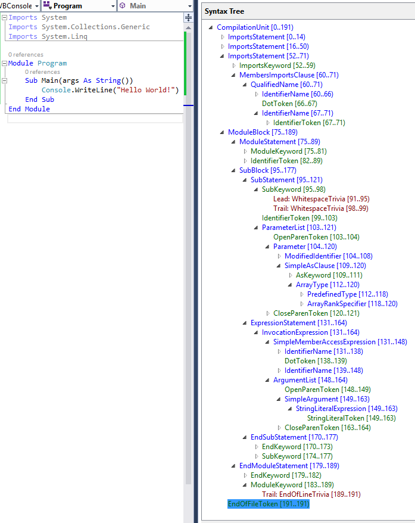

## Prerequisites
* [Visual Studio 2015](https://www.visualstudio.com/downloads)
* [.NET Compiler Platform SDK](https://aka.ms/roslynsdktemplates)

## Introduction
Today, the Visual Basic and C# compilers are black boxes - text goes in and bytes come out - with no transparency into the intermediate phases of the compilation pipeline. With the **.NET Compiler Platform** (formerly known as "Roslyn"), tools and developers can leverage the exact same data structures and algorithms the compiler uses to analyze and understand code with confidence that that information is accurate and complete.

In this walkthrough we'll explore the **Syntax API**. The **Syntax API** exposes the parsers, the syntax trees themselves, and utilities for reasoning about and constructing them.

## Understanding Syntax Trees
The **Syntax API** exposes the syntax trees the compilers use to understand Visual Basic and C# programs. They are produced by the same parser that runs when a project is built or a developer hits F5. The syntax trees have full-fidelity with the language; every bit of information in a code file is represented in the tree, including things like comments or whitespace. Writing a syntax tree to text will reproduce the exact original text that was parsed. The syntax trees are also immutable; once created a syntax tree can never be changed. This means consumers of the trees can analyze the trees on multiple threads, without locks or other concurrency measures, with the security that the data will never change.

The four primary building blocks of syntax trees are:

* The **SyntaxTree** class, an instance of which represents an entire parse tree. **SyntaxTree** is an abstract class which has language-specific derivatives. To parse syntax in a particular language you will need to use the parse methods on the **VisualBasicSyntaxTree** (or **CSharpSyntaxTree**) class.
* The **SyntaxNode** class, instances of which represent syntactic constructs such as declarations, statements, clauses, and expressions.
* The **SyntaxToken** structure, which represents an individual keyword, identifier, operator, or punctuation.
* And lastly the **SyntaxTrivia** structure, which represents syntactically insignificant bits of information such as the whitespace between tokens, preprocessing directives, and comments.
**SyntaxNodes** are composed hierarchically to form a tree that completely represents everything in a fragment of Visual Basic or C# code. For example, were you to examine the following Visual Basic source file using the Syntax Visualizer (In Visual Studio, choose **View -> Other Windows -> Syntax Visualizer**) it tree view would look like this: 

**SyntaxNode**: Blue | **SyntaxToken**: Green | **SyntaxTrivia**: Red


By navigating this tree structure you can find any statement, expression, token, or bit of whitespace in a code file!

## Traversing Trees
### Manual Traversal
The following steps use **Edit and Continue** to demonstrate how to parse VB source text and find a parameter declaration contained in the source.

#### Example - Manually traversing the tree
1) Create a new Visual Basic **Stand-Alone Code Analysis Tool** project.
  * In Visual Studio, choose **File -> New -> Project...** to display the New Project dialog.
  * Under **Visual Basic -> Extensibility**, choose **Stand-Alone Code Analysis Tool**.
  * Name your project "**GettingStartedVB**" and click OK.

2) Enter the following line at the top of your **Module1.vb** file:
```VB.NET
Option Strict Off
```

  * Some readers may run with **Option Strict** turned **On** by default at the project level. Turning **Option Strict** **Off** in this walkthrough simplifies many of the examples by removing much of the casting required.

3) Enter the following code into your **Main** method:
```VB.NET
        Dim tree As SyntaxTree = VisualBasicSyntaxTree.ParseText(
"Imports System
Imports System.Collections
Imports System.Linq
Imports System.Text

Namespace HelloWorld
    Module Program
        Sub Main(args As String())
           Console.WriteLine(""Hello, World!"")
        End Sub
    End Module
End Namespace")

        Dim root As Syntax.CompilationUnitSyntax = tree.GetRoot()
```

4) Move your cursor to the line containing the **End Sub** of your **Main** method and set a breakpoint there.
  * In Visual Studio, choose **Debug -> Toggle Breakpoint**.

5) Run the program.
  * In Visual Studio, choose **Debug -> Start Debugging**.

6) Inspect the root variable in the debugger by hovering over it and expanding the datatip.
  * Note that its **Imports** property is a collection with four elements; one for each Import statement in the parsed text.
  * Note that the **KindText** of the root node is **CompilationUnit**.
  * Note that the **Members** collection of the **CompilationUnitSyntax** node has one element.

7) Insert the following statement at the end of the Main method to store the first member of the root **CompilationUnitSyntax** variable into a new variable:
```VB.NET
        Dim firstMember = root.Members(0)
```

8) Set this statement as the next statement to be executed and execute it.
  * Right-click this line and choose **Set Next Statement**.
  * In Visual Studio, choose **Debug -> Step Over**, to execute this statement and initialize the new variable.
  * You will need to repeat this process for each of the following steps as we introduce new variables and inspect them with the debugger.

9) Hover over the **firstMember** variable and expand the datatips to inspect it. 
  * Note that its **KindText** is **NamespaceBlock**.
  * Note that its run-time type is actually **NamespaceBlockSyntax**. 

10) Cast this node to **NamespaceBlockSyntax** and store it in a new variable:
```VB.NET
        Dim helloWorldDeclaration As Syntax.NamespaceBlockSyntax = firstMember
```

11) Execute this statement and examine the **helloWorldDeclaration** variable.
  * Note that like the **CompilationUnitSyntax**, **NamespaceBlockSyntax** also has a **Members** collection.

12) Examine the **Members** collection.
  * Note that it contains a single member. Examine it.
    * Note that its **KindText** is **ModuleBlock.**
    * Note that its run-time type is **ModuleBlockSyntax**.

13) Cast this node to **ModuleBlockSyntax** and store it in a new variable:
```VB.NET
        Dim programDeclaration As Syntax.ModuleBlockSyntax = 
                helloWorldDeclaration.Members(0)
```

14) Execute this statement.

15) Locate the **Main** declaration in the **programDeclaration.Members** collection and store it in a new variable:
```VB.NET
        Dim mainDeclaration As Syntax.MethodBlockSyntax = programDeclaration.Members(0)
```

16) Execute this statement and examine the members of the **MethodBlockSyntax** object.
  * Examine the **BlockStatement** property.
    * Note the **AsClause**, and **Identifier** properties.
    * Note the **ParameterList** property; examine it.
      * Note that it contains both the open and close parentheses of the parameter list in addition to the list of parameters themselves.
      * Note that the parameters are stored as a **SeparatedSyntaxList**(**Of** **ParameterSyntax**).
  * Note the **Statements** property.

17) Store the first parameter of the **Main** declaration in a variable. 
```VB.NET
        Dim argsParameter As Syntax.ParameterSyntax = 
                mainDeclaration.BlockStatement.ParameterList.Parameters(0)
```

18) Execute this statement and examine the **argsParameter** variable.
  * Examine the **Identifier** property; note that it is of type **ModifiedIdentifierSyntax**. This type represents a normal identifier with an optional nullable modifier (**x?**) and/or array rank specifier (**arr(,)**). 
  * Note that a **ModifiedIdentifierSyntax** has an **Identifier** property of the structure type **SyntaxToken**.
  * Examine the properties of the **Identifier** **SyntaxToken**; note that the text of the identifier can be found in the **ValueText** property.

19) Stop the program.
  * In Visual Studio, choose **Debug -> Stop Debugging**.

20) Your program should look like this now:
```VB.NET
Option Strict Off

Module Module1
 
    Sub Main()
 
        Dim tree As SyntaxTree = VisualBasicSyntaxTree.ParseText(
"Imports System
Imports System.Collections
Imports System.Linq
Imports System.Text

Namespace HelloWorld
    Module Program
        Sub Main(args As String())
           Console.WriteLine(""Hello, World!"")
        End Sub
    End Module
End Namespace")

        Dim root As Syntax.CompilationUnitSyntax = tree.GetRoot()
 
        Dim firstMember = root.Members(0)

        Dim helloWorldDeclaration As Syntax.NamespaceBlockSyntax = firstMember
 
        Dim programDeclaration As Syntax.ModuleBlockSyntax = 
                helloWorldDeclaration.Members(0)
 
        Dim mainDeclaration As Syntax.MethodBlockSyntax = programDeclaration.Members(0)
 
        Dim argsParameter As Syntax.ParameterSyntax = 
                mainDeclaration.BlockStatement.ParameterList.Parameters(0)
 
    End Sub
 
End Module
```

### Query Methods
In addition to traversing trees using the properties of the **SyntaxNode** derived classes you can also explore the syntax tree using the query methods defined on **SyntaxNode**. These methods should be immediately familiar to anyone familiar with XPath. You can use these methods with LINQ to quickly find things in a tree. 

#### Example - Using query methods
1) Using IntelliSense, examine the members of the **SyntaxNode** class through the root variable.
  * Note query methods such as **DescendantNodes**, **AncestorsAndSelf**, and **ChildNodes**.

2) Add the following statements to the end of the **Main** method. The first statement uses a LINQ expression and the **DescendantNodes** method to locate the same parameter as in the previous example:
```VB.NET
Dim firstParameters = From methodStatement In root.DescendantNodes().
                                                   OfType(Of Syntax.MethodStatementSyntax)()
                      Where methodStatement.Identifier.ValueText = "Main"
                      Select methodStatement.ParameterList.Parameters.First()
 
Dim argsParameter2 = firstParameters.First()
```

3) Start debugging the program.

4) Open the Immediate Window.
  * In Visual Studio, choose **Debug -> Windows -> Immediate**.

5) Using the Immediate window, type the expression **? argsParameter Is argsParameter2** and press enter to evaluate it. 
  * Note that the LINQ expression found the same parameter as manually navigating the tree.

6) Stop the program.

### SyntaxWalkers
Often you'll want to find all nodes of a specific type in a syntax tree, for example, every property declaration in a file. By extending the **VisualBasicSyntaxWalker** class and overriding the **VisitPropertyStatement** method, you can process every property declaration in a syntax tree without knowing its structure beforehand. **VisualBasicSyntaxWalker** is a specific kind of **SyntaxVisitor** which recursively visits a node and each of its children.

#### Example - Implementing a VisualBasicSyntaxWalker
This example shows how to implement a **VisualBasicSyntaxWalker** which examines an entire syntax tree and collects any **Imports** statements it finds which aren't importing a **System** namespace.

1) Create a new Visual Basic **Stand-Alone Code Analysis Tool** project; name it "**ImportsCollectorVB**".

3) Enter the following line at the top of your **Module1.vb** file:
```VB.NET
Option Strict Off
```

3) Enter the following code into your **Main** method:
```VB.NET
        Dim tree As SyntaxTree = VisualBasicSyntaxTree.ParseText(
"Imports Microsoft.VisualBasic
Imports System
Imports System.Collections
Imports Microsoft.Win32
Imports System.Linq
Imports System.Text
Imports Microsoft.CodeAnalysis
Imports System.ComponentModel
Imports System.Runtime.CompilerServices
Imports Microsoft.CodeAnalysis.VisualBasic

Namespace HelloWorld
    Module Program
        Sub Main(args As String())
           Console.WriteLine(""Hello, World!"")
        End Sub
    End Module
End Namespace")

        Dim root As Syntax.CompilationUnitSyntax = tree.GetRoot()
```

4) Note that this source text contains a long list of **Imports** statements.

5) Add a new class file to the project.
  * In Visual Studio, choose **Project -> Add Class...** 
  * In the "Add New Item" dialog type **ImportsCollector.vb** as the filename.

6) Enter the following lines at the top of your **ImportsCollector.vb** file:
```VB.NET
Option Strict Off
```

7) Make the new **ImportsCollector** class in this file extend the **VisualBasicSyntaxWalker** class:
```VB.NET
Public Class ImportsCollector
    Inherits VisualBasicSyntaxWalker
```

8) Declare a public read-only field in the **ImportsCollector** class; we'll use this variable to store the **ImportsStatementSyntax** nodes we find:
```VB.NET
    Public ReadOnly [Imports] As New List(Of Syntax.ImportsStatementSyntax)()
```

9) Override the **VisitSimpleImportsClause** method:
```VB.NET
    Public Overrides Sub VisitSimpleImportsClause(
                             node As SimpleImportsClauseSyntax
                         )
 
    End Sub
```

10) Using IntelliSense, examine the **SimpleImportsClauseSyntax** class through the **node** parameter of this method.
  * Note the **Name** property of type **NameSyntax**; this stores the name of the namespace being imported.

11) Replace the code in the **VisitSimpleImportsClause** method with the following to conditionally add the found **node** to the **[Imports]** collection if **Name** doesn't refer to the **System** namespace or any of its descendant namespaces:
```VB.NET
        If node.Name.ToString() = "System" OrElse
           node.Name.ToString().StartsWith("System.") Then Return
 
        [Imports].Add(node.Parent)
```

12) The **ImportsCollector.vb** file should now look like this:
```VB.NET
Option Strict Off

Public Class ImportsCollector
    Inherits VisualBasicSyntaxWalker
 
    Public ReadOnly [Imports] As New List(Of Syntax.ImportsStatementSyntax)()
 
    Public Overrides Sub VisitSimpleImportsClause(
                             node As SimpleImportsClauseSyntax
                         )
 
        If node.Name.ToString() = "System" OrElse
           node.Name.ToString().StartsWith("System.") Then Return
 
        [Imports].Add(node.Parent)
 
    End Sub
End Class
```

13) Return to the **Module1.vb** file.

14) Add the following code to the end of the **Main** method to create an instance of the **ImportsCollector**, use that instance to visit the root of the parsed tree, and iterate over the **ImportsStatementSyntax** nodes collected and print their names to the **Console**:
```VB.NET
        Dim visitor As New ImportsCollector()
        visitor.Visit(root)
 
        For Each statement In visitor.Imports
            Console.WriteLine(statement)
        Next
```

15) Your **Module1.vb** file should now look like this:
```VB.NET
Option Strict Off

Module Module1
 
    Sub Main()
 
        Dim tree As SyntaxTree = VisualBasicSyntaxTree.ParseText(
"Imports Microsoft.VisualBasic
Imports System
Imports System.Collections
Imports Microsoft.Win32
Imports System.Linq
Imports System.Text
Imports Microsoft.CodeAnalysis
Imports System.ComponentModel
Imports System.Runtime.CompilerServices
Imports Microsoft.CodeAnalysis.VisualBasic
 
Namespace HelloWorld
    Module Program
        Sub Main(args As String())
           Console.WriteLine(""Hello, World!"")
        End Sub
    End Module
End Namespace")

        Dim root As Syntax.CompilationUnitSyntax = tree.GetRoot()
 
        Dim visitor As New ImportsCollector()
        visitor.Visit(root)
 
        For Each statement In visitor.Imports
            Console.WriteLine(statement)
        Next
 
    End Sub
 
End Module
```

16) Press **Ctrl+F5** to run the program without debugging it. You should see the following output:
```
Imports Microsoft.VisualBasic
Imports Microsoft.Win32
Imports Microsoft.CodeAnalysis
Imports Microsoft.CodeAnalysis.VisualBasic
Press any key to continue . . .
```

17) Observe that the walker has located all four non-**System** namespace **Imports** statements.

18) Congratulations! You've just used the **Syntax API** to locate specific kinds of VB statements and declarations in VB source code.