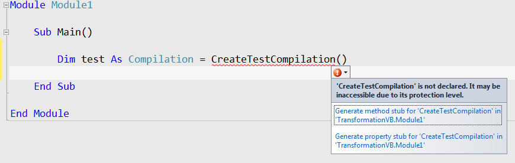

## Prerequisites
* [Visual Studio 2015](https://www.visualstudio.com/downloads)
* [.NET Compiler Platform SDK](https://aka.ms/roslynsdktemplates)
* [Getting Started VB Syntax Analysis](https://github.com/dotnet/roslyn/blob/main/docs/wiki/Getting-Started-VB-Syntax-Analysis.md)
* [Getting Started VB Semantic Analysis](https://github.com/dotnet/roslyn/blob/main/docs/wiki/Getting-Started-VB-Semantic-Analysis.md)

## Introduction
This walkthrough builds on concepts and techniques explored in the **Getting Started: Syntax Analysis** and **Getting Started: Semantic Analysis** walkthroughs. If you haven't already, it's strongly advised that you complete those walkthroughs before beginning this one.

In this walkthrough, you'll explore techniques for creating and transforming syntax trees. In combination with the techniques you learned in previous **Getting Started** walkthroughs, you will create your first command-line refactoring!

## Immutability and the .NET Compiler Platform
A fundamental tenet of the .NET Compiler Platform is immutability. Because immutable data structures cannot be changed after they are created, they can be safely shared and analyzed by multiple consumers simultaneously without the dangers of one tool affecting another in unpredictable ways. No locks or other concurrency measures needed. This applies to syntax trees, compilations, symbols, semantic models, and every other data structure you'll encounter. Instead of modification, new objects are created based on specified differences to the old ones.  You'll apply this concept to syntax trees to create tree transformations!

## Creating and "Modifying" Trees
### Creating Nodes with Factory Methods
To create **SyntaxNodes** you must use the **SyntaxFactory** class factory methods. For each kind of node, token, or trivia there is a factory method which can be used to create an instance of that type. By composing nodes hierarchically in a bottom-up fashion you can create syntax trees. 

#### Example - Creating a SyntaxNode using Factory Methods
This example uses the **SyntaxFactory** class factory methods to construct a **NameSyntax** representing the **System.Collections.Generic** namespace.

**NameSyntax** is the base class for four types of names that appear in VB: 

* **IdentifierNameSyntax** which represents simple single identifier names like **System** and **Microsoft**
* **GenericNameSyntax** which represents a generic type or method name such as **List(Of Integer)**
* **QualifiedNameSyntax** which represents a qualified name of the form ```<left-name>.<right-identifier-or-generic-name>``` such as **System.IO**
* **GlobalNameSyntax** which represents the name of the **Global** namespace.
By composing these names together you can create any name which can appear in the VB language. 

1) Create a new Visual Basic **Stand-Alone Code Analysis Tool** project.
  * In Visual Studio, choose **File -> New -> Project...** to display the New Project dialog.
  * Under **Visual Basic -> Extensibility**, choose **Stand-Alone Code Analysis Tool**.
  * Name your project "**ConstructionVB**" and click OK. 

3) Enter the following line at the top of your **Module1.vb** file:
```VB.NET
Option Strict Off
```

  * Some readers may run with **Option Strict** turned **On** by default at the project level. Turning **Option Strict** **Off** in this walkthrough simplifies many of the examples by removing much of the casting required.

4) Add the following Imports statement to the top of the file to import the factory methods of the **SyntaxFactory** class so that we can use them later without qualifying them:
```VB.NET
Imports Microsoft.CodeAnalysis.VisualBasic.SyntaxFactory
```

5) Move your cursor to the line containing the **End Sub** of your **Main** method and set a breakpoint there.
  * In Visual Studio, choose **Debug -> Toggle Breakpoint**.

6) Run the program.
  * In Visual Studio, choose **Debug -> Start Debugging**.

7) Inside the Main method, create a simple **IdentifierNameSyntax** representing the name of the **System** namespace and assign it to a variable. As you build up a **QualifiedNameSyntax** from this node you will reuse this variable so declare this variable to be of type **NameSyntax** to allow it to store both types of **SyntaxNode** - **DO NOT** use type inference:
```VB.NET
        Dim name As NameSyntax = IdentifierName("System")
```

8) Set this statement as the next statement to be executed and execute it.
  * Right-click this line and choose **Set Next Statement**.
  * In Visual Studio, choose **Debug -> Step Over**, to execute this statement and initialize the new variable.
  * You will need to repeat this process for each of the following steps as we introduce new variables and inspect them with the debugger.

9) Open the Immediate Window.
  * In Visual Studio, choose **Debug -> Windows -> Immediate**.

10) Using the Immediate window type the expression **? name.ToString()** and press Enter to evaluate it. You should see the string "**System**" as the result.
  * Note that you can also type statements in the Immediate Window to be executed. You must begin an expression evaluation in the Visual Basic Immediate Window with the question mark **?'** to differentiate expression evaluations from statement executions. 

11) Next, construct a **QualifiedNameSyntax** using this **name** node as the **left** of the name and a new **IdentifierNameSyntax** for the **Collections** namespace as the **right** side of the **QualifiedNameSyntax**:
```VB.NET
        name = QualifiedName(name, IdentifierName("Collections"))
```

12) Execute this statement to set the **name** variable to the new **QualifiedNameSyntax** node.

13) Using the Immediate Window evaluate the expression **? name.ToString()**. It should evaluate to "**System.Collections**".

14) Continue this pattern by building another **QualifiedNameSyntax** node for the **Generic** namespace:
```VB.NET
        name = QualifiedName(name, IdentifierName("Generic"))
```

15) Execute this statement and again use the Immediate Window to observe that **? name.ToString()** now evaluates to the fully qualified name "**System.Collections.Generic**". 

### Modifying Nodes with With* and ReplaceNode Methods
Because the syntax trees are immutable, the **Syntax API** provides no direct mechanism for modifying an existing syntax tree after construction. However, the **Syntax API** does provide methods for producing new trees based on specified changes to existing ones. Each concrete class that derives from **SyntaxNode** defines **With*** methods which you can use to specify changes to its child properties. Additionally, the **ReplaceNode** extension method can be used to replace a descendent node in a subtree. Without this method updating a node would also require manually updating its parent to point to the newly created child and repeating this process up the entire tree - a process known as _re-spining_ the tree. 

#### Example - Transformations using the With* and ReplaceNode methods.
This example uses the **WithName** method to replace the name in an **ImportsStatementSyntax** node with the one constructed above.

1) Continuing from the previous example above, add this code to parse a sample code file:
```VB.NET
        Dim tree = VisualBasicSyntaxTree.ParseText(
"Imports System
Imports System.Collections
Imports System.Linq
Imports System.Text
 
Namespace HelloWorld
    Module Module1
        Sub Main(args As String())
            Console.WriteLine(""Hello, World!"")
        End Sub
    End Module
End Namespace")
 
        Dim root As CompilationUnitSyntax = tree.GetRoot()
```

  * Note that the file uses the **System.Collections** namespace and not the **System.Collections.Generic** namespace. 

2) Execute these statements.

3) Create a new **SimpleImportsClauseNode** node using the **SimpleImportsClauseSyntax.WithName** method to update the "**System.Collections**" import with the name we created above:
```VB.NET
        Dim oldImportClause As SimpleImportsClauseSyntax = 
                root.Imports(1).ImportsClauses(0)
 
        Dim newImportClause = oldImportClause.WithName(name)
```

4) Execute these statements.

5) Using the Immediate Window evaluate the expression **? root.ToString()** and observe that the original tree has not been changed to contain this new updated node.

6) Add the following line using the **ReplaceNode** extension method to create a new tree, replacing the existing import with the updated **newImportClause** node, and store the new tree in the existing **root** variable:
```VB.NET
        root = root.ReplaceNode(oldImportClause, newImportClause)
```

7) Execute this statement.

8) Using the Immediate Window evaluate the expression **? root.ToString()** this time observing that the tree now correctly imports the **System.Collections.Generic** namespace.

9) Stop the program.
  * In Visual Studio, choose **Debug -> Stop Debugging**.

10) Your **Module1.vb** file should now look like this:
```VB.NET
Option Strict Off

Imports Microsoft.CodeAnalysis.VisualBasic.SyntaxFactory


Module Module1

    Sub Main()
        Dim name As NameSyntax = IdentifierName("System")

        name = QualifiedName(name, IdentifierName("Collections"))

        name = QualifiedName(name, IdentifierName("Generic"))

        Dim tree = VisualBasicSyntaxTree.ParseText(
"Imports System
Imports System.Collections
Imports System.Linq
Imports System.Text
 
Namespace HelloWorld
    Module Module1
        Sub Main(args As String())
            Console.WriteLine(""Hello, World!"")
        End Sub
    End Module
End Namespace")

        Dim root As CompilationUnitSyntax = tree.GetRoot()

        Dim oldImportClause As SimpleImportsClauseSyntax =
                root.Imports(1).ImportsClauses(0)

        Dim newImportClause = oldImportClause.WithName(name)

        root = root.ReplaceNode(oldImportClause, newImportClause)
    End Sub

End Module
```

### Transforming Trees using SyntaxRewriters
The **With*** and **ReplaceNode** methods provide convenient means to transform individual branches of a syntax tree. However, often it may be necessary to perform multiple transformations on a syntax tree in concert. The **SyntaxRewriter** class is a subclass of **SyntaxVisitor** which can be used to apply a transformation to a specific type of **SyntaxNode**. It is also possible to apply a set of transformations to multiple types of **SyntaxNode** wherever they appear in a syntax tree. The following example demonstrates this in a naive implementation of a command-line refactoring which removes explicit types in local variable declarations anywhere where type inference could be used. This example makes use of techniques discussed in this walkthrough as well as the **Getting Started: Syntactic Analysis** and **Getting Started: Semantic Analysis** walkthroughs. 

#### Example - Creating a SyntaxRewriter to transform syntax trees.
1) Create a new Visual Basic **Stand-Alone Code Analysis Tool** project.
  * In Visual Studio, choose **File -> New -> Project...** to display the New Project dialog.
  * Under **Visual Basic -> Extensibility**, choose **Stand-Alone Code Analysis Tool**.
  * Name your project "**TransformationVB**" and click OK. 

3) Enter the following lines at the top of your **Module1.vb** file:
```VB.NET
Option Strict Off

Imports System.IO
```

4) Add a new class file to the project.
  * In Visual Studio, choose **Project -> Add Class...** 
  * In the "Add New Item" dialog type **TypeInferenceRewriter.vb** as the filename.

5) Enter the following line at the top of your **TypeInferenceRewriter.vb** file:
```VB.NET
Option Strict Off
```

6) Make the **TypeInferenceRewriter** class extend the **VisualBasicSyntaxRewriter** class:
```VB.NET
Public Class TypeInferenceRewriter
    Inherits VisualBasicSyntaxRewriter
```

7) Add the following code to declare a private read-only field to hold a **SemanticModel** and initialize it from the constructor. You will need this field later on to determine where type inference can be used:
```VB.NET
    Private ReadOnly SemanticModel As SemanticModel
 
    Public Sub New(semanticModel As SemanticModel)
        Me.SemanticModel = semanticModel
    End Sub
```

8) Override the **VisitLocalDeclarationStatement** method:
```VB.NET
    Public Overrides Function VisitLocalDeclarationStatement (
                                  node As LocalDeclarationStatementSyntax
                              ) As SyntaxNode

    End Function
```

  * Note that the **VisitLocalDeclarationStatement** method returns a **SyntaxNode**, not **LocalDeclarationStatementSyntax**. In this example you'll return another **LocalDeclarationStatementSyntax** node based on the existing one. In other scenarios one kind of node may be replaced by another kind of node entirely - or even removed.

9) For the purpose of this example you'll only handle local variable declarations, though type inference may be used in **For Each** loops, **For** loops, LINQ expressions, and Lambda expressions. Furthermore this rewriter will only transform declarations of the simplest form:
```VB.NET
Dim variable As Type = expression
```

The following forms of variable declarations in VB are either incompatible with type inference or left as an exercise to the reader.

```VB.NET
' Multiple types in a single declaration.
Dim variable1 As Type1 = expression1, 
    variable2 As Type2 = expression2
' Multiple variables in a single declaration.
Dim variable1, variable2 As Type 
' No initializer.
Dim variable1 As Type 
Dim variable As New Type
' Already inferred.
Dim variable = expression
```

10) Add the following code to the body of the **VisitLocalDeclarationStatement** method to skip rewriting these forms of declarations:
```VB.NET
        If node.Declarators.Count > 1 Then Return node
        If node.Declarators(0).Names.Count > 1 Then Return node
        If node.Declarators(0).AsClause Is Nothing Then Return node
        If node.Declarators(0).AsClause.Kind = SyntaxKind.AsNewClause _
            Then Return node
        If node.Declarators(0).Initializer Is Nothing Then Return node
```

  * Note that returning the **node** parameter unmodified results in no rewriting taking place for that node. 

11) Add these statements to extract the type name specified in the declaration and bind it using the **SemanticModel** field to obtain a type symbol.
```VB.NET
        Dim declarator As VariableDeclaratorSyntax = node.Declarators(0)
        Dim asClause As SimpleAsClauseSyntax = declarator.AsClause
        Dim variableTypeName As TypeSyntax = asClause.Type
 
        Dim variableType As ITypeSymbol = 
                SemanticModel.GetSymbolInfo(variableTypeName).Symbol
```

12) Now, add this statement to bind the initializer expression:
```VB.NET
        Dim initializerInfo As TypeInfo = 
                SemanticModel.GetTypeInfo(declarator.Initializer.Value)
```

13) Finally, add the following If statement to remove the **As** clause if the type of the initializer expression matches the type specified in the **As** clause:
```VB.NET
        If variableType Is initializerInfo.Type Then
 
            Dim newDeclarator As VariableDeclaratorSyntax =
                    declarator.WithAsClause(Nothing)
 
            Return node.ReplaceNode(declarator, newDeclarator)
        Else
            Return node
        End If
```

  * Note that this conditional is required because if the types don't match, the declaration may be casting the initializer expression to a base class or interface or performing an implicit conversion. Removing the explicit type in these cases would change the semantics of a program.
  * Note that passing **Nothing** to the **WithAsClause **method causes the existing **As** clause to be removed.
  * Note also that it's simpler to use **ReplaceNode** rather than **With*** methods to transform the **LocalDeclarationStatementSyntax** because **LocalDeclarationStatementSyntax** nodes hold a **SeparatedSyntaxList(Of VariableDeclaratorSyntax)**. Using **ReplaceNode** avoids the requirement to construct and populate a new list as an intermediate step. 

14) Your **TypeInferenceRewriter.vb** file should now look like this:
```VB.NET
Option Strict Off

Public Class TypeInferenceRewriter
    Inherits VisualBasicSyntaxRewriter

    Private ReadOnly SemanticModel As SemanticModel

    Public Sub New(semanticModel As SemanticModel)
        Me.SemanticModel = semanticModel
    End Sub

    Public Overrides Function VisitLocalDeclarationStatement(
                                  node As LocalDeclarationStatementSyntax
                              ) As SyntaxNode
        If node.Declarators.Count > 1 Then Return node
        If node.Declarators(0).Names.Count > 1 Then Return node
        If node.Declarators(0).AsClause Is Nothing Then Return node
        If node.Declarators(0).AsClause.Kind = SyntaxKind.AsNewClause _
            Then Return node
        If node.Declarators(0).Initializer Is Nothing Then Return node

        Dim declarator As VariableDeclaratorSyntax = node.Declarators(0)
        Dim asClause As SimpleAsClauseSyntax = declarator.AsClause
        Dim variableTypeName As TypeSyntax = asClause.Type

        Dim variableType As ITypeSymbol =
                SemanticModel.GetSymbolInfo(variableTypeName).Symbol

        Dim initializerInfo As TypeInfo =
                SemanticModel.GetTypeInfo(declarator.Initializer.Value)

        If variableType Is initializerInfo.Type Then

            Dim newDeclarator As VariableDeclaratorSyntax =
                    declarator.WithAsClause(Nothing)

            Return node.ReplaceNode(declarator, newDeclarator)
        Else
            Return node
        End If
    End Function
End Class
```

15) Return to your **Module1.vb** file.

16) To test your **TypeInferenceRewriter** you'll need to create a test **Compilation** to obtain the **SemanticModel** required for the type inference analysis. You'll do this step last. In the meantime declare a placeholder variable representing your test Compilation:
```VB.NET
        Dim test As Compilation = CreateTestCompilation()
```

17) After a short delay you should see an error squiggle appear reporting that no **CreateTestCompilation** method exists. Press **Ctrl+Period** to open the smart tag and then select the **Generate method Module1.CreateTestCompilation'** option. This will generate a method stub for the **CreateTestCompilation** method in **Module1**. You'll come back to fill this in later:
 

18) Next, write the following code to iterate over each **SyntaxTree** in the test **Compilation.** For each one initialize a new **TypeInferenceRewriter** with the **SemanticModel** for that tree:
```VB.NET
        For Each sourceTree As SyntaxTree In test.SyntaxTrees
 
            Dim model As SemanticModel = test.GetSemanticModel(sourceTree)
 
            Dim rewriter As New TypeInferenceRewriter(model)

        Next
```

19) Lastly, inside the above For Each statement that you just created, add the following code to perform the transformation on each source tree and conditionally write out the new transformed tree if any edits were made. Remember, your rewriter should only modify a tree if it encountered one or more local variable declarations that could be simplified using type inference:
```VB.NET
            Dim newSource As SyntaxNode = rewriter.Visit(sourceTree.GetRoot())
 
            If newSource IsNot sourceTree.GetRoot() Then
                File.WriteAllText(sourceTree.FilePath, newSource.ToFullString())
            End If
```

20) You're almost done! There's just one step left: Creating a test **Compilation**. Since you haven't been using type inference at all during this walkthrough it would have made a perfect test case. Unfortunately, creating a Compilation from a VB project file is beyond the scope of this walkthrough. But fortunately, if you've been following instructions very carefully there's hope. Replace the contents of the **CreateTestCompilation** method with the following code.  It creates a test compilation  that coincidentally matches the project described in this walkthrough:
```VB.NET

        Dim globalImports As String() =
            {"Microsoft.CodeAnalysis",
             "Microsoft.CodeAnalysis.VisualBasic",
             "Microsoft.CodeAnalysis.VisualBasic.Syntax"}

        Dim options = New VisualBasicCompilationOptions(OutputKind.ConsoleApplication).
                          WithGlobalImports(From s In globalImports
                                            Select GlobalImport.Parse(s))

        Dim module1Tree As SyntaxTree =
                VisualBasicSyntaxTree.ParseText(File.ReadAllText("..\..\Module1.vb"),, "..\..\Module1.vb",)
        Dim rewriterTree As SyntaxTree =
               VisualBasicSyntaxTree.ParseText(File.ReadAllText(
"..\..\TypeInferenceRewriter.vb"),, "..\..\TypeInferenceRewriter.vb",)

        Dim sourceTrees As SyntaxTree() = {module1Tree, rewriterTree}

        Dim mscorlib As MetadataReference =
            MetadataReference.CreateFromFile(GetType(Object).Assembly.Location)
        Dim codeAnalysis As MetadataReference =
            MetadataReference.CreateFromFile(GetType(SyntaxTree).Assembly.Location)
        Dim vbCodeAnalysis As MetadataReference =
            MetadataReference.CreateFromFile(GetType(VisualBasicSyntaxTree).Assembly.Location)

        Dim references As MetadataReference() = {mscorlib, codeAnalysis, vbCodeAnalysis}

        Return VisualBasicCompilation.Create("TransformationVB",
                                             sourceTrees,
                                             references,
                                             options)
```

21) Your **Module1.vb** file should look like this now:
```VB.NET
Option Strict Off

Module Module1

    Sub Main()

        Dim test As Compilation = CreateTestCompilation()

        For Each sourceTree As SyntaxTree In test.SyntaxTrees

            Dim model As SemanticModel = test.GetSemanticModel(sourceTree)

            Dim rewriter As New TypeInferenceRewriter(model)

            Dim newSource As SyntaxNode = rewriter.Visit(sourceTree.GetRoot())

            If newSource IsNot sourceTree.GetRoot() Then
                File.WriteAllText(sourceTree.FilePath, newSource.ToFullString())
            End If
        Next

    End Sub

    Private Function CreateTestCompilation() As Compilation

        Dim globalImports As String() =
            {"Microsoft.CodeAnalysis",
             "Microsoft.CodeAnalysis.VisualBasic",
             "Microsoft.CodeAnalysis.VisualBasic.Syntax"}

        Dim options = New VisualBasicCompilationOptions(OutputKind.ConsoleApplication).
                          WithGlobalImports(From s In globalImports
                                            Select GlobalImport.Parse(s))

        Dim module1Tree As SyntaxTree =
                VisualBasicSyntaxTree.ParseText(File.ReadAllText("..\..\Module1.vb"),, "..\..\Module1.vb",)
        Dim rewriterTree As SyntaxTree =
               VisualBasicSyntaxTree.ParseText(File.ReadAllText(
"..\..\TypeInferenceRewriter.vb"),, "..\..\TypeInferenceRewriter.vb",)

        Dim sourceTrees As SyntaxTree() = {module1Tree, rewriterTree}

        Dim mscorlib As MetadataReference =
            MetadataReference.CreateFromFile(GetType(Object).Assembly.Location)
        Dim codeAnalysis As MetadataReference =
            MetadataReference.CreateFromFile(GetType(SyntaxTree).Assembly.Location)
        Dim vbCodeAnalysis As MetadataReference =
            MetadataReference.CreateFromFile(GetType(VisualBasicSyntaxTree).Assembly.Location)

        Dim references As MetadataReference() = {mscorlib, codeAnalysis, vbCodeAnalysis}

        Return VisualBasicCompilation.Create("TransformationVB",
                                             sourceTrees,
                                             references,
                                             options)

    End Function

End Module
```

22) Cross your fingers and run the project. 
  * In Visual Studio, choose **Debug -> Start Debugging**.

23) You should be prompted by Visual Studio that the files in your project have changed. Click "Yes to All" to reload the modified files. Examine them to observe your awesomeness :)
  * Note how much cleaner the code looks without all those explicit and redundant type specifiers. 

24) Congratulations! You've just used the **Compiler APIs** to write your own refactoring that searches all files in a project for certain syntactic patterns, analyzes the semantics of source code that matches those patterns, and transforms it. You're now officially a Refactoring guru!
