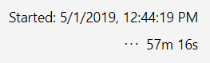

# Determine Which Tests Are Failing

1. Click details to see more information about the failing run. 

2. Click on the number of errors and warnings to open Azure DevOps.  

3. Click on the Tests tabs to see a list of failing tests.  

4. Expand each run to see which tests failed.  

# Check for Open Issues

1. Open https://github.com/dotnet/roslyn/issues
2. Enter the name of the failing test and search for open issues that match the failure.  

# Add New Occurrence to Existing Issue

1. Add a new comment and include relevent information.  
  
Good information to include in this comment:
    - A link to the Azure DevOps tests results.
    - Which attempt the failure occurred on.
    - Which test run failed.  
For instance the Debug_Async run failed on the 3rd attempt.  
  

# Creating a New Issue for Failed Integration Test

1. Open the Screenshot artifacts for one of the test runs.  
  
  
2. Focus on the first reported integration test failure. Often these failures cascade and it can be misleading.
3. Create a new issue and include the failed test name in the title
4. Good information to include in the issue body:
    - A link to the Azure DevOps tests results.
    - Which attempt the failure occurred on.
    - Which test run failed.  
    - Additional details outlined below.
3. First check to see if a new entry appears in the *.DotNet.log file for the test. There is a MissingMethodException thrown at the beginning of every test run that will log to *.DotNet.log anything thrown by a previous test run.  
  
If the file is new for the test you are creating (check file timestamp compared to when your tests ran) or contains a different exception than the one given in the MissingMethodException entry, then treat the root cause of the test failure as whatever that exception is.  
  
4. If the screenshot shows an interesting state (OS window, etc.), or if the failure is not identified by (2), make sure to include a screenshot from the time of failure in the issue.  
  
5. If the cause is not identified by (2), include the stack trace from the TargetInvocationException leading to the test failure.  
  
6. Add them to the Flaky Tests columns in the [Test Improvements project](https://github.com/dotnet/roslyn/projects/2)

Here is an example from a test failure on Jenkins - it's reviewable even though the CI link is broken
 https://github.com/dotnet/roslyn/issues/26041

# Troubleshooting Integration Test Run Failures

 1. Failure during **Checkout** because of locked file  
  
`[error] One or more errors occurred. (The process cannot access the file '...\Some.File' because it is being used by another process.)`  
    1. Take note of the machine name  
      
    * note - if you can't see pool name, make sure you change this to Attempt 1 
    
    2. Click on the Pool name (dotnet-external-vs2019-preview) in this case.  
    3. Click on the Agents tab  
    
    4. Find the machine with the matching name and disable it.  
    
    5. From the Azure DevOps Pipeline page choose to Retry the test run.  
    
    
 2. ServiceHub crash

    If you see integration tests failing for your PR with screenshots that show info-bar like so:
    
     
    
    This means the ServiceHub process crashed. Check the ServiceHub logs to see why. They are available in the log artifacts:
    
    
 
