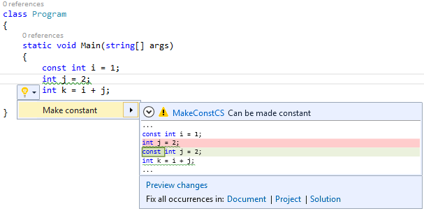

## Prerequisites
* [Visual Studio 2015](https://www.visualstudio.com/downloads)
* [.NET Compiler Platform SDK](https://aka.ms/roslynsdktemplates)
* [Getting Started C# Syntax Analysis](https://github.com/dotnet/roslyn/blob/main/docs/wiki/Getting-Started-C%23-Syntax-Analysis.md)
* [Getting Started C# Semantic Analysis](https://github.com/dotnet/roslyn/blob/main/docs/wiki/Getting-Started-C%23-Semantic-Analysis.md)
* [Getting Started C# Syntax Transformation](https://github.com/dotnet/roslyn/blob/main/docs/wiki/Getting-Started-C%23-Syntax-Transformation.md)

## Introduction
In previous releases of Visual Studio, it has been difficult to create custom warnings that target C# or Visual Basic. With the Diagnostics API in the .NET Compiler Platform ("Roslyn"), this once difficult task has become easy! All that is needed is to perform a bit of analysis to identify an issue, and optionally provide a tree transformation as a code fix. The heavy lifting of running your analysis on a background thread, showing squiggly underlines in the editor, populating the Visual Studio Error List, creating "light bulb" suggestions and showing rich previews is all done for you automatically.

In this walkthrough, we'll explore the creation of an Analyzer and an accompanying Code Fix using the Roslyn APIs. An Analyzer is a way to perform source code analysis and report a problem to the user. Optionally, an Analyzer can also provide a Code Fix which represents a modification to the user's source code. For example, an Analyzer could be created to detect and report any local variable names that begin with an uppercase letter, and provide a Code Fix that corrects them.

## Writing the Analyzer
Suppose that you wanted to report to the user any local variable declarations that can be converted to local constants. For example, consider the following code:

```C#
int x = 0;
Console.WriteLine(x);
```

In the code above, x is assigned a constant value and is never written to. Thus, it can be declared using the const modifier:

```C#
const int x = 0;
Console.WriteLine(x);
```

The analysis to determine whether a variable can be made constant is actually fairly involved, requiring syntactic analysis, constant analysis of the initializer expression and dataflow analysis to ensure that the variable is never written to. However, performing this analysis with the .NET Compiler Platform and exposing it as an Analyzer is pretty easy.

1) Create a new C# **Analyzer with Code Fix** project.
  * In Visual Studio, choose **File -> New -> Project...** to display the New Project dialog.
  * Under **Visual C# -> Extensibility**, choose **Analyzer with Code Fix (NuGet + VSIX)**.
  * Name your project "**FirstAnalyzerCS**" and click OK.


2) Press F5 to run the newly created Analyzer project in a second instance of Visual Studio. The project template creates three projects, and the .VSIX is the one the debugger will start.
  * In the second Visual Studio instance that you just started, create a new C# Console Application project. Hover over the token with a wavy underline, and the warning text provided by an Analyzer appears.

This Analyzer is provided by the AnalyzeSymbol method in the debugger project. So initially, the debugger project contains enough code to create an Analyzer for every type declaration in a C# file whose identifier contains lowercase letters.


  * Now that you've seen the initial Analyzer in action, close the second Visual Studio instance and return to your Analyzer project.

3) Take a moment to familiarize yourself with the Diagnostic Analyzer in the DiagnosticAnalyzer.cs file of your project. There are two important aspects to draw your attention to:
  * Every Diagnostic Analyzer must provide a [DiagnosticAnalyzer] attribute that describes the language it operates on.
  * Every Diagnostic Analyzer must implement the DiagnosticAnalyzer interface.

4) There are various ways to implement our analyzer to find local variables that could be constant. One straightforward way is to visit the syntax nodes for local declarations one at a time, ensuring their initializers have constant values. To start:
  * Change the registered action from one that acts on symbols to one that acts on syntax by replacing the context.RegisterSymbolAction method with the following:

```C#
context.RegisterSyntaxNodeAction(AnalyzeNode, SyntaxKind.LocalDeclarationStatement); 
```

  * Delete the TODO comment.
  * Delete the AnalyzeSymbol method, which no longer applies.
  * Use Ctrl+. on AnalyzeNode to generate the AnalyzeNode method.
  * Update the Diagnostic metadata near the top of the type to match the const rule (or change the values in the resources.resx file).

```C#
public const string DiagnosticId = "MakeConstCS";
private const string Title = "Variable can be made constant";
private const string MessageFormat = "Can be made constant";
private const string Description = "Make Constant";
private const string Category = "Usage";
```

  * When you're finished, the code in DiagnosticAnalyzer.cs should look like the following code.

```C#
using System;
using System.Collections.Generic;
using System.Collections.Immutable;
using System.Linq;
using System.Threading;
using Microsoft.CodeAnalysis;
using Microsoft.CodeAnalysis.CSharp;
using Microsoft.CodeAnalysis.CSharp.Syntax;
using Microsoft.CodeAnalysis.Diagnostics;

namespace FirstAnalyzerCS
{
    [DiagnosticAnalyzer(LanguageNames.CSharp)]
    public class FirstAnalyzerCSAnalyzer : DiagnosticAnalyzer
    {
        public const string DiagnosticId = "MakeConstCS";
        private const string Title = "Variable can be made constant";
        private const string MessageFormat = "Can be made constant";
        private const string Description = "Make Constant";
        private const string Category = "Usage";

        private static DiagnosticDescriptor Rule = new DiagnosticDescriptor(DiagnosticId, Title, MessageFormat, Category, DiagnosticSeverity.Warning, isEnabledByDefault: true, description: Description);

        public override ImmutableArray<DiagnosticDescriptor> SupportedDiagnostics { get { return ImmutableArray.Create(Rule); } }

        public override void Initialize(AnalysisContext context)
        {
            context.RegisterSyntaxNodeAction(AnalyzeNode, SyntaxKind.LocalDeclarationStatement);
        }

        private static void AnalyzeNode(SyntaxNodeAnalysisContext context)
        {
            throw new NotImplementedException();
        }
    }
}
```

  * Now you're ready to write the logic to determine whether a local variable can be declared as a const in the AnalyzeNode method.

5) First, you'll need to perform the necessary syntactic analysis.
  * In the AnalyzeNode method, cast the node passed in to the LocalDeclarationStatementSyntax type. You can safely assume this cast will succeed because the registered action only operates on syntax nodes of that type.

```C#
var localDeclaration = (LocalDeclarationStatementSyntax)context.Node;
```

  * Ensure that the local variable declaration doesn't already have the const modifier. We'll return early here without surfacing a diagnostic if the variable is already declared as a constant.
```C#
// Only consider local variable declarations that aren't already const.
if (localDeclaration.Modifiers.Any(SyntaxKind.ConstKeyword))
{
    return;
}
```

6) Next, you'll perform some semantic analysis using the context.SemanticModel argument to determine whether the local variable declaration can be made const. A SemanticModel is a representation of all semantic information in a single source file. Please see the .NET Compiler Platform Project Overview for a more detailed description of semantic models.
  * Ensure that every variable in the declaration has an initializer. This is necessary to match the C# specification which states that all const variables must be initialized. For example, int x = 0, y = 1; can be made const, but int x, y = 1; cannot. Additionally, use the SemanticModel to ensure that each variable's initializer is a compile-time constant. You'll do this by calling context.SemanticModel.GetConstantValue() for each variable's initializer and checking that the returned Optional<object> contains a value.

```C#
// Ensure that all variables in the local declaration have initializers that
// are assigned with constant values.
foreach (var variable in localDeclaration.Declaration.Variables)
{
    var initializer = variable.Initializer;
    if (initializer == null)
    {
        return;
    }

    var constantValue = context.SemanticModel.GetConstantValue(initializer.Value);
    if (!constantValue.HasValue)
    {
        return;
    }
}
```

  * Use the SemanticModel to perform data flow analysis on the local declaration statement. Then, use the results of this data flow analysis to ensure that none of the local variables are written with a new value anywhere else. You'll do this by calling context.SemanticModel.GetDeclaredSymbol to retrieve the ILocalSymbol for each variable and checking that it isn't contained with the WrittenOutside collection of the data flow analysis.

```C#
// Perform data flow analysis on the local declaration.
var dataFlowAnalysis = context.SemanticModel.AnalyzeDataFlow(localDeclaration);

// Retrieve the local symbol for each variable in the local declaration
// and ensure that it is not written outside of the data flow analysis region.
foreach (var variable in localDeclaration.Declaration.Variables)
{
    var variableSymbol = context.SemanticModel.GetDeclaredSymbol(variable);
    if (dataFlowAnalysis.WrittenOutside.Contains(variableSymbol))
    {
        return;
    }
}
```

7) With all of the necessary analysis performed, you can create a new Diagnostic object that represents a warning for the non-const variable declaration.  This Diagnostic will get its metadata from the static Rule template defined above.

```C#
context.ReportDiagnostic(Diagnostic.Create(Rule, context.Node.GetLocation()));
```

  * At this point, your AnalyzeNode method should look like so:

```C#
private static void AnalyzeNode(SyntaxNodeAnalysisContext context)
{
    var localDeclaration = (LocalDeclarationStatementSyntax)context.Node;

    // Only consider local variable declarations that aren't already const.
    if (localDeclaration.Modifiers.Any(SyntaxKind.ConstKeyword))
    {
        return;
    }

    // Ensure that all variables in the local declaration have initializers that
    // are assigned with constant values.
    foreach(var variable in localDeclaration.Declaration.Variables)
    {
        var initializer = variable.Initializer;
        if (initializer == null)
        {
            return;
        }

        var constantValue = context.SemanticModel.GetConstantValue(initializer.Value);
        if (!constantValue.HasValue)
        {
            return;
        }
    }

    // Perform data flow analysis on the local declaration.
    var dataFlowAnalysis = context.SemanticModel.AnalyzeDataFlow(localDeclaration);

    // Retrieve the local symbol for each variable in the local declaration
    // and ensure that it is not written outside of the data flow analysis region.
    foreach (var variable in localDeclaration.Declaration.Variables)
    {
        var variableSymbol = context.SemanticModel.GetDeclaredSymbol(variable);
        if (dataFlowAnalysis.WrittenOutside.Contains(variableSymbol))
        {
            return;
        }
    }

    context.ReportDiagnostic(Diagnostic.Create(Rule, context.Node.GetLocation()));
}
```

8) Press F5 to run the Analyzer project in a second instance of Visual Studio.
  * In the second Visual Studio instance create a new C# Console Application project and add a few local variable declarations initialized with constant values to the Main method.

```C#
static void Main(string[] args)
{
    int i = 1;
    int j = 2;
    int k = i + j;
}
```

  * You'll see that they are reported as warnings as below.


  * Notice that if you type const before each variable, the warnings are automatically removed. Additionally, changing a variable to const can affect the reporting of other variables.


 
9) Congratulations! You've created your first Analyzer using the .NET Compiler Platform APIs to perform non-trivial syntactic and semantic analysis.

## Writing the Code Fix
Any Analyzer can provide one or more Code Fixes which define an edit that can be performed to the source code to address the reported issue. For the Analyzer that you just created, you can provide a Code Fix that inserts the const keyword when the user chooses it from the light bulb UI in the editor. To do so, follow the steps below.

1) First, open the CodeFixProvider.cs file that was already added by the Analyzer with Code Fix template.  This Code Fix is already wired up to the Diagnostic ID produced by your Diagnostic Analyzer, but it doesn't yet implement the right code transform.

2) Change the title string to "Make constant".

3) Delete the MakeUppercaseAsync method, which no longer applies.

4) In RegisterCodeFixesAsync, change the ancestor node type you're searching for to LocalDeclarationStatementSyntax to match the Diagnostic.

```C#
// Find the local declaration identified by the diagnostic.
var declaration = root.FindToken(diagnosticSpan.Start).Parent.AncestorsAndSelf().OfType<LocalDeclarationStatementSyntax>().First();
```

5) Change the last line that creates the CodeAction object to call a MakeConstAsync method that you'll be defining next, change createChangedSolution to createChangedDocument, and remove the TODO comment. Each CodeAction represents a fix that users can choose to apply in Visual Studio.

```C#
context.RegisterCodeFix(
    CodeAction.Create(
        title: title,
        createChangedDocument: c => MakeConstAsync(context.Document, declaration, c),
        equivalenceKey: title),
    diagnostic);
```

6) At this point, your code should look like so:

```C#
using System;
using System.Collections.Generic;
using System.Collections.Immutable;
using System.Composition;
using System.Linq;
using System.Threading;
using System.Threading.Tasks;
using Microsoft.CodeAnalysis;
using Microsoft.CodeAnalysis.CodeFixes;
using Microsoft.CodeAnalysis.CodeActions;
using Microsoft.CodeAnalysis.CSharp;
using Microsoft.CodeAnalysis.CSharp.Syntax;
using Microsoft.CodeAnalysis.Rename;
using Microsoft.CodeAnalysis.Text;

namespace FirstAnalyzerCS
{
    [ExportCodeFixProvider(LanguageNames.CSharp, Name = nameof(FirstAnalyzerCSCodeFixProvider)), Shared]
    public class FirstAnalyzerCSCodeFixProvider : CodeFixProvider
    {
        private const string title = "Make constant";

        public sealed override ImmutableArray<string> FixableDiagnosticIds
        {
            get { return ImmutableArray.Create(FirstAnalyzerCSAnalyzer.DiagnosticId); }
        }

        public sealed override FixAllProvider GetFixAllProvider()
        {
            return WellKnownFixAllProviders.BatchFixer;
        }

        public sealed override async Task RegisterCodeFixesAsync(CodeFixContext context)
        {
            var root = await context.Document.GetSyntaxRootAsync(context.CancellationToken).ConfigureAwait(false);

            var diagnostic = context.Diagnostics.First();
            var diagnosticSpan = diagnostic.Location.SourceSpan;

            // Find the type declaration identified by the diagnostic.
            var declaration = root.FindToken(diagnosticSpan.Start).Parent.AncestorsAndSelf().OfType<LocalDeclarationStatementSyntax>().First();

            // Register a code action that will invoke the fix.
            context.RegisterCodeFix(
                CodeAction.Create(
                    title: title,
                    createChangedDocument: c => MakeConstAsync(context.Document, declaration, c),
                    equivalenceKey: title),
                diagnostic);
        }
    }
}
```

7) Now it's time to implement the MakeConstAsync method, which will transform the original Document into the fixed Document.
  * First, declare a MakeConstAsync method with the following signature.  This method will transform the Document representing the user's source file into a fixed Document that now contains a const declaration.

```C#
private async Task<Document> MakeConstAsync(Document document, LocalDeclarationStatementSyntax localDeclaration, CancellationToken cancellationToken)
```

  * Then, create a new const keyword token that will be inserted at the front of the declaration statement. Be careful to first remove any leading trivia from the first token of the declaration statement and attach it to the const token.

```C#
// Remove the leading trivia from the local declaration.
var firstToken = localDeclaration.GetFirstToken();
var leadingTrivia = firstToken.LeadingTrivia;
var trimmedLocal = localDeclaration.ReplaceToken(
    firstToken, firstToken.WithLeadingTrivia(SyntaxTriviaList.Empty));

// Create a const token with the leading trivia.
var constToken = SyntaxFactory.Token(leadingTrivia, SyntaxKind.ConstKeyword, SyntaxFactory.TriviaList(SyntaxFactory.ElasticMarker));
```

  * Next, create a new SyntaxTokenList containing the const token and the existing modifiers of the declaration statement.

```C#
// Insert the const token into the modifiers list, creating a new modifiers list.
var newModifiers = trimmedLocal.Modifiers.Insert(0, constToken);
```

  * Create a new declaration statement containing the new list of modifiers.

```C#
// Produce the new local declaration.
var newLocal = trimmedLocal.WithModifiers(newModifiers);
```

  * Add a Formatter syntax annotation to the new declaration statement, which is an indicator to the Code Fix engine to format any whitespace using the C# formatting rules.  You will need to hit Ctrl+. on the Formatter type to add a using statement for the Microsoft.CodeAnalysis.Formatting namespace.

```C#
// Add an annotation to format the new local declaration.
var formattedLocal = newLocal.WithAdditionalAnnotations(Formatter.Annotation);
```

  * Retrieve the root SyntaxNode from the Document and use it to replace the old declaration statement with the new one.

```C#
// Replace the old local declaration with the new local declaration.
var oldRoot = await document.GetSyntaxRootAsync(cancellationToken);
var newRoot = oldRoot.ReplaceNode(localDeclaration, formattedLocal);
```

  * Finally, return a new Document containing the updated syntax root, representing the result of the tree transformation that you just performed.

```C#
// Return document with transformed tree.
return document.WithSyntaxRoot(newRoot);
```

  * At this point, your MakeConstAsync method should be like so:

```C#
private async Task<Document> MakeConstAsync(Document document, LocalDeclarationStatementSyntax localDeclaration, CancellationToken cancellationToken)
{
    // Remove the leading trivia from the local declaration.
    var firstToken = localDeclaration.GetFirstToken();
    var leadingTrivia = firstToken.LeadingTrivia;
    var trimmedLocal = localDeclaration.ReplaceToken(
        firstToken, firstToken.WithLeadingTrivia(SyntaxTriviaList.Empty));

    // Create a const token with the leading trivia.
    var constToken = SyntaxFactory.Token(leadingTrivia, SyntaxKind.ConstKeyword, SyntaxFactory.TriviaList(SyntaxFactory.ElasticMarker));

    // Insert the const token into the modifiers list, creating a new modifiers list.
    var newModifiers = trimmedLocal.Modifiers.Insert(0, constToken);

    // Produce the new local declaration.
    var newLocal = trimmedLocal.WithModifiers(newModifiers);

    // Add an annotation to format the new local declaration.
    var formattedLocal = newLocal.WithAdditionalAnnotations(Formatter.Annotation);

    // Replace the old local declaration with the new local declaration.
    var oldRoot = await document.GetSyntaxRootAsync(cancellationToken);
    var newRoot = oldRoot.ReplaceNode(localDeclaration, formattedLocal);

    // Return document with transformed tree.
    return document.WithSyntaxRoot(newRoot);
}
```

8) Press F5 to run the Analyzer project in a second instance of Visual Studio.
  * In the second Visual Studio instance, create a new C# Console Application project and, like before, add a few local variable declarations initialized with to constant values in the Main method.

```C#
static void Main(string[] args)
{
    int i = 1;
    int j = 2;
    int k = i + j;
}
```

  * You'll see that they are reported as warnings and "light bulb" suggestions appear next to them when the editor caret is on the same line.
  * Move the editor caret to one of the squiggly underlines and press Ctrl+. to display the suggestion. Notice that a preview window appears next to the suggestion menu showing what the code will look like after the Code Fix is invoked. 



## Fixing Bugs
Sadly, there are a few bugs in the implementation.

* The Diagnostic Analyzer's AnalyzeNode method does not check to see if the constant value is actually convertible to the variable type. So, the current implementation will happily convert an incorrect declaration such as int i = "abc"' to a local constant.

* Reference types are not handled properly. The only constant value allowed for a reference type is null, except in this case of System.String, which allows string literals. In other words, const string s = "abc"' is legal, but const object s = "abc"' is not. 

* If a variable is declared with the "var" keyword, the Code Fix does the wrong thing and generates a "const var" declaration, which is not supported by the C# language. To fix this bug, the code fix must replace the "var" keyword with the inferred type's name.
Fortunately, all of the above bugs can be addressed using the same techniques that you just learned.

1) To fix the first bug, first open DiagnosticAnalyzer.cs and locate the foreach loop where each of the local declaration's initializers are checked to ensure that they're assigned with constant values.
  * Immediately _before_ the first foreach loop, call context.SemanicModel.GetTypeInfo() to retrieve detailed information about the declared type of the local declaration:

```C#
var variableTypeName = localDeclaration.Declaration.Type;
var variableType = context.SemanticModel.GetTypeInfo(variableTypeName).ConvertedType;
```

  * Next, add the following code before the closing curly brace of the foreach loop to call context.SemanticModel.ClassifyConversion() and determine whether the initializer is convertible to the local declaration type. If there is no conversion, or the conversion is user-defined, the variable can't be a local constant.

```C#
// Ensure that the initializer value can be converted to the type of the
// local declaration without a user-defined conversion.
var conversion = context.SemanticModel.ClassifyConversion(initializer.Value, variableType);
if (!conversion.Exists || conversion.IsUserDefined)
{
    return;
}
```

2) The next bug fix builds upon the last one.
  * Before the closing curly brace of the same foreach loop, add the following code to check the type of the local declaration when the constant is a string or null.

```C#
// Special cases:
//  * If the constant value is a string, the type of the local declaration
//    must be System.String.
//  * If the constant value is null, the type of the local declaration must
//    be a reference type.
if (constantValue.Value is string)
{
    if (variableType.SpecialType != SpecialType.System_String)
    {
        return;
    }
}
else if (variableType.IsReferenceType && constantValue.Value != null)
{
    return;
}
```

  * With this code in place, the AnalyzeNode method should look like so.

```C#
private static void AnalyzeNode(SyntaxNodeAnalysisContext context)
{
    var localDeclaration = (LocalDeclarationStatementSyntax)node;

    // Only consider local variable declarations that aren't already const.
    if (localDeclaration.Modifiers.Any(SyntaxKind.ConstKeyword))
    {
        return;
    }

    var variableTypeName = localDeclaration.Declaration.Type;
    var variableType = context.SemanticModel.GetTypeInfo(variableTypeName).ConvertedType;

    // Ensure that all variables in the local declaration have initializers that
    // are assigned with constant values.
    foreach (var variable in localDeclaration.Declaration.Variables)
    {
        var initializer = variable.Initializer;
        if (initializer == null)
        {
            return;
        }

        var constantValue = context.SemanticModel.GetConstantValue(initializer.Value);
        if (!constantValue.HasValue)
        {
            return;
        }

        // Ensure that the initializer value can be converted to the type of the
        // local declaration without a user-defined conversion.
        var conversion = semanticModel.ClassifyConversion(initializer.Value, variableType);
        if (!conversion.Exists || conversion.IsUserDefined)
        {
            return;
        }

        // Special cases:
        //  * If the constant value is a string, the type of the local declaration
        //    must be System.String.
        //  * If the constant value is null, the type of the local declaration must
        //    be a reference type.
        if (constantValue.Value is string)
        {
            if (variableType.SpecialType != SpecialType.System_String)
            {
                return;
            }
        }
        else if (variableType.IsReferenceType && constantValue.Value != null)
        {
            return;
        }
    }

    // Perform data flow analysis on the local declaration.
    var dataFlowAnalysis = semanticModel.AnalyzeDataFlow(localDeclaration);

    // Retrieve the local symbol for each variable in the local declaration
    // and ensure that it is not written outside of the data flow analysis region.
    foreach (var variable in localDeclaration.Declaration.Variables)
    {
        var variableSymbol = semanticModel.GetDeclaredSymbol(variable);
        if (dataFlowAnalysis.WrittenOutside.Contains(variableSymbol))
        {
            return;
        }
    }

    context.ReportDiagnostic(Diagnostic.Create(Rule, context.Node.GetLocation()));
}
```

3) Fixing the third issue requires a little more code to replace the var' keyword with the correct type name.
  * Return to CodeFixProvider.cs and replace the code at the comment which reads "Produce the new local declaration" with the following code:

```C#
// If the type of the declaration is 'var', create a new type name
// for the inferred type.
var variableDeclaration = localDeclaration.Declaration;
var variableTypeName = variableDeclaration.Type;
if (variableTypeName.IsVar)
{

}

// Produce the new local declaration.
var newLocal = trimmedLocal.WithModifiers(newModifiers)
                           .WithDeclaration(variableDeclaration);
```

  * Next, add a check inside curly braces of the if-block you wrote above to ensure that the type of the variable declaration is not an alias. If it is an alias to some other type (e.g. "using var = System.String;") then it is legal to declare a local "const var".

```C#
var semanticModel = await document.GetSemanticModelAsync(cancellationToken);

// Special case: Ensure that 'var' isn't actually an alias to another type
// (e.g. using var = System.String).
var aliasInfo = semanticModel.GetAliasInfo(variableTypeName);
if (aliasInfo == null)
{

}
```

  * Inside the curly braces that you wrote in the code above, add the following code to retrieve the type inferred for var' inside the curly braces of the if-block you wrote above.

```C#
// Retrieve the type inferred for var.
var type = semanticModel.GetTypeInfo(variableTypeName).ConvertedType;

// Special case: Ensure that 'var' isn't actually a type named 'var'.
if (type.Name != "var")
{

}
```

  * Now, add the code to create a new TypeSyntax for the inferred type inside the curly braces of the if-block you wrote above.

```C#
// Create a new TypeSyntax for the inferred type. Be careful
// to keep any leading and trailing trivia from the var keyword.
var typeName = SyntaxFactory.ParseTypeName(type.ToDisplayString())
    .WithLeadingTrivia(variableTypeName.GetLeadingTrivia())
    .WithTrailingTrivia(variableTypeName.GetTrailingTrivia());
```

  * Add a Simplifier syntax annotation to the type name to ensure that the code fix engine reduces the type name to its minimally-qualified form.  Use Ctrl+. on Simplifier to add the using statement for Microsoft.CodeAnalysis.Simplification.

```C#
// Add an annotation to simplify the type name.
var simplifiedTypeName = typeName.WithAdditionalAnnotations(Simplifier.Annotation);
```

  * Finally, replace the variable declaration's type with the one you just created.

```C#
// Replace the type in the variable declaration.
variableDeclaration = variableDeclaration.WithType(simplifiedTypeName);
```

  * With this bug fix in place, your MakeConstAsync method should now look like the following:

```C#
private async Task<Document> MakeConstAsync(Document document, LocalDeclarationStatementSyntax localDeclaration, CancellationToken cancellationToken)
{
    // Remove the leading trivia from the local declaration.
    var firstToken = localDeclaration.GetFirstToken();
    var leadingTrivia = firstToken.LeadingTrivia;
    var trimmedLocal = localDeclaration.ReplaceToken(
        firstToken, firstToken.WithLeadingTrivia(SyntaxTriviaList.Empty));

    // Create a const token with the leading trivia.
    var constToken = SyntaxFactory.Token(leadingTrivia, SyntaxKind.ConstKeyword, SyntaxFactory.TriviaList(SyntaxFactory.ElasticMarker));

    // Insert the const token into the modifiers list, creating a new modifiers list.
    var newModifiers = trimmedLocal.Modifiers.Insert(0, constToken);

    // If the type of the declaration is 'var', create a new type name
    // for the inferred type.
    var variableDeclaration = localDeclaration.Declaration;
    var variableTypeName = variableDeclaration.Type;
    if (variableTypeName.IsVar)
    {
        var semanticModel = await document.GetSemanticModelAsync(cancellationToken);

        // Special case: Ensure that 'var' isn't actually an alias to another type
        // (e.g. using var = System.String).
        var aliasInfo = semanticModel.GetAliasInfo(variableTypeName);
        if (aliasInfo == null)
        {
            // Retrieve the type inferred for var.
            var type = semanticModel.GetTypeInfo(variableTypeName).ConvertedType;

            // Special case: Ensure that 'var' isn't actually a type named 'var'.
            if (type.Name != "var")
            {
                // Create a new TypeSyntax for the inferred type. Be careful
                // to keep any leading and trailing trivia from the var keyword.
                var typeName = SyntaxFactory.ParseTypeName(type.ToDisplayString())
                    .WithLeadingTrivia(variableTypeName.GetLeadingTrivia())
                    .WithTrailingTrivia(variableTypeName.GetTrailingTrivia());

                // Add an annotation to simplify the type name.
                var simplifiedTypeName = typeName.WithAdditionalAnnotations(Simplifier.Annotation);

                // Replace the type in the variable declaration.
                variableDeclaration = variableDeclaration.WithType(simplifiedTypeName);
            }
        }
    }

    // Produce the new local declaration.
    var newLocal = trimmedLocal.WithModifiers(newModifiers)
                               .WithDeclaration(variableDeclaration);

    // Add an annotation to format the new local declaration.
    var formattedLocal = newLocal.WithAdditionalAnnotations(Formatter.Annotation);

    // Replace the old local declaration with the new local declaration.
    var root = await document.GetSyntaxRootAsync(cancellationToken);
    var newRoot = root.ReplaceNode(localDeclaration, formattedLocal);

    // Return document with transformed tree.
    return document.WithSyntaxRoot(newRoot);
}
```

4) Once again, press Ctrl+F5 to run the Analyzer project in a second instance of Visual Studio with the Roslyn Preview extension loaded.
  * In the second Visual Studio instance, create a new C# Console Application project and add int x = "abc";' to the Main method. Thanks to the first bug fix, no warning should be reported for this local variable declaration (though there's a compiler error as expected).
  * Next, add object s = "abc";' to the Main method. Because of the second bug fix, no warning should be reported.
  * Finally, add another local variable that uses the var' keyword. You'll see that a warning is reported and a suggestion appears beneath to the left.
  * Move the editor caret over the squiggly underline and press Ctrl+. to display the suggested code fix. Upon selecting your code fix, note that the var' keyword is now handled correctly.


5) Congratulations! You've created your first .NET Compiler Platform extension that performs on-the-fly code analysis to detect an issue and provides a quick fix to correct it.
