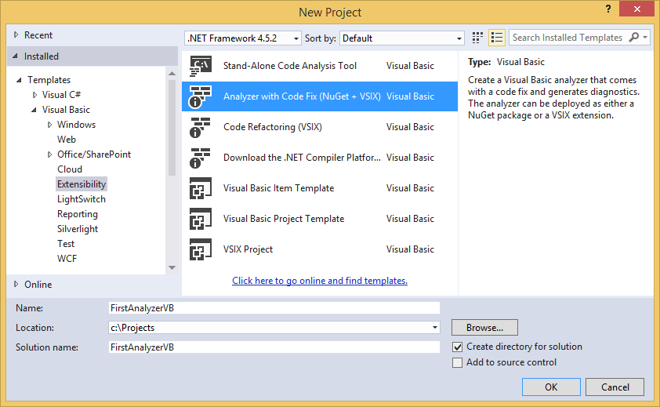
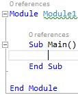
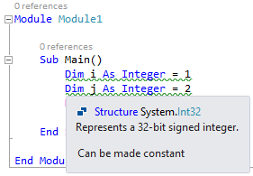
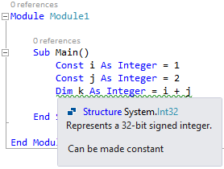
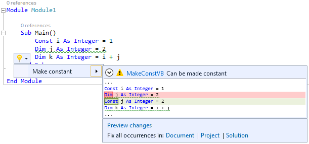

## Prerequisites
* [Visual Studio 2015](https://www.visualstudio.com/downloads)
* [.NET Compiler Platform SDK](https://aka.ms/roslynsdktemplates)
* [Getting Started VB Syntax Analysis](https://github.com/dotnet/roslyn/blob/main/docs/wiki/Getting-Started-VB-Syntax-Analysis.md)
* [Getting Started VB Semantic Analysis](https://github.com/dotnet/roslyn/blob/main/docs/wiki/Getting-Started-VB-Semantic-Analysis.md)
* [Getting Started VB Syntax Transformation](https://github.com/dotnet/roslyn/blob/main/docs/wiki/Getting-Started-VB-Syntax-Transformation.md)

## Introduction
In previous releases of Visual Studio, it has been difficult to create custom warnings that target C# or Visual Basic. With the Diagnostics API in the .NET Compiler Platform ("Roslyn"), this once difficult task has become easy! All that is needed is to perform a bit of analysis to identify an issue, and optionally provide a tree transformation as a code fix. The heavy lifting of running your analysis on a background thread, showing squiggly underlines in the editor, populating the Visual Studio Error List, creating "light bulb" suggestions and showing rich previews is all done for you automatically.

In this walkthrough, we'll explore the creation of an Analyzer and an accompanying Code Fix using the Roslyn APIs. An Analyzer is a way to perform source code analysis and report a problem to the user. Optionally, an Analyzer can also provide a Code Fix which represents a modification to the user's source code. For example, an Analyzer could be created to detect and report any local variable names that begin with an uppercase letter, and provide a Code Fix that corrects them.

## Writing the Analyzer
Suppose that you wanted to report to the user any local variable declarations that can be converted to local constants. For example, consider the following code:

```VB.NET
Dim x As Integer = 0
Console.WriteLine(x)
```

In the code above, x is assigned a constant value and is never written to. Thus, it can be declared using the Const modifier:

```VB.NET
Const x As Integer = 0
Console.WriteLine(x)
```

The analysis to determine whether a variable can be made constant is actually fairly involved, requiring syntactic analysis, constant analysis of the initializer expression and dataflow analysis to ensure that the variable is never written to. However, performing this analysis with the .NET Compiler Platform and exposing it as an Analyzer is pretty easy. 

1) Create a new Visual Basic **Analyzer with Code Fix** project.
  * In Visual Studio, choose **File -> New -> Project...** to display the New Project dialog.
  * Under **Visual Basic -> Extensibility**, choose **Analyzer with Code Fix (NuGet + VSIX)**.
  * Name your project "**FirstAnalyzerVB**" and click OK.



2) Press F5 to run the newly created Analyzer project in a second instance of Visual Studio.
  * In the second Visual Studio instance that you just started, create a new Visual Basic Console Application project. Hover over the token with a wavy underline, and the warning text provided by an Analyzer appears.

This Analyzer is provided by the AnalyzeSymbol method in the debugger project. So initially, the debugger project contains enough code to create an Analyzer for every type declaration in a Visual Basic file whose identifier contains lowercase letters.



  * Now that you've seen the initial Analyzer in action, close the second Visual Studio instance and return to your Analyzer project.

3) Take a moment to familiarize yourself with the Diagnostic Analyzer in the DiagnosticAnalyzer.vb file of your project. There are two important aspects to draw your attention to:
  * Every Diagnostic Analyzer must provide a <DiagnosticAnalyzer> attribute that describes the language it operates on.
  * Every Diagnostic Analyzer must implement the DiagnosticAnalyzer interface.

4) There are various ways to implement our analyzer to find local variables that could be constant. One straightforward way is to visit the syntax nodes for local declarations one at a time, ensuring their initializers have constant values. To start:
  * Change the registered action from one that acts on symbols to one that acts on syntax by replacing the context.RegisterSymbolAction method with the following:

```VB.NET
context.RegisterSyntaxNodeAction(AddressOf AnalyzeNode, SyntaxKind.LocalDeclarationStatement)
```

  * Delete the TODO comment.
  * Delete the AnalyzeSymbol method, which no longer applies.
  * Use Ctrl+. on AnalyzeNode to generate the AnalyzeNode method.
  * Update the Diagnostic metadata near the top of the type to match the const rule (or change the values in the resources.resx file).

```VB.NET
Public Const DiagnosticId = "MakeConstVB"
Private Const Title = "Variable can be made constant"
Private Const MessageFormat = "Can be made constant"
Private Const Description = "Make Constant"
Private Const Category = "Usage"
```

  * When you're finished, the code in DiagnosticAnalyzer.vb should look like the following code.

```VB.NET
<DiagnosticAnalyzer(LanguageNames.VisualBasic)>
Public Class FirstAnalyzerVBAnalyzer
    Inherits DiagnosticAnalyzer

    Public Const DiagnosticId = "MakeConstVB"
    Private Const Title = "Variable can be made constant"
    Private Const MessageFormat = "Can be made constant"
    Private Const Description = "Make Constant"
    Private Const Category = "Usage"

    Private Shared Rule As New DiagnosticDescriptor(DiagnosticId, Title, MessageFormat, Category, DiagnosticSeverity.Warning, isEnabledByDefault:=True, description:=Description)

    Public Overrides ReadOnly Property SupportedDiagnostics As ImmutableArray(Of DiagnosticDescriptor)
        Get
            Return ImmutableArray.Create(Rule)
        End Get
    End Property

    Public Overrides Sub Initialize(context As AnalysisContext)
        context.RegisterSyntaxNodeAction(AddressOf AnalyzeNode, SyntaxKind.LocalDeclarationStatement)
    End Sub

    Private Sub AnalyzeNode(context As SyntaxNodeAnalysisContext)
        Throw New NotImplementedException()
    End Sub
End Class
```

  * Now you're ready to write the logic to determine whether a local variable can be declared as a Const in the AnalyzeNode method.

5) First, you'll need to perform the necessary syntactic analysis.
  * In the AnalyzeNode method, cast the node passed in to the LocalDeclarationStatementSyntax type. You can safely assume this cast will succeed because the registered action only operates on syntax nodes of that type.

```VB.NET
Dim localDeclaration = CType(context.Node, LocalDeclarationStatementSyntax)
```

  * Ensure that the local variable declaration only has a Dim modifier. We'll return early here without surfacing a diagnostic if the variable is already declared as a constant.

```VB.NET
' Only consider local variable declarations that are Dim (no Static or Const).
If Not localDeclaration.Modifiers.All(Function(m) m.Kind() = SyntaxKind.DimKeyword) Then
    Return
End If
```

6) Next, you'll perform some semantic analysis using the context.SemanticModel argument to determine whether the local variable declaration can be made Const. A SemanticModel is a representation of all semantic information in a single source file. Please see the .NET Compiler Platform Project Overview for a more detailed description of semantic models.
  * Ensure that every variable in the declaration has an initializer. This is necessary to match the Visual Basic specification which states that all Const variables must be initialized. For example, Dim x As Integer = 0, y As Integer = 1 can be made Const, but Dim x As Integer, y As Integer = 1 cannot. Additionally, use the SemanticModel to ensure that each variable's initializer is a compile-time constant. You'll do this by calling context.SemanticModel.GetConstantValue() for each variable's initializer and checking that the returned Optional(Of Object) contains a value.

```VB.NET
' Ensure that all variable declarators in the local declaration have
' initializers and a single variable name. Additionally, ensure that
' each variable is assigned with a constant value.
For Each declarator In localDeclaration.Declarators
    If declarator.Initializer Is Nothing OrElse declarator.Names.Count <> 1 Then
        Return
    End If

    If Not context.SemanticModel.GetConstantValue(declarator.Initializer.Value).HasValue Then
        Return
    End If
Next
```

  * Use the SemanticModel to perform data flow analysis on the local declaration statement. Then, use the results of this data flow analysis to ensure that none of the local variables are written with a new value anywhere else. You'll do this by calling context.SemanticModel.GetDeclaredSymbol to retrieve the ILocalSymbol for each variable and checking that it isn't contained with the WrittenOutside collection of the data flow analysis.
```VB.NET
' Perform data flow analysis on the local declaration.
Dim dataFlowAnalysis = context.SemanticModel.AnalyzeDataFlow(localDeclaration)

' Retrieve the local symbol for each variable in the local declaration
' and ensure that it is not written outside of the data flow analysis region.
For Each declarator In localDeclaration.Declarators
    Dim variable = declarator.Names.Single()
    Dim variableSymbol = context.SemanticModel.GetDeclaredSymbol(variable)
    If dataFlowAnalysis.WrittenOutside.Contains(variableSymbol) Then
        Return
    End If
Next
```

7) With all of the necessary analysis performed, you can create a new Diagnostic object that represents a warning for the non-Const variable declaration.  This Diagnostic will get its metadata from the static Rule template defined above.
```VB.NET
context.ReportDiagnostic(Diagnostic.Create(Rule, context.Node.GetLocation()))
```

  * At this point, your AnalyzeNode method should look like so:

```VB.NET
Private Sub AnalyzeNode(context As SyntaxNodeAnalysisContext)
    Dim localDeclaration = CType(context.Node, LocalDeclarationStatementSyntax)

    ' Only consider local variable declarations that are Dim (no Static or Const).
    If Not localDeclaration.Modifiers.All(Function(m) m.Kind() = SyntaxKind.DimKeyword) Then
        Return
    End If

    ' Ensure that all variable declarators in the local declaration have
    ' initializers and a single variable name. Additionally, ensure that
    ' each variable is assigned with a constant value.
    For Each declarator In localDeclaration.Declarators
        If declarator.Initializer Is Nothing OrElse declarator.Names.Count <> 1 Then
            Return
        End If

        If Not context.SemanticModel.GetConstantValue(declarator.Initializer.Value).HasValue Then
            Return
        End If
    Next

    ' Perform data flow analysis on the local declaration.
    Dim dataFlowAnalysis = context.SemanticModel.AnalyzeDataFlow(localDeclaration)

    ' Retrieve the local symbol for each variable in the local declaration
    ' and ensure that it is not written outside the data flow analysis region.
    For Each declarator In localDeclaration.Declarators
        Dim variable = declarator.Names.Single()
        Dim variableSymbol = context.SemanticModel.GetDeclaredSymbol(variable)
        If dataFlowAnalysis.WrittenOutside.Contains(variableSymbol) Then
            Return
        End If
    Next

    context.ReportDiagnostic(Diagnostic.Create(Rule, context.Node.GetLocation()))
End Sub
```

8) Press F5 to run the Analyzer project in a second instance of Visual Studio.
  * In the second Visual Studio instance create a new Visual Basic Console Application project and add a few local variable declarations initialized with constant values to the Main method.

```VB.NET
Sub Main()
    Dim i As Integer = 1
    Dim j As Integer = 2
    Dim k As Integer = i + j
End Sub
```

  * You'll see that they are reported as warnings as below.



  * Notice that if you type Const before each variable, the warnings are automatically removed. Additionally, changing a variable to Const can affect the reporting of other variables.



9) Congratulations! You've created your first Analyzer using the .NET Compiler Platform APIs to perform non-trivial syntactic and semantic analysis.

## Writing the Code Fix
Any Analyzer can provide one or more Code Fixes which define an edit that can be performed to the source code to address the reported issue. For the Analyzer that you just created, you can provide a Code Fix that replaces Dim with the Const keyword when the user chooses it from the light bulb UI in the editor. To do so, follow the steps below.

1) First, open the CodeFixProvider.vb file that was already added by the Analyzer with Code Fix template.  This Code Fix is already wired up to the Diagnostic ID produced by your Diagnostic Analyzer, but it doesn't yet implement the right code transform.

2) Change the title string to "Make constant".

3) Delete the MakeUppercaseAsync method, which no longer applies.

4) In RegisterCodeFixesAsync, change the ancestor node type you're searching for to LocalDeclarationStatementSyntax to match the Diagnostic.

```VB.NET
' Find the type statement identified by the diagnostic.
Dim declaration = root.FindToken(diagnosticSpan.Start).Parent.AncestorsAndSelf().OfType(Of LocalDeclarationStatementSyntax)().First()
```

5) Change the last line that creates the CodeAction object to call a MakeConstAsync method that you'll be defining next, change createChangedSolution to createChangedDocument, and remove the TODO comment. Each CodeAction represents a fix that users can choose to apply in Visual Studio.

```VB.NET
' Register a code action that will invoke the fix.
context.RegisterCodeFix(
    CodeAction.Create(
        title:=title,
        createChangedDocument:=Function(c) MakeConstAsync(context.Document, declaration, c),
        equivalenceKey:=title),
    diagnostic)
```

6) At this point, your code should look like so:

```VB.NET
Imports System.Collections.Immutable
Imports Microsoft.CodeAnalysis.Rename

<ExportCodeFixProvider(LanguageNames.VisualBasic, Name:=NameOf(Analyzer3CodeFixProvider)), [Shared]>
Public Class Analyzer3CodeFixProvider
    Inherits CodeFixProvider

    Private Const title As String = "Make constant"

    Public NotOverridable Overrides ReadOnly Property FixableDiagnosticIds As ImmutableArray(Of String)
        Get
            Return ImmutableArray.Create(Analyzer3Analyzer.DiagnosticId)
        End Get
    End Property

    Public NotOverridable Overrides Function GetFixAllProvider() As FixAllProvider
        Return WellKnownFixAllProviders.BatchFixer
    End Function

    Public NotOverridable Overrides Async Function RegisterCodeFixesAsync(context As CodeFixContext) As Task
        Dim root = Await context.Document.GetSyntaxRootAsync(context.CancellationToken).ConfigureAwait(False)

        ' TODO: Replace the following code with your own analysis, generating a CodeAction for each fix to suggest

        Dim diagnostic = context.Diagnostics.First()
        Dim diagnosticSpan = diagnostic.Location.SourceSpan

        ' Find the type statement identified by the diagnostic.
        Dim declaration = root.FindToken(diagnosticSpan.Start).Parent.AncestorsAndSelf().OfType(Of LocalDeclarationStatementSyntax)().First()

        ' Register a code action that will invoke the fix.
        context.RegisterCodeFix(
            CodeAction.Create(
                title:=title,
                createChangedDocument:=Function(c) MakeConstAsync(context.Document, declaration, c),
                equivalenceKey:=title),
            diagnostic)
    End Function
End Class
```

7) Now it's time to implement the MakeConstAsync method, which will transform the original Document into the fixed Document.
  * First, declare a MakeConstAsync method with the following signature.  This method will transform the Document representing the user's source file into a fixed Document that now contains a Const declaration.

```VB.NET
Private Async Function MakeConstAsync(document As Document, localDeclaration As LocalDeclarationStatementSyntax, cancellationToken As CancellationToken) As Task(Of Document)
```

  * Then, create a new Const keyword token that will replace the first token of the local declaration. Be careful to first remove any trivia from the first token of the local declaration and attach it to the Const token.

```VB.NET
' Create a const token with the leading trivia from the local declaration.
        Dim firstToken = localDeclaration.GetFirstToken()
        Dim constToken = SyntaxFactory.Token(firstToken.LeadingTrivia, SyntaxKind.ConstKeyword, firstToken.TrailingTrivia)
```

  * Next, create a new SyntaxTokenList containing just the Const token.

```VB.NET
' Create a new modifier list with the const token.
Dim newModifiers = SyntaxFactory.TokenList(constToken)
```

  * Create a new local declaration containing the new list of modifiers.

```VB.NET
' Produce new local declaration.
Dim newLocalDeclaration = localDeclaration.WithModifiers(newModifiers)
```

  * Add a Formatter syntax annotation to the new declaration statement, which is an indicator to the Code Fix engine to format any whitespace using the Visual Basic formatting rules.  You will need to hit Ctrl+. on the Formatter type to add a using statement for the Microsoft.CodeAnalysis.Formatting namespace.

```VB.NET
' Add an annotation to format the new local declaration.
Dim formattedLocalDeclaration = newLocalDeclaration.WithAdditionalAnnotations(Formatter.Annotation)
```

  * Retrieve the root SyntaxNode from the Document and use it to replace the old declaration statement with the new one.

```VB.NET
' Replace the old local declaration with the new local declaration.
Dim oldRoot = Await document.GetSyntaxRootAsync(cancellationToken)
Dim newRoot = oldRoot.ReplaceNode(localDeclaration, formattedLocalDeclaration)
```

  * Finally, return a new Document containing the updated syntax root, representing the result of the tree transformation that you just performed.

```VB.NET
' Return document with transformed tree.
Return document.WithSyntaxRoot(newRoot)
```

  * At this point, your MakeConstAsync method should be like so:

```VB.NET
Private Async Function MakeConstAsync(document As Document, localDeclaration As LocalDeclarationStatementSyntax, cancellationToken As CancellationToken) As Task(Of Document)
    ' Create a const token with the leading trivia from the local declaration.
    Dim firstToken = localDeclaration.GetFirstToken()
    Dim constToken = SyntaxFactory.Token(
        firstToken.LeadingTrivia, SyntaxKind.ConstKeyword, firstToken.TrailingTrivia)

    ' Create a new modifier list with the const token.
    Dim newModifiers = SyntaxFactory.TokenList(constToken)

    ' Produce new local declaration.
    Dim newLocalDeclaration = localDeclaration.WithModifiers(newModifiers)

    ' Add an annotation to format the new local declaration.
    Dim formattedLocalDeclaration = newLocalDeclaration.WithAdditionalAnnotations(Formatter.Annotation)

    ' Replace the old local declaration with the new local declaration.
    Dim oldRoot = Await document.GetSyntaxRootAsync(cancellationToken)
    Dim newRoot = oldRoot.ReplaceNode(localDeclaration, formattedLocalDeclaration)

    ' Return document with transformed tree.
    Return document.WithSyntaxRoot(newRoot)
End Function
```

8) Press F5 to run the Analyzer project in a second instance of Visual Studio.
  * In the second Visual Studio instance, create a new Visual Basic Console Application project and, like before, add a few local variable declarations initialized with to constant values in the Main method.

```VB.NET
Sub Main()
    Dim i As Integer = 1
    Dim j As Integer = 2
    Dim k As Integer = i + j
End Sub
```

  * You'll see that they are reported as warnings and "light bulb" suggestions appear next to them when the editor caret is on the same line.
  * Move the editor caret to one of the squiggly underlines and press Ctrl+. to display the suggestion. Notice that a preview window appears next to the suggestion menu showing what the code will look like after the Code Fix is invoked



9) Congratulations! You've created your first .NET Compiler Platform extension that performs on-the-fly code analysis to detect an issue and provides a quick fix to correct it.