# Syntax Visualizer Overview

## Contents
- [Syntax Visualizer Overview](#syntax-visualizer-overview)
  - [Contents](#contents)
  - [Getting Started](#getting-started)
  - [Syntax Visualizer](#syntax-visualizer)
- [Syntax Graphs](#syntax-graphs)
- [Inspecting Semantics](#inspecting-semantics)
  - [Closing and Disabling Syntax Visualizer](#closing-and-disabling-syntax-visualizer)

This document is an overview of the Syntax Visualizer tool that ships as part of the .NET Compiler Platform (“Roslyn”) SDK Preview. The Syntax Visualizer is a Visual Studio Extension that facilitates inspection and exploration of Roslyn syntax trees and can be used as a debugging aid when you develop your own applications atop the .NET Compiler Platform (“Roslyn”) APIs.

## Getting Started
Let’s begin by getting a box set up with [Visual Studio 2015](https://github.com/dotnet/roslyn/blob/main/docs/wiki/Getting-Started-on-Visual-Studio-2015.md).

The Syntax Visualizer is installed as part of the [.NET Compiler Platform SDK](https://visualstudiogallery.msdn.microsoft.com/2ddb7240-5249-4c8c-969e-5d05823bcb89).

To understand the concepts presented in this document better, I would strongly recommend reading the [.NET Compiler Platform (“Roslyn”) Overview document](https://github.com/dotnet/roslyn/blob/main/docs/wiki/Roslyn-Overview.md). This document provides a very good overview of the .NET Compiler Platform (“Roslyn”) APIs including syntax trees, nodes, tokens, and trivia.

## Syntax Visualizer
Once installed, the Syntax Visualizer enables inspection of the syntax tree for any C# or VB code file that is open inside the Visual Studio IDE. The visualizer can be launched by clicking on View –> Other Windows –> Roslyn Syntax Visualizer.

*Figure 1 Launching the Syntax Visualizer*

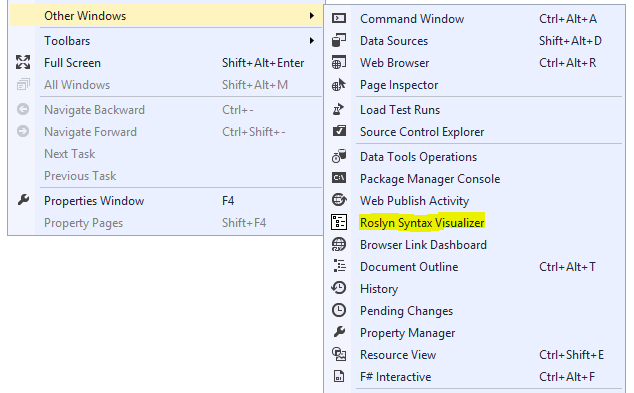

This should bring up a tool window that looks like below. Let’s dock this tool window at a convenient location inside Visual Studio. I usually dock this window on the left side.

*Figure 2 The Syntax Visualizer tool window*

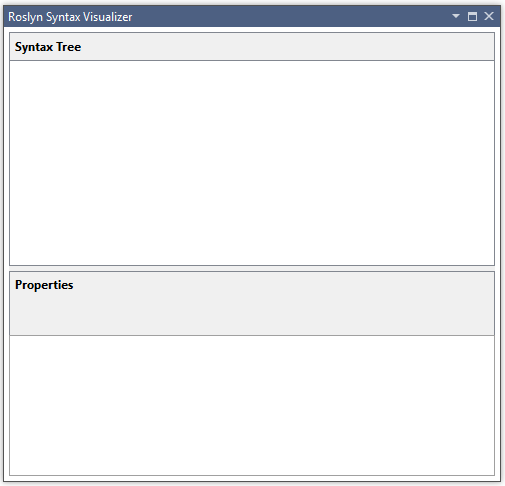

Now, let’s create a new project by clicking on File –> New Project. You can create either a VB or C# project. As soon as Visual Studio opens the main code file for this project, you should see the syntax tree for this file in the visualizer tool window as shown in the below image. You can open any existing C# / VB file in this Visual Studio instance, and the syntax tree for the opened file will be displayed in the visualizer tool window. If you have multiple code files open inside Visual Studio, the visualizer will always display the syntax tree for the currently active code file (i.e., the code file that has keyboard focus).

*Figure 3 Visualizing a C# syntax tree*

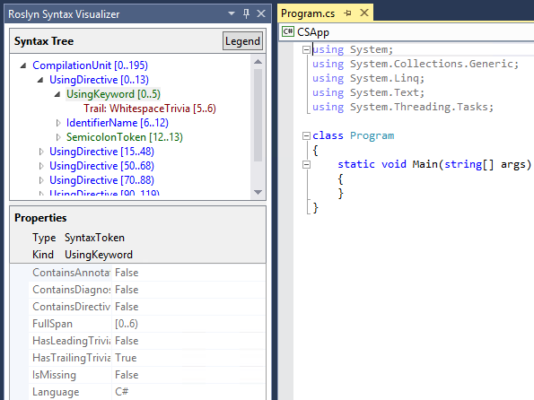

*Figure 4 Visualizing a VB syntax tree*

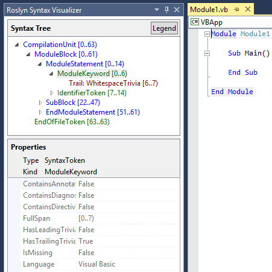

As you can see in the above image, the visualizer tool window displays the syntax tree at the top and a property grid at the bottom. The property grid displays the properties of the item that is currently selected in the tree, including the .NET ‘Type’ and the ‘Kind’ (SyntaxKind) of the item.

Syntax trees comprise three types of items – nodes, tokens, and trivia. You can read more about these types in the [.NET Compiler Platform (“Roslyn”) Overview document](https://github.com/dotnet/roslyn/blob/main/docs/wiki/Roslyn-Overview.md). Items of each type are represented using a different color. Click on the button titled ‘Legend’ for an overview of the colors used.

*Figure 5 Legend*

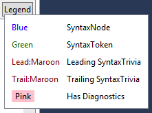

Each item in the tree also displays its own ‘Span’. In the C# example above for instance, the selected “UsingKeyword [0..5)” token has a Span that is 5 characters wide i.e. [0..5).

There are a couple of different ways in which you can navigate the tree:
* You can navigate the tree by expanding / clicking on items in the tree. If you click on an item in the tree, the visualizer automatically selects the text corresponding to this item’s Span in the code editor.
* You can also navigate the tree by clicking on / selecting text in the code editor. In the VB example above for instance, if you select the line containing "Module Module1" in the code editor, the visualizer will automatically navigate to the corresponding ModuleStatement node in the tree. In essence, the visualizer will try to find and highlight the item in the tree whose span best matches the span of the text that you select.

Next, let’s see what happens when we modify the code in the active code file. In the above example, lets type a call to Console.WriteLine() inside Main(). As you type, notice that the visualizer refreshes the tree to match the new code.

Pause typing once you have typed `Console.`. Notice that the tree has some items colored in pink. This is because at this point, there are errors (also referred to as ‘Diagnostics’) in the typed code. These errors are attached to nodes, tokens and trivia in the syntax tree and the visualizer shows you which items have errors attached to them by coloring them specially. You can inspect the errors that are present on any item colored pink by hovering over the item with your mouse. Note that the visualizer will only display syntactic errors (i.e. errors related to the syntax of the typed code) – it will not display any semantic errors.
 
# Syntax Graphs

Right clicking on any item in the tree and clicking on View Directed Syntax Graph will display a graphical representation of the sub-tree rooted at the selected item. Let’s try this for the MethodDeclaration node corresponding to the Main() method in the C# example above. This should display a syntax graph that looks as follows:

*Figure 6 Viewing a C# syntax graph*

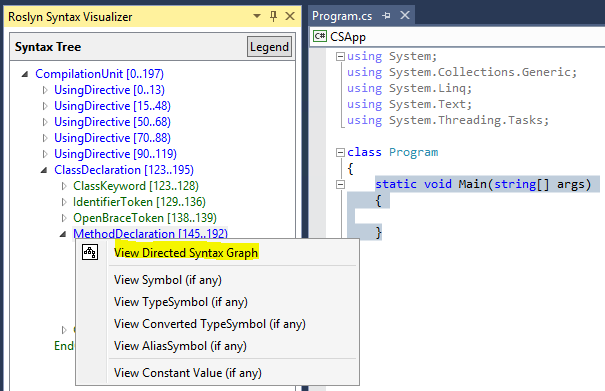

*Figure 7 A C# syntax graph*

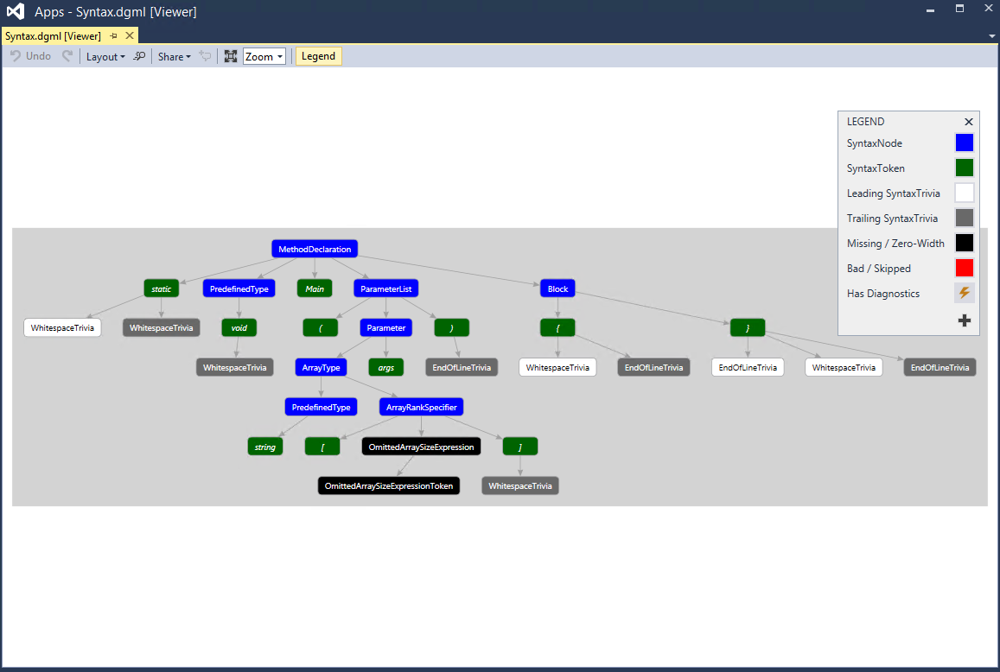

Let’s try the same for the SubBlock node corresponding to the Main() method in the VB example above. This should display a syntax graph that looks as follows:

*Figure 8 Viewing a VB syntax graph*

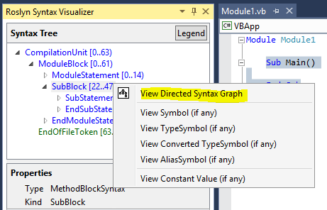

*Figure 9 A VB syntax graph*

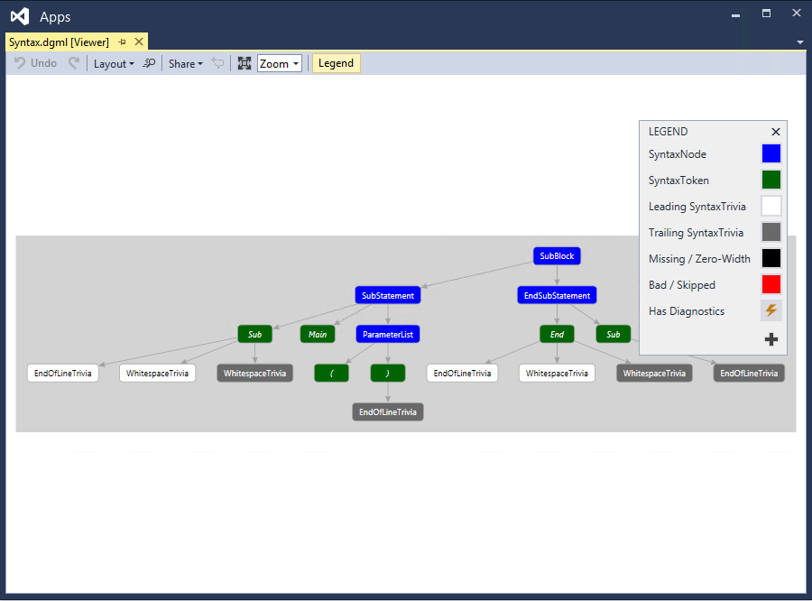

As you can see in the above screenshots, the syntax graph viewer has an option to display a legend for the coloring scheme it uses. You can also hover over individual items in the syntax graph with the mouse to view the properties corresponding to that item.

You can view syntax graphs for different items in the tree repeatedly and the graphs will always be displayed in the same window inside Visual Studio. Dock this window at a convenient location inside Visual Studio so that you don’t have to switch between tabs to view a new syntax graph. I usually dock this window at the bottom (below my code editor windows).

Here is the docking layout that I normally use for the visualizer tool window and the syntax graph window:

*Figure 10 My preferred docking layout*

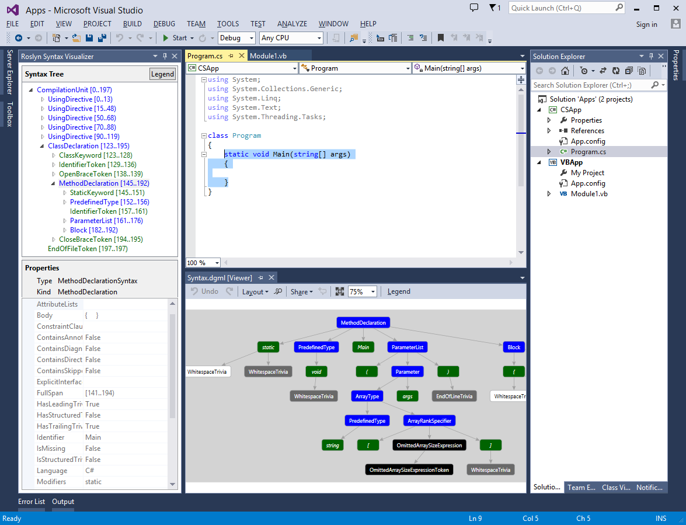

# Inspecting Semantics
The Syntax Visualizer also allows you to do some rudimentary inspection of symbols and semantic information. Let’s look at some examples. You can read more about APIs for performing semantic analysis in the [.NET Compiler Platform (“Roslyn”) Overview document](https://github.com/dotnet/roslyn/blob/main/docs/wiki/Roslyn-Overview.md).

In the C# file above, type `double x = 1 + 1;` inside Main().

Now select the expression `1 + 1` in the code editor window. This should highlight the corresponding AddExpression node in the visualizer. Right click on this AddExpression and click on View Symbol (if any).

*Figure 11 Viewing symbol for an expression*

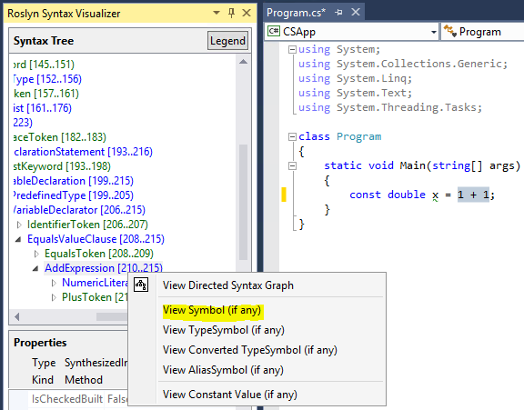

The property grid in the visualizer should now be updated as follows indicating that the symbol for the expression is a SynthesizedIntrinsicOperatorSymbol with Kind = Method.

*Figure 12 Symbol properties*

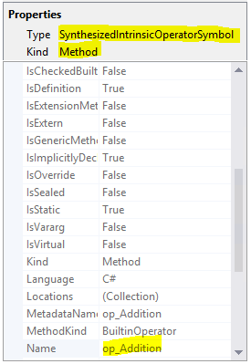

Next let’s try View **TypeSymbol (if any)** for the same AddExpression node. This time the property grid in the visualizer is updated as follows indicating that the type of the selected expression is Int32.

*Figure 13 TypeSymbol properties*

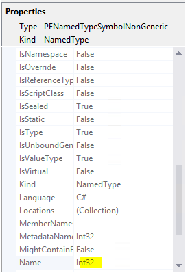

Next let’s try View **Converted TypeSymbol (if any)** for the same AddExpression node. This time, the property grid is updated as follows indicating that although the type of the expression is Int32, the converted type of the expression is Double (because the Int32 expression is used in a context where it has to be converted to a Double in order to satisfy the type specified for the variable x on the left hand side of the assignment operator).

*Figure 14 Converted TypeSymbol properties*

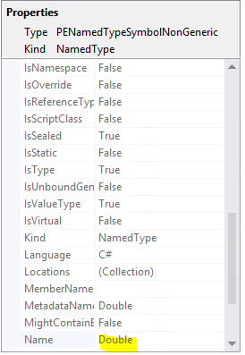

Finally, let’s try **View Constant Value (if any)** for the same AddExpression node above. The property grid tells us that the value of the expression is a compile time constant with value `2`.

*Figure 15 A constant value*

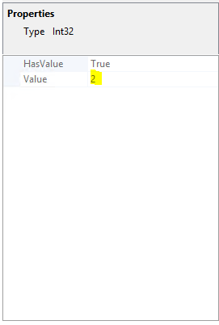

The above inspection example can also be replicated in VB. Type `Dim x As Double = 1 + 1` in a VB file. Now select the expression `1 + 1` in the code editor window. This should highlight the corresponding AddExpression node in the visualizer. Repeat the above steps for this AddExpression and you should see identical results.

Let’s try another example, this time in VB. Update the code in the VB file to match what’s in the below image. This code introduces an alias named C (that maps to the type System.Console) at the top of the file and uses this alias inside Main(). Let’s select the use of this alias inside the method (see below screenshot). This should select the corresponding IdentifierName node in the visualizer. Right click this node and click on **View Symbol (if any)**.

*Figure 16 Viewing symbol for an identifier*

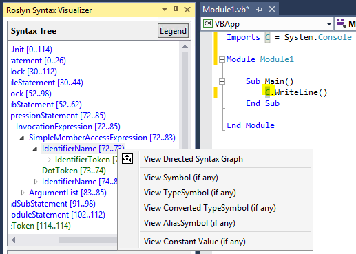

The property grid tells us that this identifier is bound to the type `System.Console`.

*Figure 17 Symbol properties*

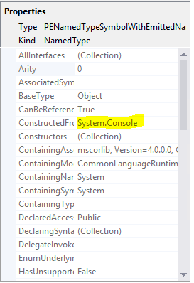

Now let’s try **View AliasSymbol (if any)** for the same IdentifierName node. This time, the property grid tells us that the identifier is an alias with name C that is bound to the System.Console target. In other words, the property grid gives us information regarding the AliasSymbol corresponding to the identifier C.

*Figure 18 AliasSymbol properties*

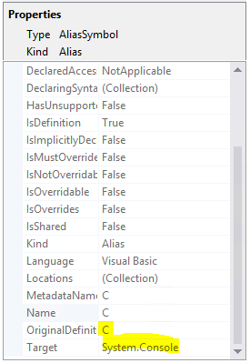

Note that you can also inspect the symbol corresponding to any declared type, method, property etc. by selecting the corresponding node in the visualizer and clicking on View Symbol (if any). For example, select the method `Sub Main()` in the above example and click on View Symbol (if any) for the corresponding SubBlock node in the visualizer, the property grid will tell us that the MethodSymbol for this SubBlock has name Main with return type Void.

*Figure 19 Viewing symbol for a method declaration*

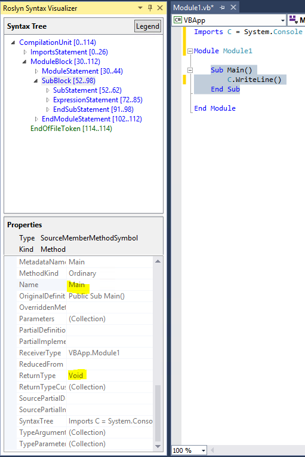

Note that the above VB examples can be easily replicated in C# (for the alias, type `using C = System.Console;` in place of `Imports C = System.Console`). Repeating the above steps in C# should yield identical results.

 Note that the semantic inspection operations described above are only available on nodes and not on tokens or trivia. Also note that not all nodes will have interesting semantic information to inspect. For nodes that don’t have interesting semantic information, clicking on **View * Symbol (if any)** will be a no-op (i.e., will return no useful information). In such cases, the visualizer property grid will be empty indicating that there is no useful semantic information to display.

*Figure 20 An empty property grid is displayed when no semantic information is available for the selected node*

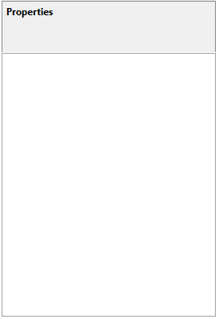

## Closing and Disabling Syntax Visualizer
The visualizer tool window can be closed at any time and once closed it should cease to have any impact. You can also disable / uninstall the visualizer extension completely using Tools –> Extensions and Updates in Visual Studio.
