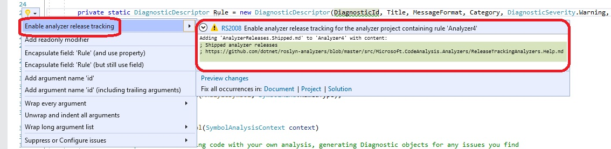

# Release tracking analyzer

## Overview

Release tracking analyzer enables third party analyzer packages to define analyzer releases with associated versions. Each release can track the following changes:

1. Additions: Set of new analyzer rules that shipped for the first time in this release.
2. Removals: Set of old analyzer rules that shipped in an earlier release, but are removed starting this release.
3. Changes: Set of existing analyzer rules that shipped in an earlier release, but one of the following attributes of the diagnostic changed in this release:
   1. Category of the diagnostic.
   2. Default severity of the diagnostic
   3. Enabled by default status.

This analyzer expects that the third party analyzer project has two additional files, namely `AnalyzerReleases.Unshipped.md` and `AnalyzerReleases.Shipped.md`, to track this release specific metadata.

1. `AnalyzerReleases.Unshipped.md`: Additional file for the upcoming or unshipped analyzer release. This file will start empty at the beginning of each release. While working on the upcoming release, it will track additions/removals/changes to analyzer rules in the repo.
2. `AnalyzerReleases.Shipped.md`: Additional file for shipped analyzer releases. This file only tracks analyzer rules for shipped releases. It cannot be changed while work is in progress for upcoming release. When a new analyzer package is released, a new release with shipped package version should be created in the shipped file, and all the entries from the unshipped file should be moved under the new shipped release.

Note that each analyzer project that contributes an assembly to the analyzer NuGet package would require these additional files.

Release tracking analyzer provides the diagnostics and code fixes to enable analyzer authors to maintain the shipped and unshipped files. Analyzer author only requires to perform the following two manual tasks:

1. Create these two files and pass mark them as additional files for their analyzer project (steps explained in next section), and
2. Move all the entries from unshipped file to the shipped file after each release.

## Example

Consider the following example:

1. `AnalyzerReleases.Shipped.md`:

    ```md
    ## Release 1.0

    ### New Rules

    Rule ID | Category | Severity | Notes
    --------|----------|----------|--------------------
    CA1000  |  Design  |  Warning | CA1000_AnalyzerName, [Documentation](CA1000_Documentation_Link)
    CA2000  | Security |  Info    | CA2000_AnalyzerName, [Documentation](CA2000_Documentation_Link)
    CA3000  |  Usage   | Disabled | CA3000_AnalyzerName, [Documentation](CA3000_Documentation_Link)


    ## Release 2.0

    ### New Rules

    Rule ID | Category | Severity | Notes
    --------|----------|----------|--------------------
    CA4000  |  Design  |  Warning | CA4000_AnalyzerName, [Documentation](CA4000_Documentation_Link)

    ### Removed Rules

    Rule ID | Category | Severity | Notes
    --------|----------|----------|--------------------
    CA3000  |  Usage   |  Disable | CA3000_AnalyzerName, [Documentation](CA3000_Documentation_Link)

    ### Changed Rules

    Rule ID | Category | Severity | Notes
    --------|----------|----------|--------------------
    CA2000  | Security | Disabled | CA2000_AnalyzerName, [Documentation](CA2000_Documentation_Link)
    ```

2. `AnalyzerReleases.Unshipped.md`:

    ```md
    ### New Rules

    Rule ID | Category | Severity | Notes
    --------|----------|----------|--------------------
    CA5000  | Security |  Warning | CA5000_AnalyzerName
    CA6000  |  Design  |  Warning | CA6000_AnalyzerName
    ```

Analyzer author has shipped 2 analyzer releases:

1. Version 1.0 shipped three rules: CA1000, CA2000 and CA3000.
2. Version 2.0 changed the default severity of a shipped rule CA2000 from 'Warning' to 'Disabled'. It removed a shipped rule CA3000 and added a new rule CA4000.
3. Upcoming release will add 2 new rules CA5000 and CA6000.

When the next release is shipped, say version '3.0', a new release section for 3.0 should be created at the end of the shipped file and the entries from unshipped file should be moved under it. The files will change as below:

1. `AnalyzerReleases.Shipped.md`:

    ```md
    ## Release 1.0

    ### New Rules

    Rule ID | Category | Severity | Notes
    --------|----------|----------|--------------------
    CA1000  |  Design  |  Warning | CA1000_AnalyzerName, [Documentation](CA1000_Documentation_Link)
    CA2000  | Security |  Info    | CA2000_AnalyzerName, [Documentation](CA2000_Documentation_Link)
    CA3000  |  Usage   | Disabled | CA3000_AnalyzerName, [Documentation](CA3000_Documentation_Link)


    ## Release 2.0

    ### New Rules

    Rule ID | Category | Severity | Notes
    --------|----------|----------|--------------------
    CA4000  |  Design  |  Warning | CA4000_AnalyzerName, [Documentation](CA4000_Documentation_Link)

    ### Removed Rules

    Rule ID | Category | Severity | Notes
    --------|----------|----------|--------------------
    CA3000  |  Usage   |  Disable | CA3000_AnalyzerName, [Documentation](CA3000_Documentation_Link)

    ### Changed Rules

    Rule ID | Category | Severity | Notes
    --------|----------|----------|--------------------
    CA2000  | Security | Disabled | CA2000_AnalyzerName, [Documentation](CA2000_Documentation_Link)


    ## Release 3.0

    ### New Rules

    Rule ID | Category | Severity | Notes
    --------|----------|----------|--------------------
    CA5000  | Security |  Warning | CA5000_AnalyzerName
    CA6000  |  Design  |  Warning | CA6000_AnalyzerName
    ```

2. `AnalyzerReleases.Unshipped.md` (empty):

    ```md
    ```

## How to enable Release Tracking analyzer

The following additional files have to be added to any project referencing this package to enable analysis:

- `AnalyzerReleases.Shipped.md`
- `AnalyzerReleases.Unshipped.md`

This can be done in couple of ways, which is detailed in below sections.

### Using the light bulb



### Manual steps

This can be done by:

- In Visual Studio, right-click the project in Solution Explorer, choose "Add -> New Item...", and then select "Text File" in the "Add New Item" dialog. Then right-click each file, select "Properties", and choose "C# analyzer additional file" for "Build Action" in the "Properties" window.
- Or, create these two files at the location you desire, then add the following text to your project/target file (replace file path with its actual location):

  ```xml
  <ItemGroup>
    <AdditionalFiles Include="AnalyzerReleases.Shipped.md" />
    <AdditionalFiles Include="AnalyzerReleases.Unshipped.md" />
  </ItemGroup>
  ```
