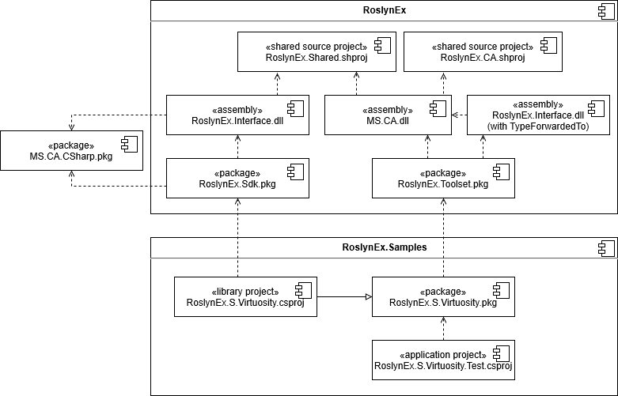

## Component diagram

The diagram above shows relationships between the components of RoslynEx, along with a sample transformer project and an application using it. Most of this information are implementation details and are not necessary to understand to author source transformers or to use them.

### RoslynEx

#### RoslynEx.Interface.dll

The RoslynEx.Interface.dll assembly contains the 4 types described in [the API](API.md), referencing the official stable version of Microsoft.CodeAnalysis.CSharp.

Because there is a cyclic dependency between RoslynEx.Interface and the RoslynEx version of Microsoft.CodeAnalysis.dll, the relevant code is actually in the shared source project RoslynEx.Shared, which is included into the RoslynEx.Sdk version of RoslynEx.Interface.dll and the RoslynEx.Toolset version of Microsoft.CodeAnalysis.dll (more on the distinction between Sdk and Toolset below). To make assembly identity work, RoslynEx.Toolset also contains a version of RoslynEx.Interface.dll which uses `[TypeForwardedTo]` to Microsoft.CodeAnalysis.dll.

#### Microsoft.CodeAnalysis.dll

Microsoft.CodeAnalysis.dll contains many of the modifications of Roslyn code needed for RoslynEx (others are in Microsoft.CodeAnalysis.CSharp.dll).

These modifications come in three forms:

1. As mentioned above, the RoslynEx API, code for which comes from the shared source project RoslynEx.Shared.
2. Direct modifications of existing code in Microsoft.CodeAnalysis.dll.
3. Code from the shared source project RoslynEx.CodeAnalysis, which contains new types introduced for RoslynEx. This isn't strictly speaking necessary, but exists for better separation of RoslynEx code from Roslyn code.

#### RoslynEx.Sdk.pkg

RoslynEx.Sdk is the NuGet package used as a reference by transformer projects. It contains reference assembly RoslynEx.Interface.dll, along with MSBuild targets necessary for producing transformer packages. That includes editing the nuspec file of the transformer project so that the produced package depends on RoslynEx.Toolset instead of RoslynEx.Sdk.

#### RoslynEx.Toolset.pkg

RoslynEx.Toolset is a NuGet package used as a dependency of transformer packages. It includes the RoslynEx fork of the C# compiler along with MSBuild files that make sure this is the compiler used at build time.

It is effectively a renamed Microsoft.Net.Compilers.Toolset.

### RoslynEx.Samples

#### RoslynEx.Samples.Virtuosity

A sample transformer project, which references RoslynEx.Sdk. The built package then depends on RoslynEx.Toolset.

#### RoslynEx.Samples.Virtuosity.Test

A sample application that depends on the RoslynEx.Samples.Virtuosity transformer package. This means it also indirectly depends on RoslynEx.Toolset, which means compiling this project will use the RoslynEx compiler.