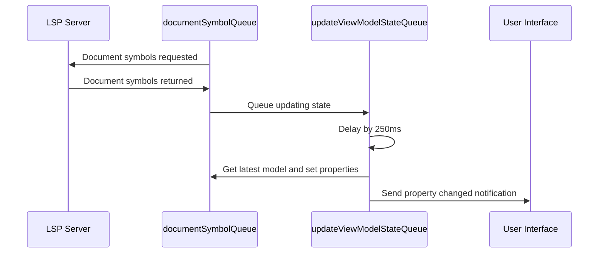

# Document Outline

## Design

## Implementation Notes

### Queues

We have two queues that we use in document outline: `_documentSymbolQueue` and `_updateViewModelStateQueue`.

Each time the text document is updated the following flow happens:

## Tests