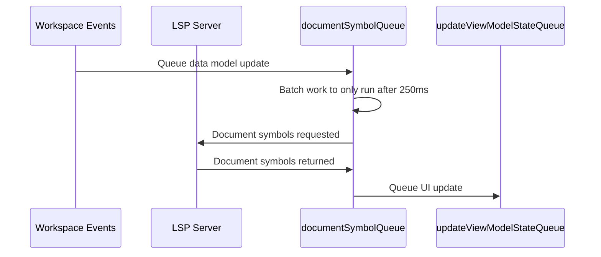
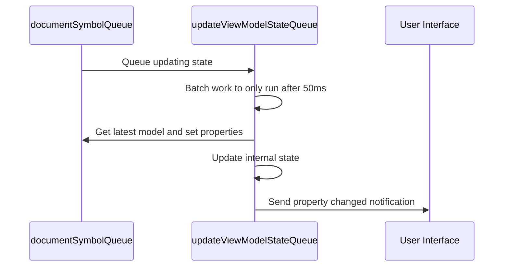
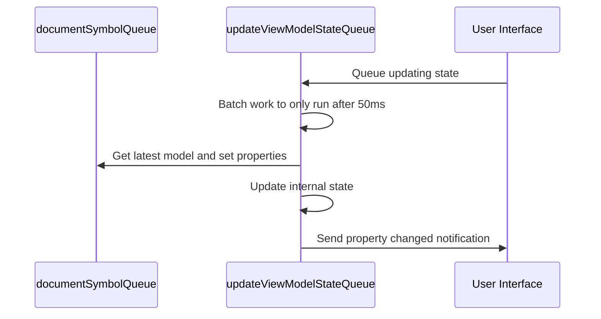
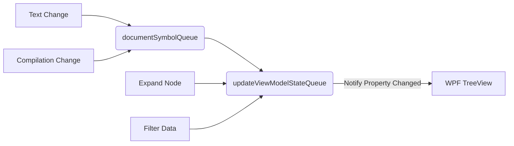

# Document Outline

Note: the contents of this document are stale and do not reflect the actual design or implementation of this feature.

## Design

The intended design is that the LSP protocol (specifically the document symbol API) provides all of the data we need to populate this feature. User interactions are queued and processed after a slight delay (250 ms) to ensure that multiple UI operations do not cause things to lock up. All the user interactions are received on the UI thread before being queued for processing. Events such as the text document changing can come in from any thread.

## Implementation Notes

### Visual Studio API and Document Outline Lifecycle

Visual Studio calls us whenever a code window is opened. This can be opening a file for the first time, or switching focus to it in the editor. Once this happens we create an instance of the document outline window and kickoff an LSP request to populate ourselves. Once focus changes to another window, we are disposed and we cancel all ongoing background work. Because of this life cycle it is expected that we are associated with one text buffer at a time and it would be a Visual Studio editor bug to arbitrarily attach to a different buffer after we are created.

### Sorting

Sorting is handled by WPF, this helps us not need to re-create objects each time we need to change the order. Unfortunately sorting a tree is a bit more complex in WPF than just a list.

We have a [CollectionViewSource](DocumentOutlineView.xaml#L24) that is bound to our view models. This has [SortDescriptions](DocumentOutlineView.xaml#L29) that sort the top-level items in the tree. Sorting the child items is handled by custom [ItemSorter](DocumentOutlineView.xaml#L35) that is bound to our child items [here](DocumentOutlineView.xaml#L148). While it is unfortunate that WPF does not handle this case by default and so we have two things to track for sorting, this is much more performant that attempting to do all sorting ourselves and forcing a repaint of all items. As this is currently implemented WPF will virtualize these and not re-draw elements that are not in view or do not change.

### Expansion, Collapsing, and Selection

We bind expand/collapse state to a boolean on the view model [here](DocumentOutlineView.xaml#L169). This allows us to programmatically expand or collapse nodes from a background thread. The view model sends a notification whenever this property changes to WPF and the WPF render engine is responsible for schedule time on the UI thread to read the new value and re-draw things if necessary. Because expansion and collapsing of nodes is a very common operation when following the cursor this ensures we never lock the UI thread unnecessarily. For the same reasons we also bind [IsSelected](DocumentOutlineView.xaml#L170) so its state can be updated from any thread. If, in the future, these properties are refactored to no longer be `bool`s this design will need to be reconsidered.

### Filtering

Filtering a tree of items doesn't have a mechanism in WPF that doesn't require the UI thread. Therefore we filter our data on a background thread and replace the data collection wholesale. This does cause all the items to be re-drawn, but this is better than doing sorting on the UI thread. By sorting on a background thread and then firing a notify property changes event when we are done we end up with the minimal amount of UI thread usage.

### Navigation

Navigation events are always expected to happen on the UI thread so we just call the editor API to scroll us to the location. This operation is expected to be instantaneous as there should be no need to do and calculations.

### Data Update

We subscribe to text update events and, for each one, attempt to gather data from the LSP server. If a user is typing we expect the 250ms delay to be continually reset until they are done ensuring we do not flood the LSP server with requests. Once we receive data from the LSP server we reconcile it with any other UI state that has been queued up and update the entire view model at once

#### Queues

We have two queues that we use in document outline: `_documentSymbolQueue` and `_updateViewModelStateQueue`.

These queues batch all updates so each time new data is added to process the timer it is configured with is reset. This ensures that if the user is typing or a large batch of updates from the workspace are coming in we don't waste time computing results that are just going to be thrown away.

For the `_documentSymbolQueue` our input is workspace changes (such as the from the user typing) and our output is a `DocumentSymbolDataModel`. This queue operates on a 250ms delay and a typical execution look like this:

At the end we always queue a UI update to the `updateViewModelStateQueue`.  If the user interact with the UI in a way we cannot hand off to WPF (such as filtering) we also queue a UI update. `updateViewModelStateQueue` also batches up its operations to only occur every 50ms at the most frequent.

Here is the same operation initiated by user interaction instead of a model update.

In summary, we expect the following flow for updates:

